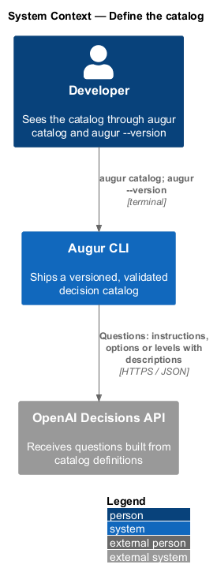
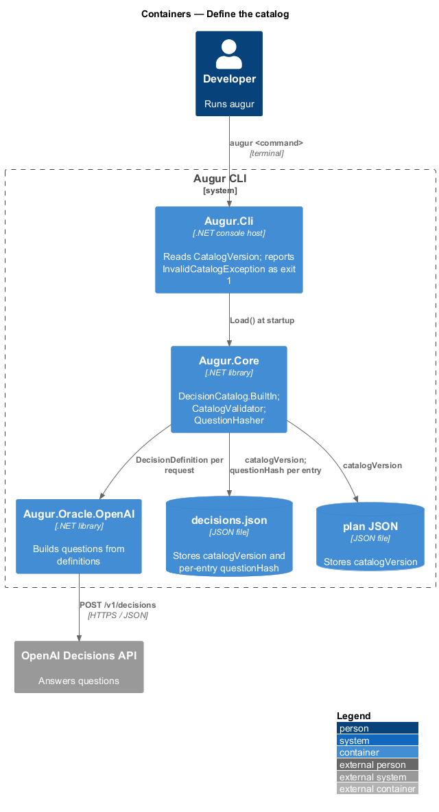
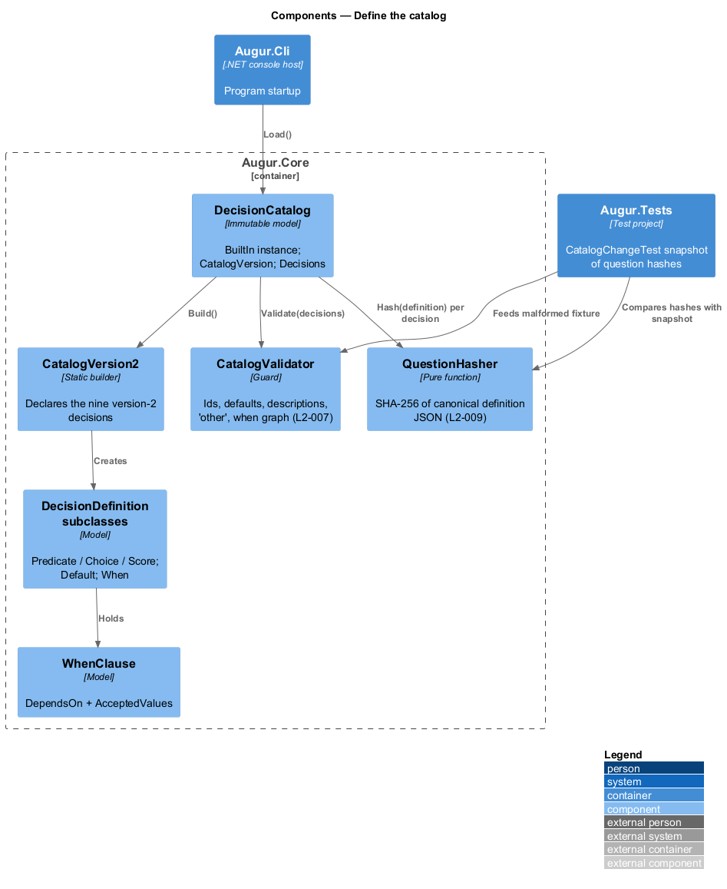
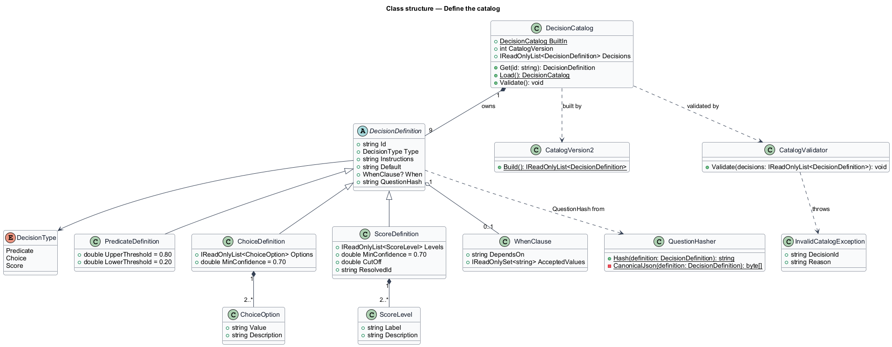
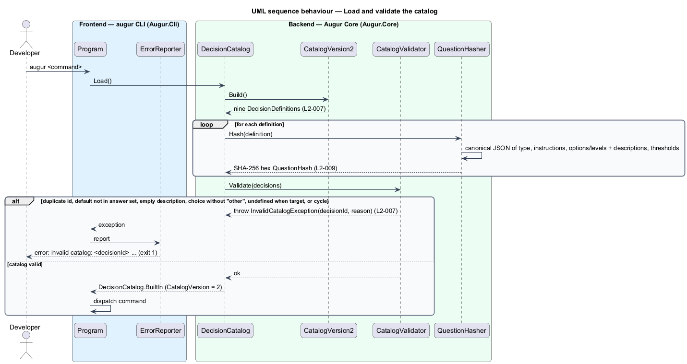

# Define the catalog

## Overview

Augur never lets a model choose freely. Every question it asks the OpenAI Decisions API, and every answer it is willing to accept, is written down in advance in the *decision catalog* — versioned, built-in list of the decisions Augur can make, each with a closed set of answers, a description of when each answer applies, confidence thresholds, and a safe default. This feature covers the catalog itself: its shape, its contents, how it is checked on load, and how a change to it is detected.

A *decision* — one named question the catalog poses about a specification — has one of three types matching the Decisions API question types: `predicate` (yes/no, answered by a probability), `choice` (one option from a list, answered by a choice and a confidence), or `score` (a position on ordered levels, answered by a continuous score). Each decision carries an `id`, `instructions` the model reads, the answer set with a description per option or level, thresholds, a `default` that is a member of the answer set, and an optional `when` clause — dependency rule naming another decision and the values of it under which this decision applies. Every `choice` decision includes the catch-all option `other`, which Augur treats as low-confidence rather than as a value.

Catalog version 2 holds nine decisions. `target` and `authentication` always apply. `architecture`, `persistence`, and `background-processing` apply to .NET and fullstack targets; `ui-library`, `state-management`, and `server-side-rendering` apply to Angular and fullstack targets; `domain-complexity` applies only under `clean-architecture` or `vertical-slice`. The behaviour tree that walks these dependencies is described in `../../decisions/evaluate-decision-tree/README.md`.

Two numbers make a catalog change visible. The *catalog version* — single integer that increments whenever any decision changes — is written into every plan and lockfile. The *question hash* — SHA-256 over the canonical JSON of one decision's definition (type, instructions, options or levels with their descriptions, thresholds) — is stored with every recorded answer, so a lockfile entry recorded under an old wording of a question is re-asked rather than replayed (see `../../lockfile/replay-decisions/README.md`).

## Description

The catalog lives in `Augur.Core` as code, not as a user-editable file; user-defined catalogs are out of scope for this release. Names are introduced by this design.

- **`DecisionCatalog`** — immutable set of `DecisionDefinition` instances plus `CatalogVersion`. `DecisionCatalog.BuiltIn` is the one instance Augur uses; `Load()` constructs it and calls `Validate()` once at startup.
- **`DecisionDefinition`** — abstract record with `Id`, `Type`, `Instructions`, `Default`, `When` (nullable `WhenClause`), and a computed `QuestionHash`. The three subclasses `PredicateDefinition`, `ChoiceDefinition`, and `ScoreDefinition` add their answer sets and thresholds; they are detailed in `../../decisions/resolve-decision/README.md`.
- **`WhenClause`** — record of `DependsOn` (a decision id) and `AcceptedValues`. For `domain-complexity` it is `{ architecture: [clean-architecture, vertical-slice] }`.
- **`CatalogVersion2`** — static builder that declares the nine decisions of version 2 with the ids, types, answers, defaults, and `when` clauses from L2-007. Option and level descriptions are authored here and treated as code: they drive answer accuracy and are versioned with the catalog (ADR `docs/adr/integration/0001`).
- **`CatalogValidator`** — runs on load and rejects a catalog in which: an `id` is duplicated; a `default` is not in the answer set; any option or level has an empty description; a `choice` decision lacks `other`; a `when` clause references an undefined decision; or the `when` graph contains a cycle. A failure throws `InvalidCatalogException`, which `ErrorReporter` reports with exit code 1 and the offending decision id (L2-007). A build-time test feeds a malformed catalog fixture through the validator.
- **`QuestionHasher`** — computes the question hash. It serializes the definition to canonical JSON — sorted keys, no whitespace, invariant number formatting, UTF-8 — including `type`, `instructions`, the options or levels with their `value`/`label` and `description`, and thresholds, and excludes `id`, `default`, and `when`. SHA-256 of those bytes, lower-case hex, is the hash (L2-009).
- **`CatalogChangeTest`** — build-time test that computes the question hashes of the shipped catalog and compares them with a committed snapshot. A changed hash without a bumped `CatalogVersion` fails the build, which is how the "shall require the catalog version to be incremented" clause of L2-009 is enforced.

## Requirements

The feature realizes the following level-2 (L2) requirements. Each L2 requirement refines a level-1 (L1) requirement, cited by identifier.

| L2 ID | Refines (L1) | Requirement |
|-------|--------------|-------------|
| `L2-007` | `L1-003` | The catalog shall define each decision with: a unique `id`, a `type` (`predicate`, `choice`, or `score`), `instructions`, the closed answer set (options or levels, each with a description), confidence thresholds, a `default` answer, and an optional `when` dependency on other decisions. Catalog version 2 shall contain these decisions: `target` (choice: `fullstack`, `dotnet`, `angular`, `other`; default `fullstack`; always), `authentication` (predicate; default `false`; always), `architecture` (choice: `clean-architecture`, `vertical-slice`, `minimal-api`, `other`; default `clean-architecture`; when `target` is `fullstack` or `dotnet`), `persistence` (choice: `ef-core-sqlserver`, `ef-core-postgresql`, `ef-core-sqlite`, `none`, `other`; default `ef-core-sqlite`; when `target` is `fullstack` or `dotnet`), `background-processing` (predicate; default `false`; when `target` is `fullstack` or `dotnet`), `domain-complexity` (score: levels 0 `trivial`, 1 `crud`, 2 `business-rules`, 3 `complex-domain`; resolves to `cqrs` = `true` when score >= 2.0, else `false`; default `false`; when `architecture` is `clean-architecture` or `vertical-slice`), `ui-library` (choice: `angular-material`, `none`, `other`; default `angular-material`; when `target` is `fullstack` or `angular`), `state-management` (choice: `signals`, `ngrx-signal-store`, `other`; default `signals`; when `target` is `fullstack` or `angular`), `server-side-rendering` (predicate; default `false`; when `target` is `fullstack` or `angular`). |
| `L2-009` | `L1-003` | The catalog shall carry an integer version. Any change to a decision's instructions, answers, descriptions, or thresholds shall change that decision's question hash and shall require the catalog version to be incremented. |

## Diagrams

### System context

The catalog is internal to Augur. Its contents shape every request to the Decisions API and are reported to the developer through `augur catalog` and `augur --version`.

### Containers

`Augur.Core` holds the catalog; `Augur.Cli` reads its version; the oracle and lockfile libraries consume definitions and question hashes.

### Components

`CatalogVersion2` builds the definitions, `CatalogValidator` checks them on load, and `QuestionHasher` fixes each definition's identity.

### Class structure

`DecisionCatalog` owns nine `DecisionDefinition`s of three subtypes; each may hold a `WhenClause`; `QuestionHasher` derives the hash from the definition's content.

### Behaviour — load and validate the catalog

At startup the catalog is built, validated, and hashed once; a malformed catalog ends the process with exit code 1 before any command runs (`L2-007`, `L2-009`).

