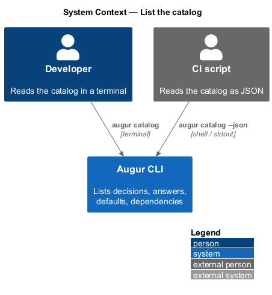
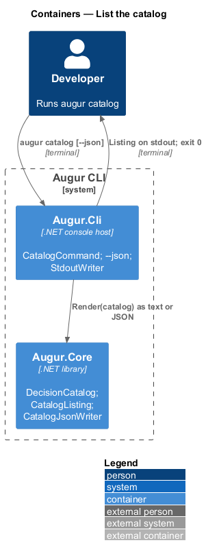
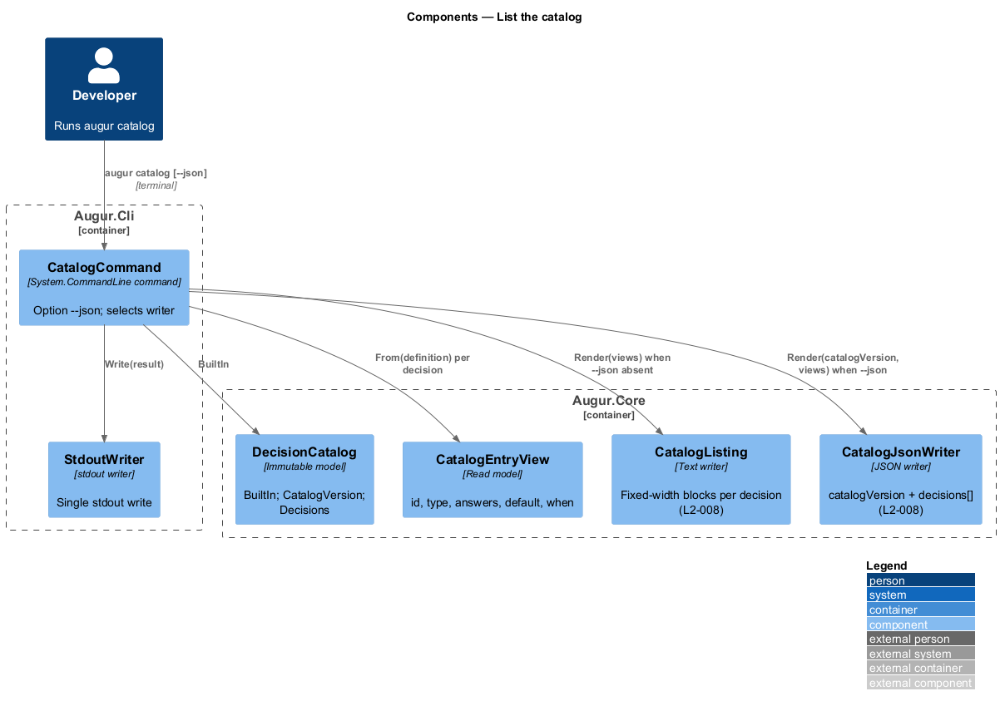
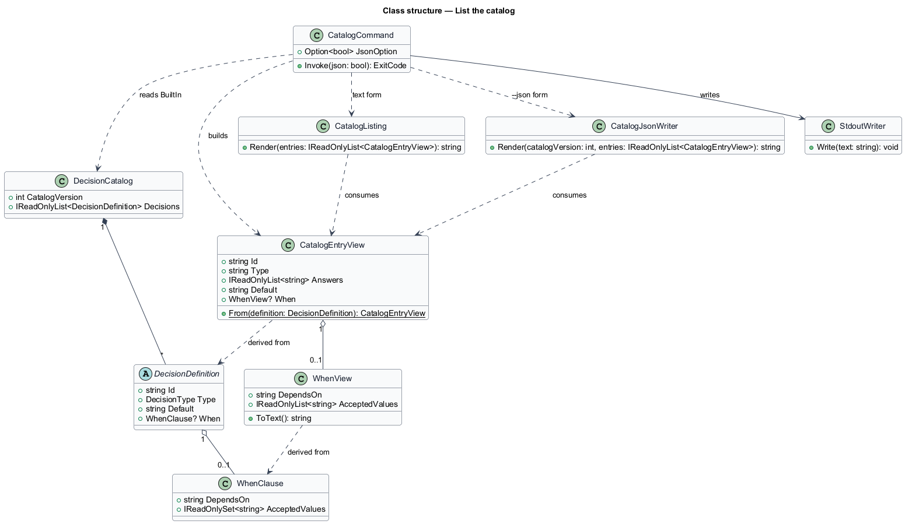
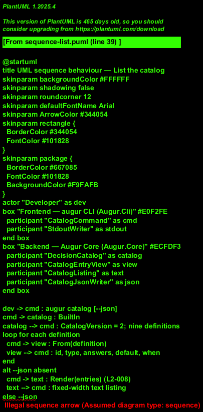

# List the catalog

## Overview

Before trusting a code generator to make decisions, a developer wants to see which decisions it can make. `augur catalog` answers that question. It prints every decision in the built-in *decision catalog* — versioned list of the questions Augur asks, each with a closed answer set and a default — showing the decision's id, type, allowed answers, default, and the dependency under which it applies. The same information is available as JSON with `--json`, so scripts can read the answer sets and, for example, validate `--set` overrides before a run.

The listing is derived from the catalog that `define-catalog` describes (see `../define-catalog/README.md`); it adds no information of its own and therefore cannot drift from what Augur actually asks. The text form is for people; the JSON form is a stable, machine-readable contract that reports `catalogVersion` and a `decisions` array. Both are written to stdout and nothing else is, so `augur catalog --json > catalog.json` captures exactly the document.

## Description

The command lives in `Augur.Cli`; the formatting lives in `Augur.Core` so it can be unit-tested without a console. Names are introduced by this design.

- **`CatalogCommand`** — `System.CommandLine` command `catalog` with one option, `--json`. It loads `DecisionCatalog.BuiltIn`, chooses `CatalogListing` or `CatalogJsonWriter`, and writes the result through `StdoutWriter`. It exits 0; the only failure path is an invalid catalog, which is reported at startup (see `../define-catalog/README.md`).
- **`CatalogListing`** — renders the human-readable form. One block per decision in catalog order: the id as a heading, then `type`, `answers` (option values or level labels in order), `default`, and `when` (`always` or `<id> is <v1> or <v2>`). For a score decision it also shows the cut-off and the plan key it resolves to (`cqrs`). Column widths are fixed so the output is stable across runs (L2-008).
- **`CatalogJsonWriter`** — renders the JSON form: `{ "catalogVersion": 2, "decisions": [ ... ] }`. Each entry has `id`, `type`, `answers` (array of option values or level labels), `default`, and `when` (`null` or `{ "dependsOn": "<id>", "acceptedValues": [...] }`). Serialization uses sorted keys, two-space indentation, LF line endings, and a trailing newline, matching the plan and lockfile conventions (L2-008).
- **`CatalogEntryView`** — read model that both writers share. It flattens a `DecisionDefinition` into the five fields above and maps `WhenClause` to its text and JSON forms, so the two outputs cannot disagree.
- **`StdoutWriter`** — the CLI's single stdout writer (see `../../cli/run-command/README.md`).

## Requirements

The feature realizes the following level-2 (L2) requirements. Each L2 requirement refines a level-1 (L1) requirement, cited by identifier.

| L2 ID | Refines (L1) | Requirement |
|-------|--------------|-------------|
| `L2-008` | `L1-003` | `augur catalog` shall list every decision with its id, type, allowed answers, default, and dependency. `--json` shall output the same information as JSON. |

## Diagrams

### System context

The developer or a script asks Augur for its catalog; no external system is involved.

### Containers

`Augur.Cli` hosts the command; `Augur.Core` supplies the catalog and the two writers.

### Components

`CatalogCommand` builds `CatalogEntryView`s from the catalog and hands them to either `CatalogListing` or `CatalogJsonWriter`.

### Class structure

Both writers consume the same `CatalogEntryView`, which is derived from `DecisionDefinition` and `WhenClause`.

### Behaviour — list the catalog

The `alt` block shows the text and JSON paths; both end with a single stdout write and exit code 0 (`L2-008`).

