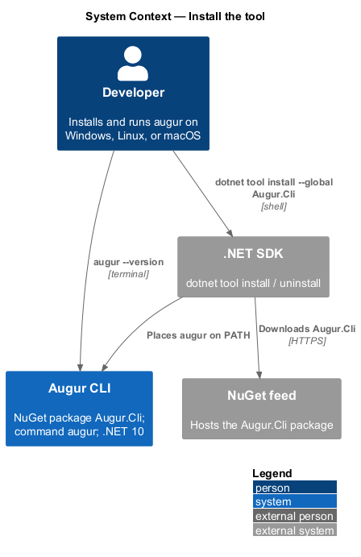
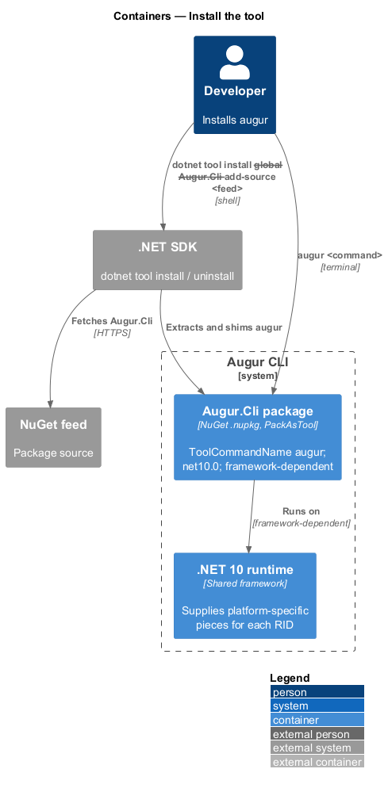
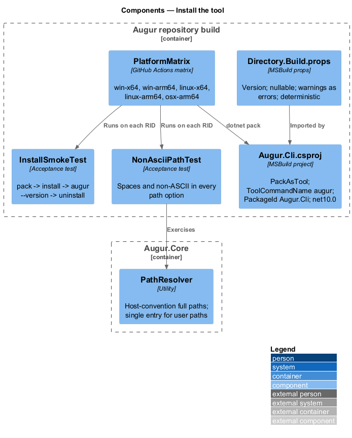
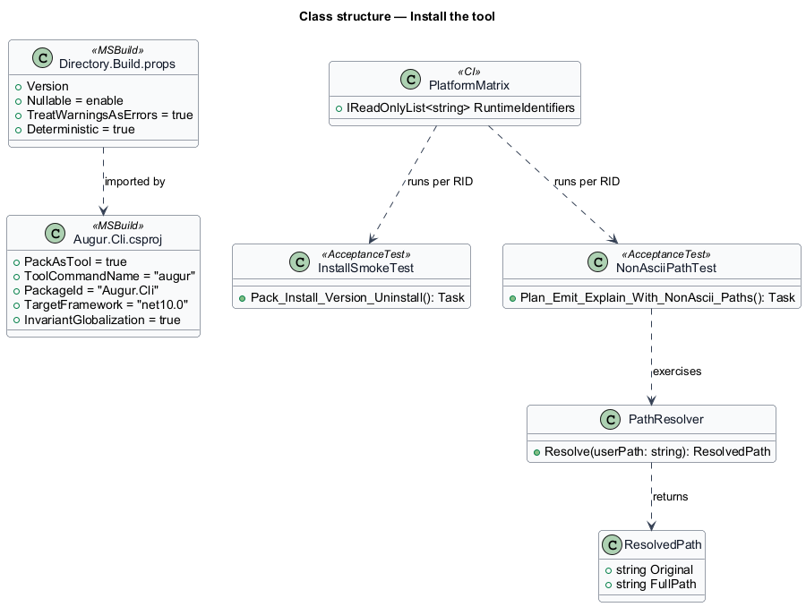
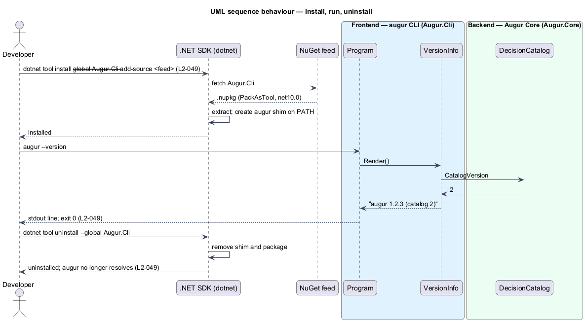

# Install the tool

## Overview

Augur reaches a developer's machine as a *.NET global tool* — console application packaged as a NuGet package that `dotnet tool install` places on the user's `PATH` under a short command name. This feature covers that packaging: the package identity, the command name, the runtime it targets, the platforms it runs on, and the care taken so that the same package works on every one of them.

The package is `Augur.Cli`, the command is `augur`, and the target framework is .NET 10. A single framework-dependent package serves every platform; the .NET 10 runtime already on the machine supplies the platform-specific pieces. Augur is tested on five *runtime identifiers* — platform and architecture pairs .NET uses to name a build target: `win-x64`, `win-arm64`, `linux-x64`, `linux-arm64`, and `osx-arm64`. On each of them the full acceptance suite runs in continuous integration.

The one place a cross-platform tool commonly fails is file paths. Augur therefore treats every path the developer supplies — specification, images, lockfile, plan, output directory — through one `PathResolver` that normalizes to the host's conventions, accepts spaces and non-ASCII characters, and never assumes a separator or case rule. PlantUML's `plantuml.jar`, Node.js, and the Angular CLI are not prerequisites: Augur emits code from embedded templates and never starts an external process (ADR `docs/adr/backend/0002`).

## Description

Packaging is a build concern of the `Augur.Cli` project. Names below are introduced by this design.

- **`Augur.Cli.csproj`** — the project file. It sets `<PackAsTool>true</PackAsTool>`, `<ToolCommandName>augur</ToolCommandName>`, `<PackageId>Augur.Cli</PackageId>`, `<TargetFramework>net10.0</TargetFramework>`, `<RollForward>LatestMajor</RollForward>` is not set so the tool runs only on the runtime it targets, and `<InvariantGlobalization>true</InvariantGlobalization>` so culture data is not needed. The package carries no runtime identifier; it is framework-dependent.
- **`Directory.Build.props`** — repository-wide build settings: nullable reference types on, warnings as errors, deterministic builds, `ContinuousIntegrationBuild` in CI, and a single `<Version>` that `VersionInfo` reads at run time (see `../run-command/README.md`).
- **`PathResolver`** — in `Augur.Core`. `Resolve(string userPath)` returns a full path using `Path.GetFullPath` against the current directory, preserves the original string for error messages, and rejects paths containing a NUL character. It is the only place user-supplied paths become file-system paths, which keeps the platform rules in one spot (L2-050).
- **`PlatformMatrix`** — the CI job matrix (`.github/workflows/ci.yml`): `windows-latest` (x64), `windows-11-arm` (arm64), `ubuntu-latest` (x64), `ubuntu-24.04-arm` (arm64), `macos-latest` (arm64). Each job restores, builds, runs the acceptance suite, and on tags packs and publishes the NuGet package. Runner labels are current as of this design and are `<TO SUPPLY>` for confirmation against the GitHub Actions runner catalogue at implementation time.
- **`InstallSmokeTest`** — acceptance test that packs the tool into a local feed, runs `dotnet tool install --global Augur.Cli --add-source <feed>`, invokes `augur --version`, and then `dotnet tool uninstall --global Augur.Cli`, asserting that the command is present and then absent (L2-049).
- **`NonAsciiPathTest`** — acceptance test that runs `augur plan`, `augur emit`, and `augur explain` with a specification path, lockfile path, and output directory containing a space and the characters `é`, `ü`, and `日本` on every CI platform (L2-050).

## Requirements

The feature realizes the following level-2 (L2) requirements. Each L2 requirement refines a level-1 (L1) requirement, cited by identifier.

| L2 ID | Refines (L1) | Requirement |
|-------|--------------|-------------|
| `L2-049` | `L1-014` | Augur shall be packaged as the NuGet package `Augur.Cli` with tool command name `augur`, targeting .NET 10. |
| `L2-050` | `L1-014` | Augur shall run on Windows x64 and arm64, Linux x64 and arm64, and macOS arm64, and shall handle paths using the host platform's conventions. |

## Diagrams

### System context

The developer installs the package from a NuGet feed with the .NET SDK; after installation `augur` runs locally with no external prerequisites beyond the .NET 10 runtime.

### Containers

The container view adds little to the context view for this slice: the `Augur.Cli` package is the one container the install touches, and the .NET SDK and feed are external. It is kept because it names the package, the command, and the runtime the tool depends on.

### Components

Inside the build, the project file and `Directory.Build.props` define the package; `PathResolver` is the single run-time component that implements the platform rule.

### Class structure

`PathResolver` is the only class the feature introduces at run time; the rest of the structure is build metadata, shown as classes for the properties they carry.

### Behaviour — install, run, uninstall

The developer installs from a feed, runs `augur --version`, and uninstalls; the smoke test follows the same path on every CI platform (`L2-049`, `L2-050`).

