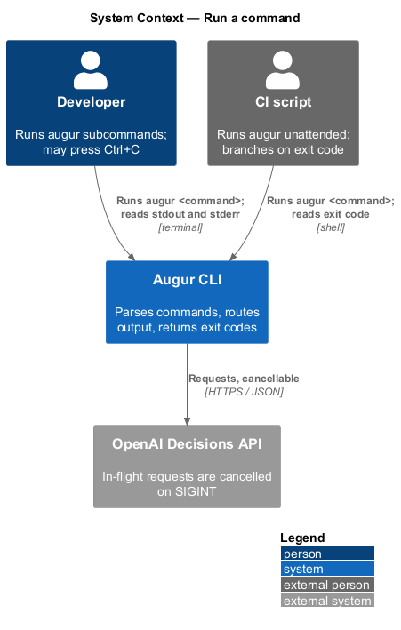
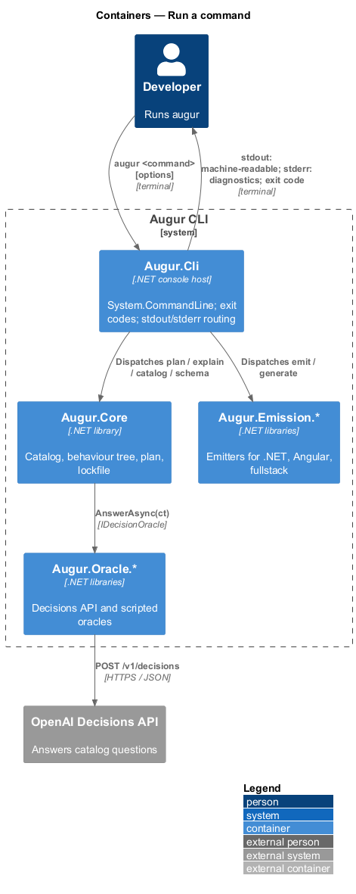
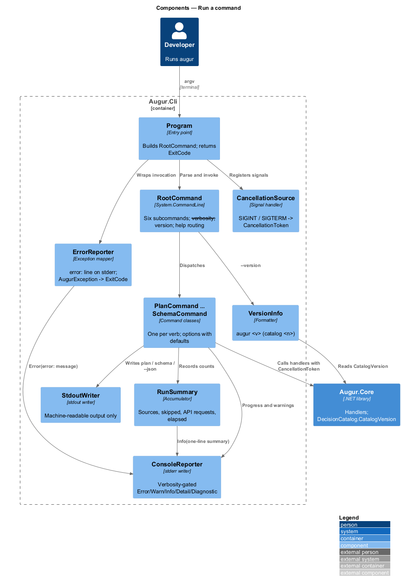
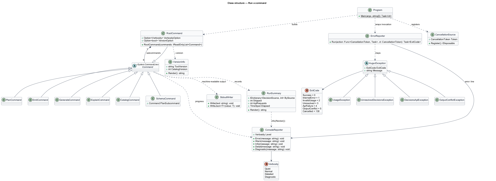
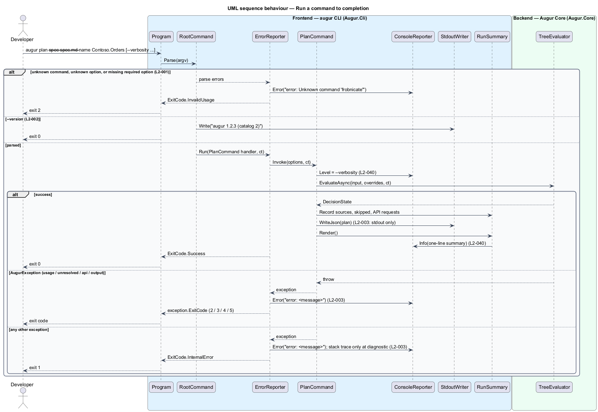
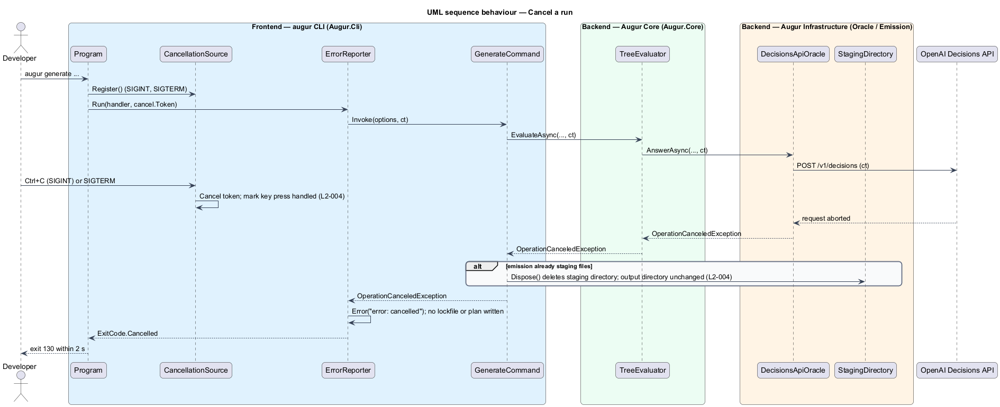

# Run a command

## Overview

Augur is a command-line code generator. A developer invokes it as `augur` followed by a subcommand, and every other feature of the system is reached through that entry point. This feature covers the shell around those subcommands: how the command line is parsed, how a run reports its outcome, which stream each kind of output goes to, and what happens when the developer interrupts a run.

Augur exposes six subcommands. `augur plan` resolves decisions for a specification and writes a *generation plan* — typed, serializable record of every resolved decision that the emitters consume. `augur emit` turns an existing plan into code. `augur generate` runs both in one step. `augur explain` shows how each recorded decision was reached, `augur catalog` lists the built-in decisions, and `augur schema plan` prints the JSON Schema for a plan. `augur --version` prints the tool version together with the catalog version so a plan can be matched to the catalog that produced it.

Every run ends with an *exit code* — small integer the process returns to its caller, documented so scripts can branch on it: 0 success, 1 unexpected internal error, 2 invalid usage or input, 3 unresolved decisions, 4 Decisions API failure, 5 output conflict or write failure, 130 cancelled by the user. Output is split by purpose. Machine-readable output such as plan JSON, schema JSON, and `--json` listings goes to stdout and nothing else does. Progress, warnings, errors, and logs go to stderr, so `augur plan > plan.json` captures exactly the plan. A *verbosity level* — one of `quiet`, `normal`, `detailed`, `diagnostic` — controls how much stderr receives, from errors only up to one line per HTTP request.

When the developer presses Ctrl+C or the process receives SIGTERM, Augur cancels any in-flight Decisions API request, stops work, leaves existing files unchanged, and exits with code 130. Atomic emission (see `../../emission/emit-output/README.md`) is what makes "leaves existing files unchanged" true during a write.

## Description

The feature is the `Augur.Cli` project, built on `System.CommandLine` (ADR `docs/adr/backend/0001`). It depends on `Augur.Core` for the catalog version and on nothing else at the shell level. Names are introduced by this design.

- **`Program`** — entry point. It builds the `RootCommand`, wires the `CancellationToken` to SIGINT and SIGTERM, invokes the parser, and returns the `ExitCode` as the process exit code.
- **`RootCommand`** — the `augur` command. It registers the six subcommands, the global options `--verbosity` and `--version`, and a custom help action that writes help to stdout for `--help` and to stderr for a bare `augur` invocation.
- **`PlanCommand`, `EmitCommand`, `GenerateCommand`, `ExplainCommand`, `CatalogCommand`, `SchemaCommand`** — one `Command` subclass per verb. Each declares its options with descriptions and defaults, validates option values that are checkable without the catalog (ranges, formats), and delegates to a handler in `Augur.Core` or an emitter project. `SchemaCommand` holds the `plan` subcommand.
- **`ExitCode`** — enum `Success = 0`, `InternalError = 1`, `InvalidUsage = 2`, `Unresolved = 3`, `ApiFailure = 4`, `OutputConflict = 5`, `Cancelled = 130`.
- **`AugurException`** — abstract base for every expected failure. Subclasses carry an `ExitCode`: `UsageException` (2), `UnresolvedDecisionsException` (3), `DecisionsApiException` (4), `OutputConflictException` (5). Any other exception is an internal error (1).
- **`ErrorReporter`** — catch-all around command execution. It writes one stderr line `error: <message>` for every failure and returns the matching `ExitCode`. For an internal error it appends the stack trace only when verbosity is `diagnostic` (L2-003). `OperationCanceledException` maps to `Cancelled` with the message `error: cancelled`.
- **`ConsoleReporter`** — the only writer to stderr. It holds the `Verbosity` and exposes `Error`, `Warn`, `Info` (normal), `Detail` (detailed), and `Diagnostic` methods that write only when the level permits. `Quiet` lets only `Error` through (L2-040).
- **`RunSummary`** — accumulator filled during a run: decisions by `DecisionSource`, skipped count, API request count (from `RequestCounter`), and a `Stopwatch`. `Render()` yields the one-line summary that `ConsoleReporter.Info` writes at the end of `plan`, `emit`, and `generate`.
- **`StdoutWriter`** — the only writer to stdout. Commands that produce machine-readable output obtain it from here, which keeps help, progress, and diagnostics off the stream.
- **`VersionInfo`** — reads the assembly's informational version and `DecisionCatalog.CatalogVersion` and formats `augur <version> (catalog <n>)` (L2-002).
- **`CancellationSource`** — registers `Console.CancelKeyPress` and `PosixSignalRegistration` for `SIGTERM`, cancels the shared `CancellationTokenSource`, and marks the key press handled so the runtime does not terminate the process before cleanup finishes (L2-004).

Parser errors (unknown command, unknown option, missing required option) are intercepted before any handler runs and routed through `ErrorReporter` as `UsageException`, so the message form and exit code 2 are uniform.

## Requirements

The feature realizes the following level-2 (L2) requirements. Each L2 requirement refines a level-1 (L1) requirement, cited by identifier.

| L2 ID | Refines (L1) | Requirement |
|-------|--------------|-------------|
| `L2-001` | `L1-001` | The CLI command is `augur`. It shall provide the following subcommands: `augur plan` (Resolve decisions for a specification and write a `GenerationPlan`), `augur emit` (Emit code from an existing `GenerationPlan`), `augur generate` (Run `plan` then `emit` in one step), `augur explain` (Show how each decision in a lockfile was reached), `augur catalog` (List the decisions in the built-in catalog and their allowed answers), `augur schema plan` (Print the JSON Schema for `GenerationPlan`). |
| `L2-002` | `L1-001` | `augur --version` shall print the tool version and the catalog version. |
| `L2-003` | `L1-001` | Every command shall exit with one of the codes in the Conventions table. Machine-readable output (plan JSON, schema JSON, `--json` output) shall be written only to stdout. Progress, warnings, errors, and logs shall be written only to stderr. |
| `L2-004` | `L1-001` | When the user presses Ctrl+C (SIGINT) or the process receives SIGTERM, Augur shall cancel in-flight API requests, stop work, leave existing files unchanged, and exit with code 130. |
| `L2-040` | `L1-011` | `--verbosity <quiet\|normal\|detailed\|diagnostic>` (default `normal`) shall control stderr output. At `normal` and above, each run shall end with a one-line summary: decisions resolved by source (`api`, `lockfile`, `override`, `fallback`, `user`, `script`), skipped decisions, number of API requests, and elapsed time. At `detailed`, each decision's resolution is logged as it happens. At `diagnostic`, each HTTP request logs method, URL path, status code, duration, attempt number, and the response's `x-request-id`. At `quiet`, only errors are written. |

## Diagrams

### System context

The developer or a script runs `augur` in a terminal and reads two streams back; the Decisions API is the only external system a run can be waiting on when it is cancelled.

### Containers

`Augur.Cli` is the only container that touches the console. It calls into `Augur.Core` and the emitter libraries and owns the exit code of the process.

### Components

`Program` builds the `RootCommand`, which dispatches to one command class per verb; `ErrorReporter`, `ConsoleReporter`, and `StdoutWriter` own the two output streams and the exit code.

### Class structure

Every command derives from `System.CommandLine.Command`; every expected failure derives from `AugurException` and carries its `ExitCode`.

### Behaviour — run a command to completion

The parser either rejects the input with exit code 2 or dispatches to a command; the command's result or exception is mapped to an exit code and a single `error:` line (`L2-001`, `L2-003`), and the run ends with the one-line summary (`L2-040`).

### Behaviour — cancel a run

SIGINT or SIGTERM cancels the shared token; the in-flight HTTP request aborts, staged files are discarded, and the process exits with code 130 (`L2-004`).

