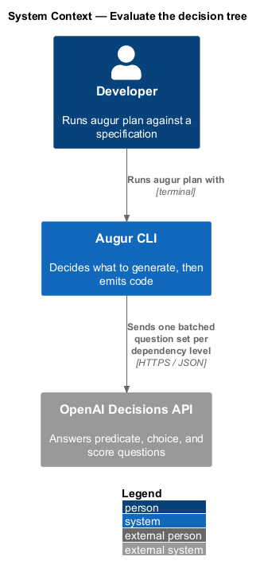
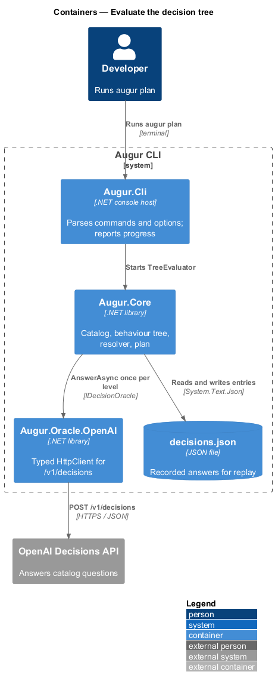
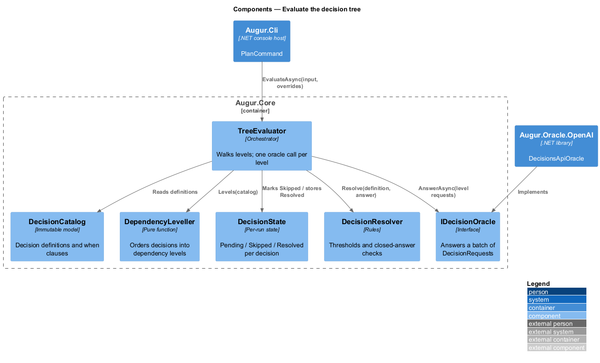
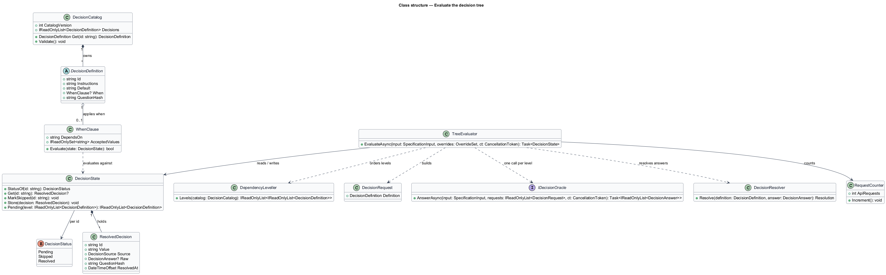
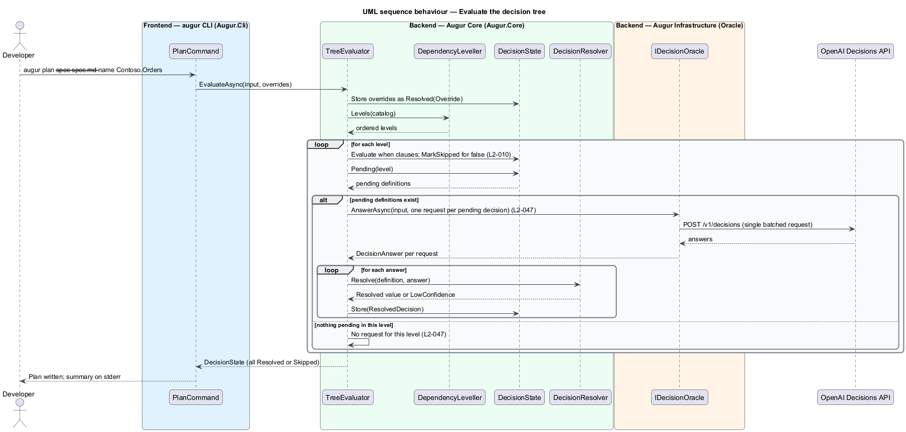

# Evaluate the decision tree

## Overview

Augur is a command-line code generator. It reads a natural-language specification, asks the OpenAI Decisions API a fixed set of questions about that specification, and emits code from the answers. The questions come from a *decision catalog* — versioned list of every decision Augur can make, the closed set of answers each decision accepts, and a safe default. This feature covers how Augur walks that catalog: the order in which decisions are asked, which decisions are asked at all, and how many requests the walk costs.

The catalog forms a *behaviour tree* — tree of decisions in which a child decision is asked only when its parent decisions have taken particular values. Each decision carries an optional `when` clause naming the decisions it depends on and the values that make it applicable. For example, `domain-complexity` applies only when `architecture` is `clean-architecture` or `vertical-slice`; it is never asked for a `minimal-api` solution. A decision whose `when` clause evaluates to false is *skipped*: it is not sent to the Decisions API and it takes no value in the generation plan.

Evaluation proceeds in *dependency levels* — groups of decisions whose `when` clauses are fully resolved by earlier levels. All pending decisions in one level share one Decisions API request, so a run costs one request per level that still has an open question (L2-047). For catalog version 2, that is at most three requests: `target` and `authentication` first; the target-specific decisions second; `domain-complexity` third. Decisions already answered by an override or a lockfile entry are not pending and do not add to the count.

## Description

The feature lives in `Augur.Core` and is driven by `PlanCommand` in `Augur.Cli`. All names below are introduced by this design.

- **`PlanCommand`** — System.CommandLine handler for `augur plan` and the planning half of `augur generate`. It loads the catalog, parses overrides, builds the oracle chain, and calls the evaluator.
- **`DecisionCatalog`** — immutable set of `DecisionDefinition` instances plus the integer `CatalogVersion`. It validates on load that every `when` clause references a defined decision and that the dependency graph is acyclic (L2-007).
- **`DecisionDefinition`** — abstract description of one decision: `Id`, `Instructions`, `Default`, and an optional `When` clause. `PredicateDefinition`, `ChoiceDefinition`, and `ScoreDefinition` specialize it and are described in the resolve-decision design.
- **`WhenClause`** — dependency rule holding `DependsOn` (a decision id) and `AcceptedValues`. `Evaluate(DecisionState)` returns true only when the referenced decision is resolved to one of the accepted values; a skipped or unresolved reference evaluates to false (L2-010).
- **`DependencyLeveller`** — pure function from a catalog to an ordered list of levels. Level 0 holds decisions with no `when` clause; level *n* holds decisions whose `when` clause references a decision in level *n − 1* or earlier.
- **`DecisionState`** — mutable per-run map from decision id to one of three states: `Pending`, `Skipped`, or `Resolved(ResolvedDecision)`. It is the single source of truth the evaluator reads and writes.
- **`TreeEvaluator`** — orchestrator. For each level it marks inapplicable decisions `Skipped`, collects the remaining `Pending` decisions into one `DecisionRequest` batch, calls `IDecisionOracle.AnswerAsync` once, hands each answer to `DecisionResolver`, and stores the result. It stops when every decision is `Resolved` or `Skipped`.
- **`IDecisionOracle`** — interface answering a batch of `DecisionRequest`s for one `SpecificationInput`. The evaluator never knows whether the answers came from the Decisions API, a lockfile, or a script (ADR integration/0001).
- **`DecisionResolver`** — turns a raw `DecisionAnswer` into a `ResolvedDecision` or a low-confidence outcome; detailed in the resolve-decision design.
- **`RequestCounter`** — diagnostic counter incremented once per oracle call that reaches the Decisions API. The run summary reports it (L2-040) and the acceptance tests for L2-047 assert on the stub server's request count.

Overrides from `--set` are written into `DecisionState` as `Resolved` with source `Override` before level 0 runs, so they shape `when` evaluation and never reach the oracle (see the override-decision design).

## Requirements

The feature realizes the following level-2 (L2) requirements. Each L2 requirement refines a level-1 (L1) requirement, cited by identifier.

| L2 ID | Refines (L1) | Requirement |
|-------|--------------|-------------|
| `L2-010` | `L1-004` | Decisions shall be evaluated in dependency levels: a decision is evaluated only after every decision named in its `when` clause has been resolved. A decision whose `when` clause evaluates to false shall be marked `skipped`, shall not be sent to the Decisions API, and shall take no value in the plan. A `when` clause that refers to a skipped decision evaluates to false. |
| `L2-047` | `L1-013` | All pending decisions in the same dependency level shall be sent in a single Decisions API request. The number of API requests in a run (excluding retries) shall equal the number of dependency levels that contain at least one pending decision. |

## Diagrams

### System context

A developer runs `augur plan` against a specification; Augur asks the OpenAI Decisions API the catalog questions and records the answers locally.

### Containers

The CLI host hands the run to the core library, which drives the oracle implementation in `Augur.Oracle.OpenAI` and records results in the lockfile.

### Components

Inside `Augur.Core`, `TreeEvaluator` reads levels from `DependencyLeveller`, tracks progress in `DecisionState`, batches one oracle call per level, and delegates each answer to `DecisionResolver`.

### Class structure

`DecisionCatalog` owns its `DecisionDefinition`s, each of which may hold a `WhenClause`. `TreeEvaluator` depends on the leveller, the state, the resolver, and the oracle interface.

### Behaviour — evaluate one run

The evaluator loops over levels. In each level it skips inapplicable decisions, sends one batched request for the rest (`L2-047`), and resolves every answer before moving on (`L2-010`).

