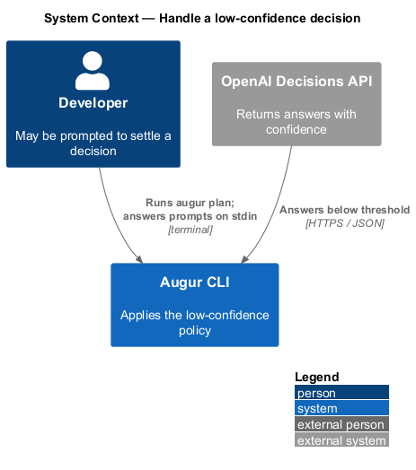
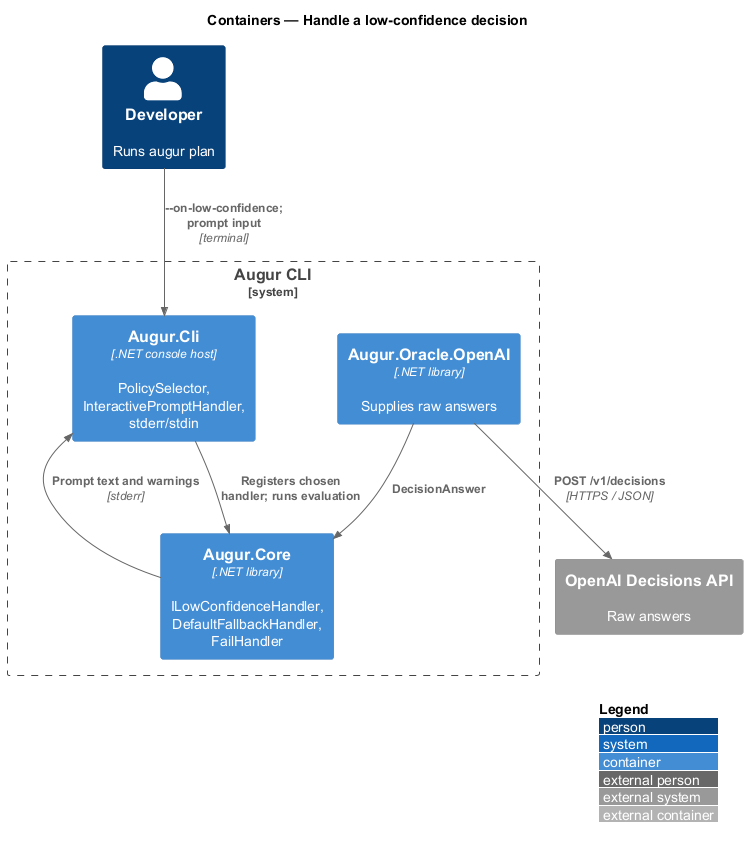
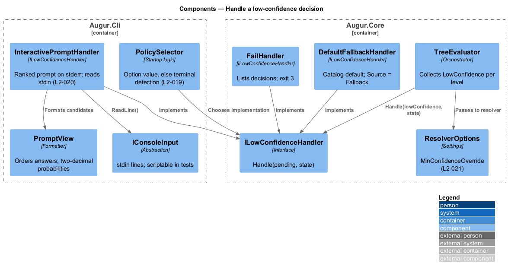
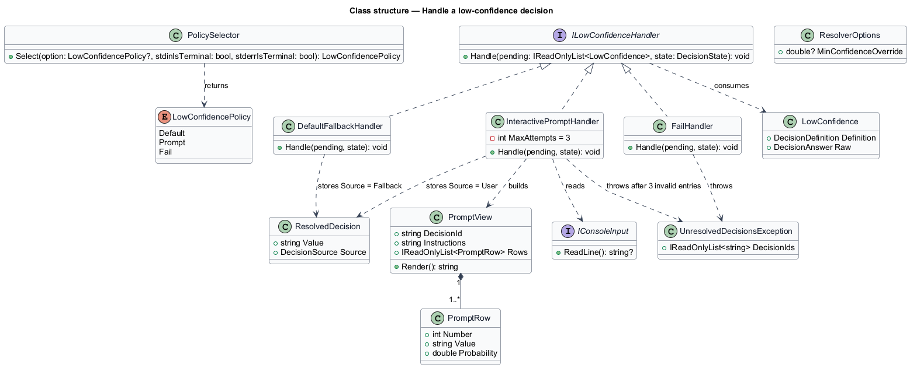
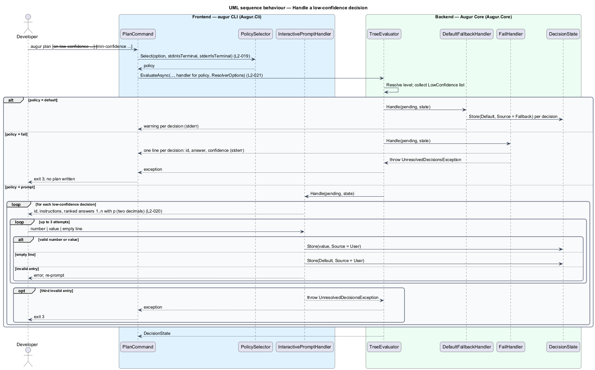

# Handle a low-confidence decision

## Overview

The OpenAI Decisions API returns a probability or confidence with every answer. When that number falls short of the catalog's threshold, or when the model picks the catch-all option `other`, Augur does not quietly take the top answer. The decision is *low-confidence* — answer that fails its threshold and cannot be used as returned — and this feature decides what happens next.

Augur offers three *low-confidence policies*, selected with `--on-low-confidence`:

- **`default`** — use the decision's catalog default and record source `fallback`, with a warning on stderr
- **`prompt`** — show the decision and its candidate answers on stderr, ranked by probability, and read the developer's choice from stdin; record source `user`
- **`fail`** — list every low-confidence decision in the current dependency level and exit with code 3 without writing a plan

When the option is omitted, Augur prompts if both stdin and stderr are terminals and fails otherwise, so an unattended script never hangs waiting for input. A fourth control, `--min-confidence`, raises or lowers the bar for every choice and score decision in the run; it does not touch predicate thresholds, which have their own upper and lower bounds.

The interactive prompt lists answers other than `other`, numbered from 1 in descending probability with each probability shown to two decimals. The developer types a number or the value itself; an empty line selects the default. Three invalid entries end the run with exit code 3.

## Description

Policy selection and the console prompt live in `Augur.Cli`; the handler interface and the default/fail handlers live in `Augur.Core`. Names are introduced by this design.

- **`LowConfidencePolicy`** — enum `Default`, `Prompt`, `Fail`.
- **`PolicySelector`** — resolves the effective policy. It returns the `--on-low-confidence` value when given; otherwise `Prompt` when `Console.IsInputRedirected` and `Console.IsErrorRedirected` are both false, else `Fail` (L2-019).
- **`ILowConfidenceHandler`** — interface with `Handle(IReadOnlyList<LowConfidence> pending, DecisionState state)`. `TreeEvaluator` calls it once per dependency level with every low-confidence resolution from that level, so a `fail` policy can report them all together.
- **`DefaultFallbackHandler`** — stores each decision's catalog `Default` as a `ResolvedDecision` with `Source = Fallback` and emits one warning line per decision through `ConsoleReporter`.
- **`FailHandler`** — writes one stderr line per low-confidence decision (id, returned answer, confidence or probability) and throws `UnresolvedDecisionsException`, which `PlanCommand` maps to exit code 3. No plan or lockfile is written.
- **`InteractivePromptHandler`** — for each decision, builds a `PromptView` from the `DecisionAnswer` and reads up to three lines from an `IConsoleInput`. Accepts a 1-based number or a value from the answer set; an empty line selects the default. Every accepted answer is stored with `Source = User` (L2-020). After the third invalid entry it throws `UnresolvedDecisionsException`.
- **`PromptView`** — formatting helper. It orders answers by probability descending, drops `other`, numbers from 1, and formats each probability with two decimals. For a predicate the two rows are `true` (p) and `false` (1 − p).
- **`IConsoleInput`** — thin abstraction over stdin so acceptance tests can feed scripted lines.
- **`ResolverOptions.MinConfidenceOverride`** — populated from `--min-confidence`, validated to [0, 1] at parse time (exit code 2 outside the range), and applied only to `ChoiceDefinition` and `ScoreDefinition` (L2-021).

The resolved value from any handler passes through `AnswerValidator` like every other answer, so a typed value that is not in the answer set is rejected rather than stored.

## Requirements

The feature realizes the following level-2 (L2) requirements. Each L2 requirement refines a level-1 (L1) requirement, cited by identifier.

| L2 ID | Refines (L1) | Requirement |
|-------|--------------|-------------|
| `L2-019` | `L1-006` | `--on-low-confidence <default\|prompt\|fail>` shall select how low-confidence decisions are resolved. When the option is omitted, the policy is `prompt` if stdin and stderr are both terminals, and `fail` otherwise. |
| `L2-020` | `L1-006` | Under the `prompt` policy, Augur shall write to stderr the decision id, its instructions, and its answers other than `other` numbered from 1 in descending order of returned probability (each with its probability formatted to two decimals), then read one line from stdin. The user can enter either the number or the value. An empty line selects the catalog default. After 3 invalid entries the command exits with code 3. |
| `L2-021` | `L1-006` | `--min-confidence <0..1>` shall replace the minimum confidence of every choice and score decision for the run. It shall not change predicate thresholds. |

## Diagrams

### System context

The developer may be asked to settle a decision the Decisions API could not; the choice never leaves the machine.

### Containers

The console prompt is a CLI-host concern; the fallback and fail handlers live in the core so they can run without a terminal.

### Components

`TreeEvaluator` hands each level's low-confidence resolutions to the handler chosen by `PolicySelector`.

### Class structure

Three handlers implement `ILowConfidenceHandler`; `InteractivePromptHandler` depends on `PromptView` and `IConsoleInput`.

### Behaviour — resolve low-confidence decisions in one level

The `alt` block covers the three policies (`L2-019`). The prompt branch shows the retry loop and the three ways an entry is accepted (`L2-020`).

