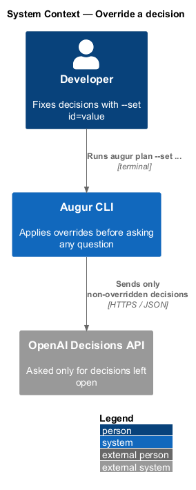
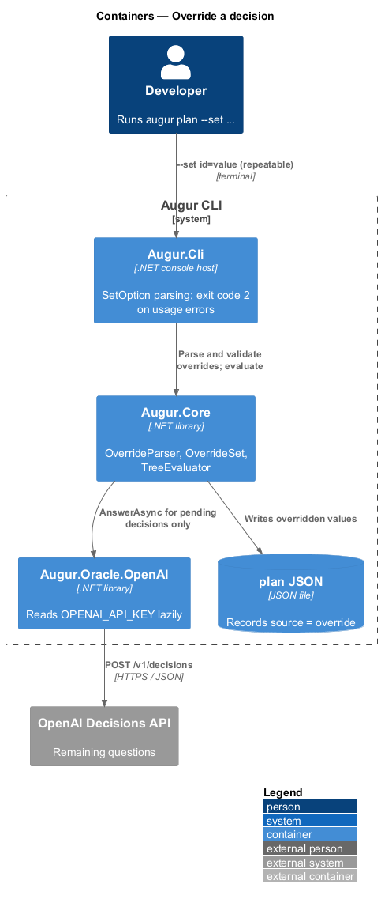
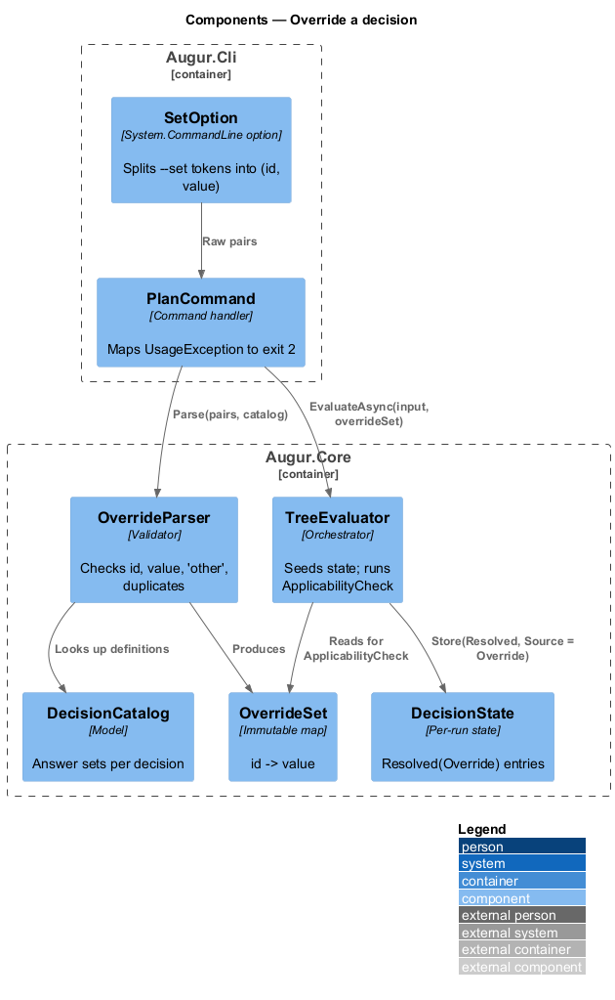
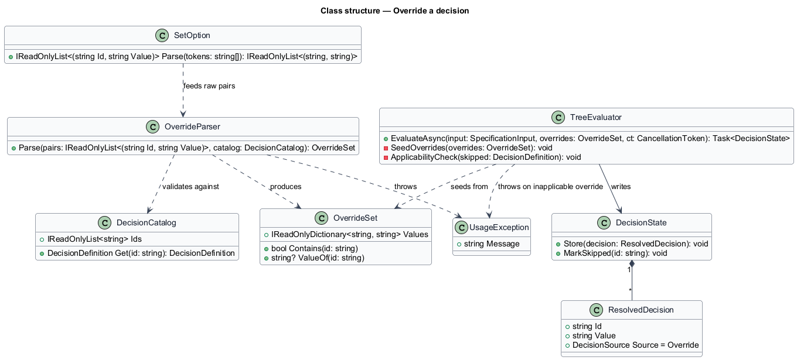
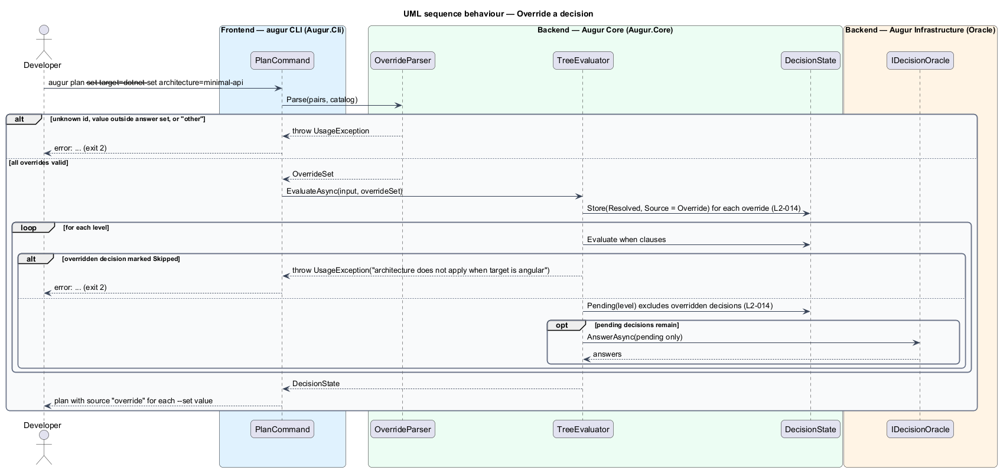

# Override a decision

## Overview

Augur normally lets the OpenAI Decisions API choose how to generate a project. Sometimes the developer already knows the answer: the team mandates PostgreSQL, or a continuous-integration job needs to produce a `minimal-api` solution without any model involvement. This feature covers the `--set <id>=<value>` option, which fixes one decision to one value before the behaviour tree runs.

An *override* — developer-supplied value for a catalog decision — is resolved deterministically. It is never sent to the Decisions API, it is recorded in the plan with source `override`, and it is not written to the lockfile, because it is not a recorded answer that needs replaying. Overrides take part in `when` evaluation exactly like any other resolved decision, so `--set target=dotnet` is enough to skip every Angular decision and save a request. When every applicable decision is overridden, the run needs no API key and makes no network request.

Overrides are validated against the *decision catalog* — versioned list of every decision Augur can make and its closed set of answers — before anything else happens. An unknown id, a value outside the answer set, the catch-all value `other`, or an override for a decision that does not apply under the other overrides each end the run with exit code 2 and a one-line error.

## Description

Parsing lives in `Augur.Cli`; validation and application live in `Augur.Core`. Names are introduced by this design.

- **`SetOption`** — System.CommandLine option definition for the repeatable `--set <id>=<value>` argument. It splits each token at the first `=` and yields raw `(id, value)` pairs; a token with no `=` is a usage error.
- **`OverrideParser`** — turns raw pairs into an `OverrideSet` against a `DecisionCatalog`. It rejects an id that is not a catalog decision (listing the valid ids), a value outside the decision's answer set (listing the allowed values), the value `other`, and a duplicate id. Predicate overrides accept `true` and `false`. Each rejection throws `UsageException`, which `PlanCommand` maps to exit code 2.
- **`OverrideSet`** — immutable map from decision id to value. `TreeEvaluator` seeds `DecisionState` from it before level 0 runs.
- **`ApplicabilityCheck`** — step inside `TreeEvaluator`. When `when` evaluation marks a decision `Skipped` and that decision has an override, the run stops with a `UsageException` naming the decision and the dependency value that excluded it (L2-014 criterion 7). The check runs at the level where the dependency becomes known, so `--set target=angular --set architecture=minimal-api` fails before any request is sent.
- **`ResolvedDecision`** with `Source = Override` — the stored form. `PlanWriter` emits it into `decisions.<id>.source` as `override`; `LockfileStore` filters it out (L2-022).
- **`ApiKeyProvider`** (in `Augur.Oracle.OpenAI`) — reads `OPENAI_API_KEY` lazily, on the first request that reaches the API. A run in which every pending decision is overridden never triggers the read, so an unset key is not an error (L2-014 criterion 6).

## Requirements

The feature realizes the following level-2 (L2) requirements. Each L2 requirement refines a level-1 (L1) requirement, cited by identifier.

| L2 ID | Refines (L1) | Requirement |
|-------|--------------|-------------|
| `L2-014` | `L1-004` | `--set <id>=<value>` (repeatable) shall resolve a decision deterministically without calling any oracle. Overridden decisions are recorded with source `override`. Overrides also determine `when` clauses of dependent decisions. |

## Diagrams

### System context

The developer supplies overrides on the command line; the Decisions API is consulted only for decisions that remain open.

### Containers

Overrides are parsed in the CLI host, validated against the catalog in the core, and applied before the oracle is reached.

### Components

`OverrideParser` produces an `OverrideSet`; `TreeEvaluator` seeds `DecisionState` from it and runs `ApplicabilityCheck` as `when` clauses resolve.

### Class structure

`OverrideParser` depends on `DecisionCatalog` for validation and produces an `OverrideSet` that `TreeEvaluator` consumes.

### Behaviour — apply overrides

Validation failures end the run with exit code 2 before any request. Valid overrides are stored with source `override`, shape `when` evaluation, and are excluded from every oracle batch (`L2-014`).

