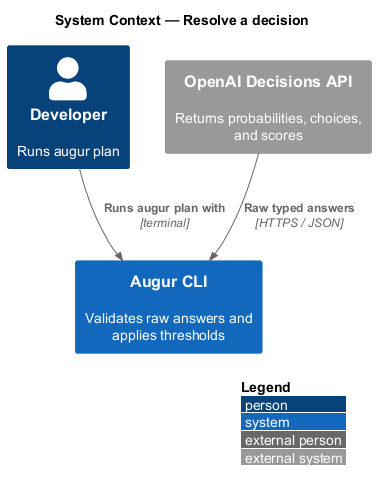
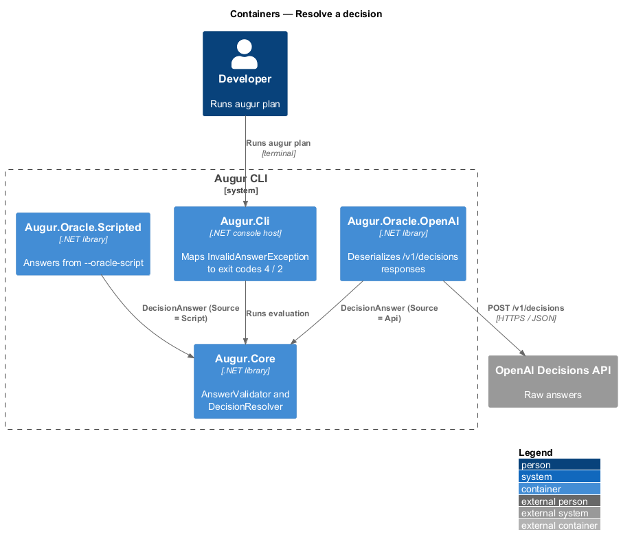
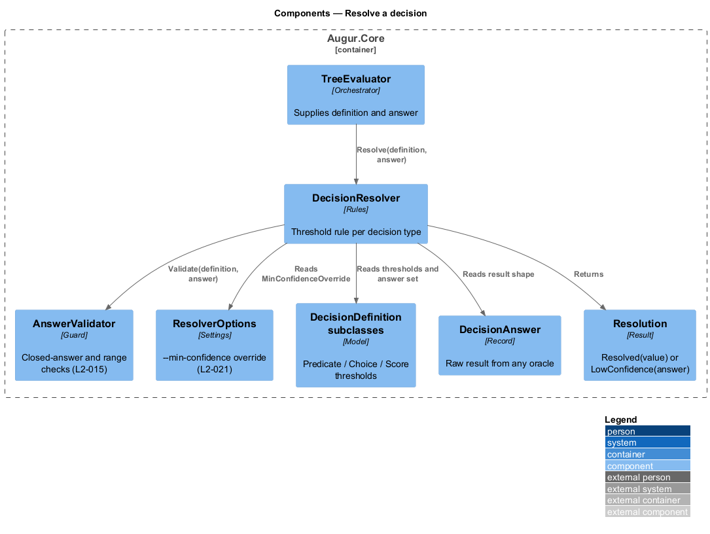
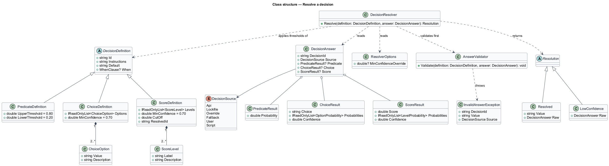
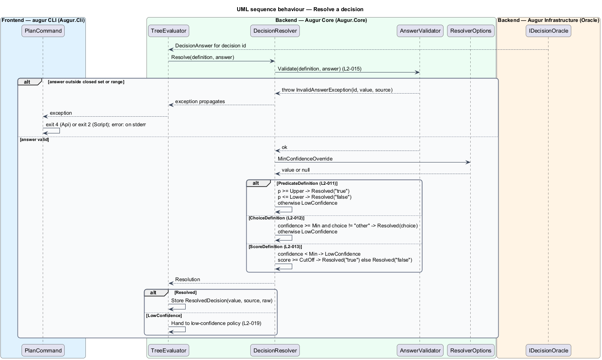

# Resolve a decision

## Overview

Augur asks the OpenAI Decisions API typed questions about a specification. The API does not return code or free text; it returns numbers: a probability that a condition holds, a chosen option with a probability for each option and an overall confidence, or a score positioned among ordered levels. This feature covers how Augur turns one of those raw answers into a *resolved decision* — concrete value from the decision's closed answer set, or a declaration that the answer is not trustworthy enough to use.

Each decision in the catalog has one of three types, matching the three Decisions API question types:

- **predicate decision** — yes/no question answered by a probability from 0 to 1
- **choice decision** — selection of one option from a fixed list, answered by a `choice`, a probability per option, and a `confidence`
- **score decision** — placement on an ordered scale, answered by a continuous `score` (a probability-weighted average of level indices), a probability per level, and a `confidence`

A *threshold* decides whether an answer is strong enough. A predicate has an upper and a lower threshold: at or above the upper it is `true`, at or below the lower it is `false`, and anything between is *low-confidence*. Choice and score decisions have a minimum confidence; below it, or when the model picks the catch-all option `other`, the decision is low-confidence. Low-confidence decisions are handed to the low-confidence policy, described in the handle-low-confidence design.

Before any threshold is applied, the answer is checked against the decision's definition. A choice that is not in the option list, a probability outside 0 to 1, or a score outside the level range is rejected outright, whatever its source (L2-015). This closed-answer check is what keeps model output from ever steering Augur toward something the generator does not support.

## Description

All components live in `Augur.Core`. Names are introduced by this design.

- **`PredicateDefinition`** — `DecisionDefinition` for a yes/no decision. Holds `UpperThreshold` (default 0.80) and `LowerThreshold` (default 0.20).
- **`ChoiceDefinition`** — `DecisionDefinition` for a pick-one decision. Holds an ordered list of `ChoiceOption` (`Value`, `Description`) that always includes `other`, and `MinConfidence` (default 0.70).
- **`ScoreDefinition`** — `DecisionDefinition` for a scaled decision. Holds an ordered list of `ScoreLevel` (`Label`, `Description`), `MinConfidence` (default 0.70), a `CutOff` score, and `ResolvedId` — the plan key the decision resolves to (for `domain-complexity`, `cqrs`). The resolved value is `true` when `score >= CutOff`.
- **`DecisionAnswer`** — raw result record returned by any `IDecisionOracle`. Exactly one of `PredicateResult` (`Probability`), `ChoiceResult` (`Choice`, `Probabilities`, `Confidence`), or `ScoreResult` (`Score`, `Probabilities`, `Confidence`) is set, and `Source` records where it came from.
- **`AnswerValidator`** — enforces L2-015. It checks that the result shape matches the definition type, that every probability and confidence lies in [0, 1], that a choice is a member of the option list, and that a score lies in [0, levels − 1]. On failure it throws `InvalidAnswerException` carrying the decision id, the offending value, and the source; `PlanCommand` maps the exception to exit code 4 for an API source and 2 for a script source.
- **`ResolverOptions`** — per-run settings. `MinConfidenceOverride` (from `--min-confidence`) replaces `MinConfidence` on every choice and score definition and leaves predicate thresholds unchanged (L2-021).
- **`DecisionResolver`** — applies validation and then the type-specific threshold rule. It returns a `Resolution`: `Resolved(value)` or `LowConfidence(answer)`.
- **`Resolution`** — discriminated result. `Resolved` carries the value and the `DecisionAnswer` for the lockfile; `LowConfidence` carries the answer so the policy can display probabilities.
- **`ResolvedDecision`** — the stored outcome: `Id`, `Value`, `Source`, raw `DecisionAnswer`, `QuestionHash`, `ResolvedAt`.

Threshold comparisons are inclusive as the requirements state them: probability 0.80 resolves `true`, 0.20 resolves `false`, confidence 0.70 is accepted, score 2.0 crosses a cut-off of 2.0.

## Requirements

The feature realizes the following level-2 (L2) requirements. Each L2 requirement refines a level-1 (L1) requirement, cited by identifier.

| L2 ID | Refines (L1) | Requirement |
|-------|--------------|-------------|
| `L2-011` | `L1-004` | A predicate decision has an upper threshold (default 0.80) and a lower threshold (default 0.20). It resolves to `true` when probability >= upper, to `false` when probability <= lower, and is low-confidence otherwise. |
| `L2-012` | `L1-004` | A choice decision has a minimum confidence (default 0.70). It resolves to the returned `choice` when `confidence` >= the minimum and the choice is not `other`; otherwise it is low-confidence. |
| `L2-013` | `L1-004` | A score decision has a minimum confidence (default 0.70) and a cut-off that maps the continuous score to its resolved value. For `domain-complexity`, `cqrs` is `true` when score >= 2.0. |
| `L2-015` | `L1-004` | An answer from any source (API, lockfile, script, user) that is not a member of the decision's answer set, or a probability, confidence, or score outside its valid range, shall be rejected and never used. |

## Diagrams

### System context

Resolution is internal to Augur; the only external party is the Decisions API that supplies raw answers.

### Containers

Raw answers arrive from `Augur.Oracle.OpenAI` (or a scripted oracle) and are resolved inside `Augur.Core` before anything is recorded.

### Components

`DecisionResolver` first calls `AnswerValidator`, then applies the rule for the definition's type, reading `ResolverOptions` for any confidence override.

### Class structure

The three `DecisionDefinition` subclasses carry their thresholds; `DecisionAnswer` carries one of three result shapes; `DecisionResolver` maps the pair to a `Resolution`.

### Behaviour — resolve one answer

Validation runs first (`L2-015`); the `alt` block then shows the predicate (`L2-011`), choice (`L2-012`), and score (`L2-013`) rules, each ending in `Resolved` or `LowConfidence`.

