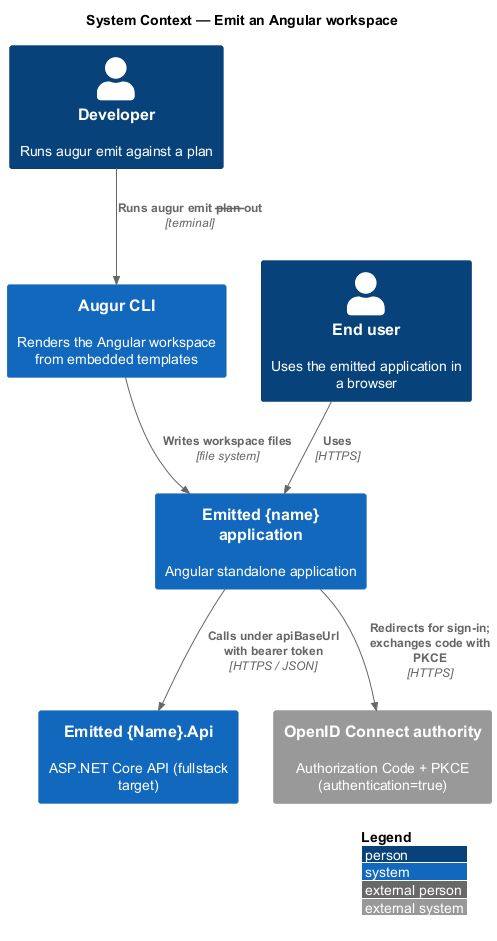
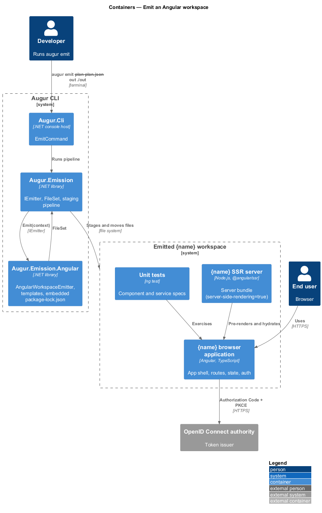
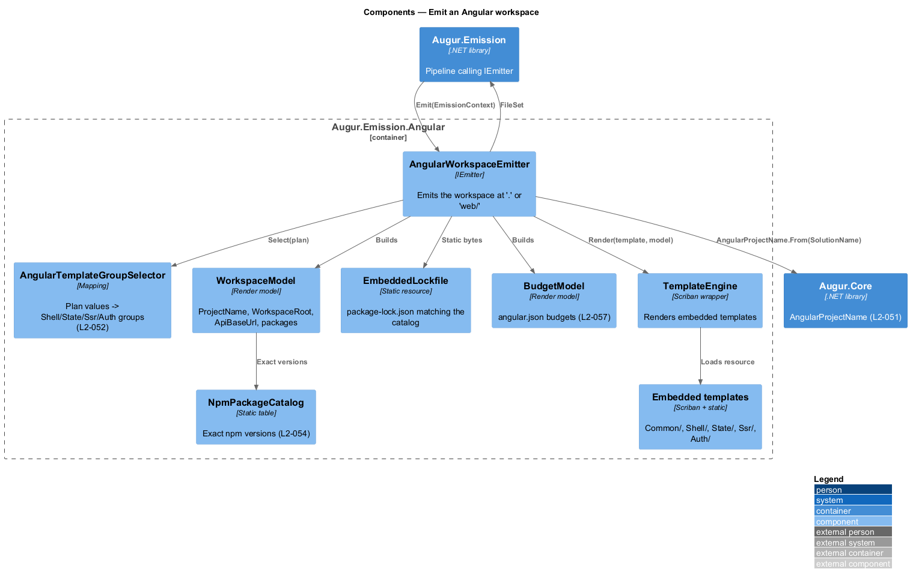
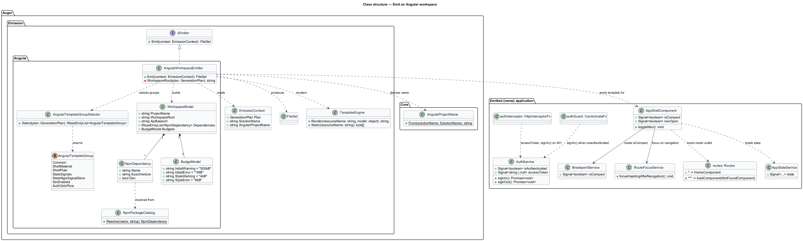
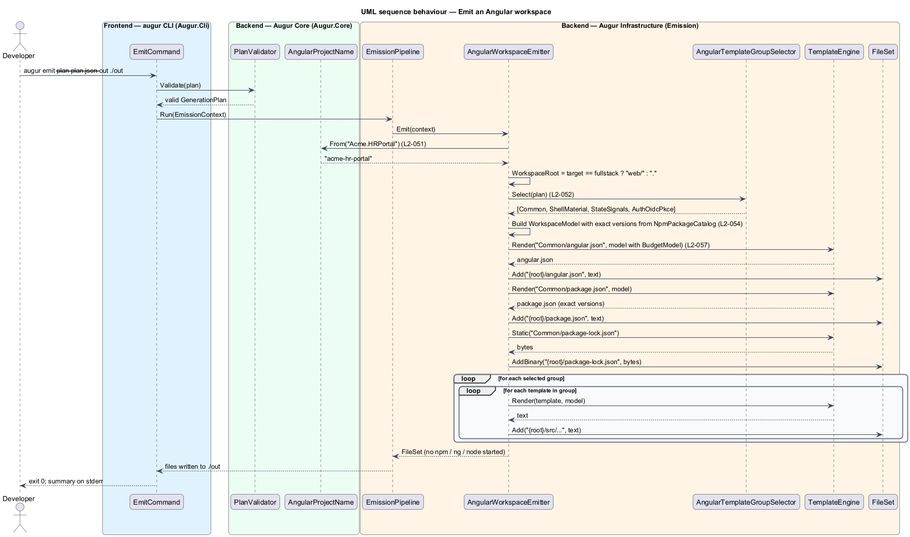
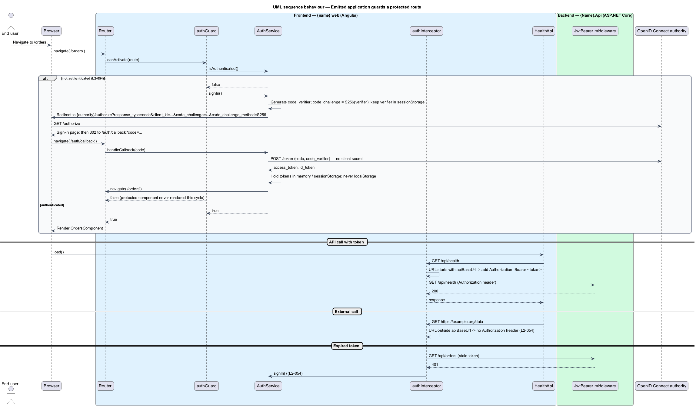
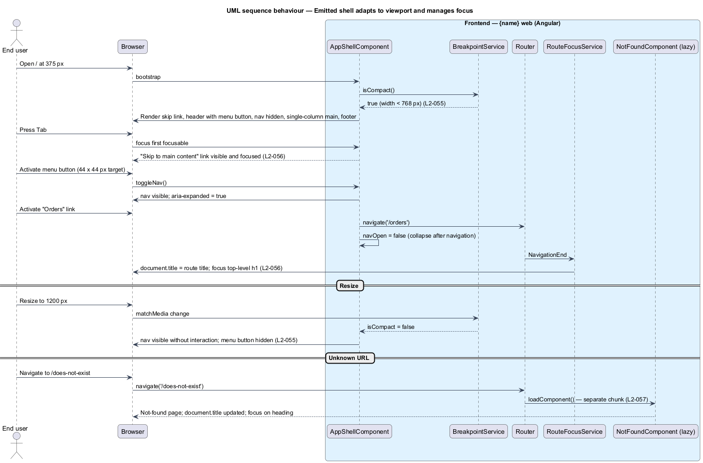

# Emit an Angular workspace

## Overview

When the generation plan's `target` is `angular` or `fullstack`, Augur emits an *Angular workspace* — directory holding `angular.json`, `package.json`, a lock file, and one application project — that builds with the Angular CLI and passes its own tests on first run. This feature covers the Angular emitter and the application it produces: its shell, its routes, its state and UI library choices, its security defaults, and the responsive, accessible, and performant behaviour the emitted user interface exhibits.

The application name is derived from the plan's `solutionName` by a fixed rule (L2-051): each dot-separated segment is split into words at every lower-case-or-digit-to-upper-case boundary and before the last upper-case letter of an upper-case run that a lower-case letter follows, the words are lower-cased, and all words are joined with `-`. `Acme.HRPortal` becomes `acme-hr-portal`; `Contoso2Web` becomes `contoso2-web`.

Four plan decisions shape the workspace. `ui-library` chooses between Angular Material and plain HTML and CSS for the *app shell* — persistent header, navigation, main content region, and footer that frame every page. `state-management` chooses between plain Angular signals in injectable services and an `@ngrx/signals` store. `server-side-rendering` adds `@angular/ssr` and a server bundle. `authentication` adds sign-in and sign-out views, a route guard, and an HTTP interceptor built on the OpenID Connect Authorization Code flow with PKCE.

Regardless of those choices, the emitted application uses standalone components only, compiles under strict TypeScript and strict templates, pins every npm dependency to an exact version, ships its own `package-lock.json`, lazy-loads every route but home, enforces bundle budgets, collapses navigation behind a menu button below 768 px, never scrolls horizontally between 320 px and 2560 px, and conforms to WCAG 2.2 level AA. Like the .NET emitter, it never runs `npm`, `node`, or `ng`; every file comes from an embedded template or static resource (ADR backend/0002).

## Description

The emitter lives in `Augur.Emission.Angular` and shares `IEmitter`, `EmissionContext`, `FileSet`, and `TemplateEngine` with the .NET emitter (see [../emit-dotnet-solution/README.md](../emit-dotnet-solution/README.md) and [../emit-output/README.md](../emit-output/README.md)). Names below are introduced by this design; emitted names use `{name}` for the derived Angular project name.

### Emitter components

- **`AngularProjectName`** — value object in `Augur.Core` implementing the L2-051 derivation. `From(SolutionName)` returns the kebab-case name; the four examples in the requirement are its unit tests.
- **`AngularWorkspaceEmitter`** — `IEmitter` for the `angular` and `fullstack` targets. It computes the workspace root (`.` for `angular`, `web/` for `fullstack`), selects template groups, renders the workspace, and returns a `FileSet`.
- **`AngularTemplateGroupSelector`** — maps plan values to groups: `Shell/Material`, `Shell/Plain`, `State/Signals`, `State/NgrxSignalStore`, `Ssr/Enabled`, `Auth/OidcPkce`, and `Common` (always).
- **`WorkspaceModel`** — rendering model: `ProjectName`, `WorkspaceRoot`, `ApiBaseUrl` (`/api` for `fullstack`, `<TO SUPPLY>` for standalone `angular`), the selected groups, and the exact dependency list.
- **`NpmPackageCatalog`** — static table of every npm dependency with its exact version. The Angular major version and all package versions are `<TO SUPPLY>` at release time; the release pipeline runs `npm audit --omit=dev --audit-level=high` and regenerates the embedded `package-lock.json` whenever the table changes.
- **`EmbeddedLockfile`** — static resource `package-lock.json` matching `NpmPackageCatalog` byte-for-byte, copied without rendering.
- **`BudgetModel`** — the `angular.json` production budgets: initial bundle 500 kB warning / 1 MB error; any component style 4 kB warning / 8 kB error (L2-057).

### Emitted workspace

| Plan value | Emitted |
|------------|---------|
| `target=angular` | Workspace at the output root |
| `target=fullstack` | Workspace at `web/` |
| `ui-library=angular-material` | `@angular/material`, an application theme, `AppShellComponent` built from `MatToolbar` and `MatSidenav` |
| `ui-library=none` | No `@angular/material`; `AppShellComponent` built from semantic HTML and CSS Grid |
| `state-management=signals` | `AppStateService` holding `signal()`s; no `@ngrx/*` |
| `state-management=ngrx-signal-store` | `AppStore` built with `signalStore` from `@ngrx/signals` |
| `server-side-rendering=true` | `@angular/ssr`, `server.ts`, `main.server.ts`; production build emits a server bundle |
| `authentication=true` | `AuthService`, `authGuard`, `authInterceptor`, `SignInComponent`, `SignOutComponent` |
| always | Standalone components; `strict` and `strictTemplates`; `AppShellComponent`; `HomeComponent` (eager); `NotFoundComponent` (lazy, wildcard route); unit tests; exact-version `package.json`; `package-lock.json`; `.editorconfig`; `.gitignore`; `engines.node` |

Key emitted types:

- **`AppShellComponent`** — root standalone component rendering a skip link, `header` (banner landmark) with the menu button and `nav`, `main` with the router outlet, and `footer`. A `BreakpointService` exposes a `isCompact` signal (true below 768 px) that collapses navigation behind the menu button and switches the layout to a single column (L2-055). Interactive elements are at least 44 × 44 CSS pixels; body text is at least 16 px. All transitions are wrapped in `@media (prefers-reduced-motion: no-preference)`.
- **`routes`** — `''` → `HomeComponent`, every other route via `loadComponent`, `'**'` → `NotFoundComponent`. Each route carries a `title` so `document.title` changes per route; a `RouteFocusService` moves focus to the route's top-level heading after navigation (L2-056).
- **`HomeComponent`** — landing page. For `fullstack` it calls `GET /api/health` through `HealthApi` and shows `API: Healthy` or `API: Unavailable` (see [../wire-fullstack/README.md](../wire-fullstack/README.md)).
- **`AppStateService`** / **`AppStore`** — the state holder selected by `state-management`.
- **`AuthService`** — wraps an OIDC client library (`<TO SUPPLY>`) configured with `authority` and `clientId` from `environment.ts`. It starts the Authorization Code flow with PKCE `S256`, keeps tokens in memory with `sessionStorage` as the only persistence, and exposes `isAuthenticated` and `accessToken` signals. No client secret exists in the workspace (L2-054).
- **`authGuard`** — `CanActivateFn` that calls `AuthService.signIn()` and returns `false` for unauthenticated users, so the protected component never renders.
- **`authInterceptor`** — `HttpInterceptorFn` that adds `Authorization: Bearer <token>` only when the request URL starts with `environment.apiBaseUrl`, and calls `AuthService.signIn()` on a 401 response.
- **Templates** — contain no `[innerHTML]` binding; code contains no `bypassSecurityTrust*` call.

## Requirements

The feature realizes the following level-2 (L2) requirements. Each L2 requirement refines a level-1 (L1) requirement, cited by identifier.

| L2 ID | Refines (L1) | Requirement |
|-------|--------------|-------------|
| `L2-031` | `L1-009` | Emitted code shall build with zero errors and zero warnings, and its tests shall pass. For .NET output this means `dotnet build` and `dotnet test`; for Angular output it means `npm ci`, `ng build` (production configuration), and `ng test` (single headless run). This shall hold for every valid combination of decision values for the `dotnet` and `angular` targets, and for a pairwise-covering set of `fullstack` plans in which every pair of values from two different decisions appears in at least one plan. |
| `L2-051` | `L1-008` | When the plan's `target` is `fullstack` or `angular`, the Angular workspace and application name shall be derived from `solutionName` by splitting each dot-separated segment into words at every lower-case-or-digit-to-upper-case boundary and before the last upper-case letter of an upper-case run that is followed by a lower-case letter, lower-casing every word, and joining all words with `-`. |
| `L2-052` | `L1-009` | When the plan's `target` is `fullstack` or `angular`, `augur emit` shall produce an Angular workspace containing one application named as in L2-051, built on the single Angular major version pinned by the Augur release. The workspace location and features depend on the plan: |
| `L2-054` | `L1-012` | Emitted Angular workspaces shall contain no secrets, shall pin every npm dependency to an exact version, and shall have no known high or critical vulnerabilities in production dependencies at release time. Templates shall not bind to `innerHTML` and code shall not call any `DomSanitizer.bypassSecurityTrust*` method. With `authentication=true`: |
| `L2-055` | `L1-015` | The emitted Angular app shell and pages shall adapt to these viewport widths: extra small (< 576 px), small (>= 576 px), medium (>= 768 px), large (>= 992 px), and extra large (>= 1200 px). Below 768 px, navigation shall be collapsed behind a menu button in the header and the content shall be a single column. At 768 px and above, navigation shall be visible without interaction. No page shall scroll horizontally at any width from 320 px to 2560 px. This applies to both `ui-library` values. |
| `L2-056` | `L1-015` | The emitted Angular app shell and pages (home, not-found, and sign-in and sign-out views when `authentication=true`) shall conform to WCAG 2.2 level AA. |
| `L2-057` | `L1-013` | Emitted Angular workspaces shall configure production budgets in `angular.json` of 500 kB (warning) and 1 MB (error) for the initial bundle, and 4 kB (warning) and 8 kB (error) for any component stylesheet. Every route other than the home route shall be lazy-loaded. The production build of the home page shall meet the Core Web Vitals "good" thresholds. |

The feature table that follows the `L2-052` paragraph and the authentication list that follows the `L2-054` paragraph are reproduced in the Description above.

## Diagrams

### System context

The developer runs `augur emit`; Augur writes the workspace. The emitted application, once served, talks to the API it was generated alongside and, when authentication is on, to an OpenID Connect authority.

### Containers

`Augur.Emission.Angular` renders the workspace into a `FileSet`. The emitted application is shown as its own system boundary, with the browser-side application and the optional SSR server as containers.

### Components

`AngularWorkspaceEmitter` derives the project name, selects template groups, resolves exact package versions, and renders every file, including the embedded lock file and `angular.json` budgets.

### Class structure

Emitter classes on the left; the key emitted Angular types — shell, routes, state holder, and the authentication trio — on the right.

### Behaviour — emit the workspace

The emitter computes the name and root, selects groups, renders the files, and returns a `FileSet` (`L2-051`, `L2-052`). No external process runs.

### Behaviour — emitted application guards a protected route

An unauthenticated navigation is intercepted by `authGuard`, which starts the PKCE flow; the interceptor attaches the bearer token only to API calls and restarts sign-in on 401 (`L2-054`).

### Behaviour — emitted shell adapts to viewport and manages focus

On a narrow viewport the shell hides navigation behind the menu button; on route change it updates `document.title` and moves focus to the page heading (`L2-055`, `L2-056`).

