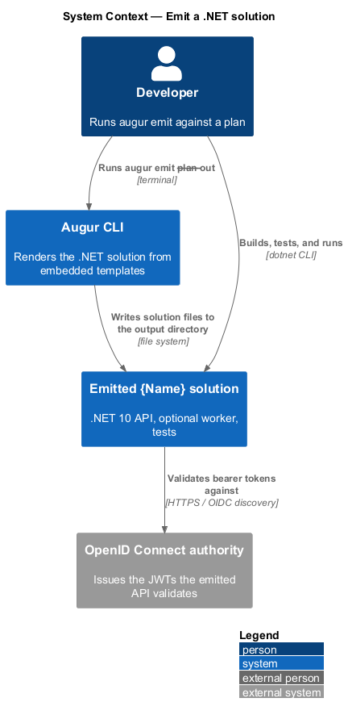
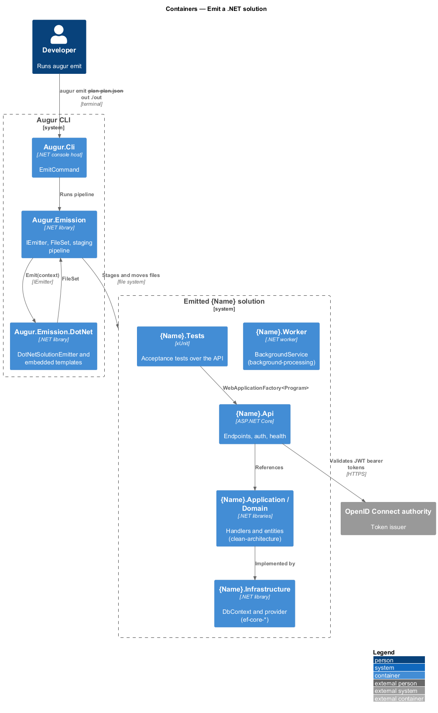
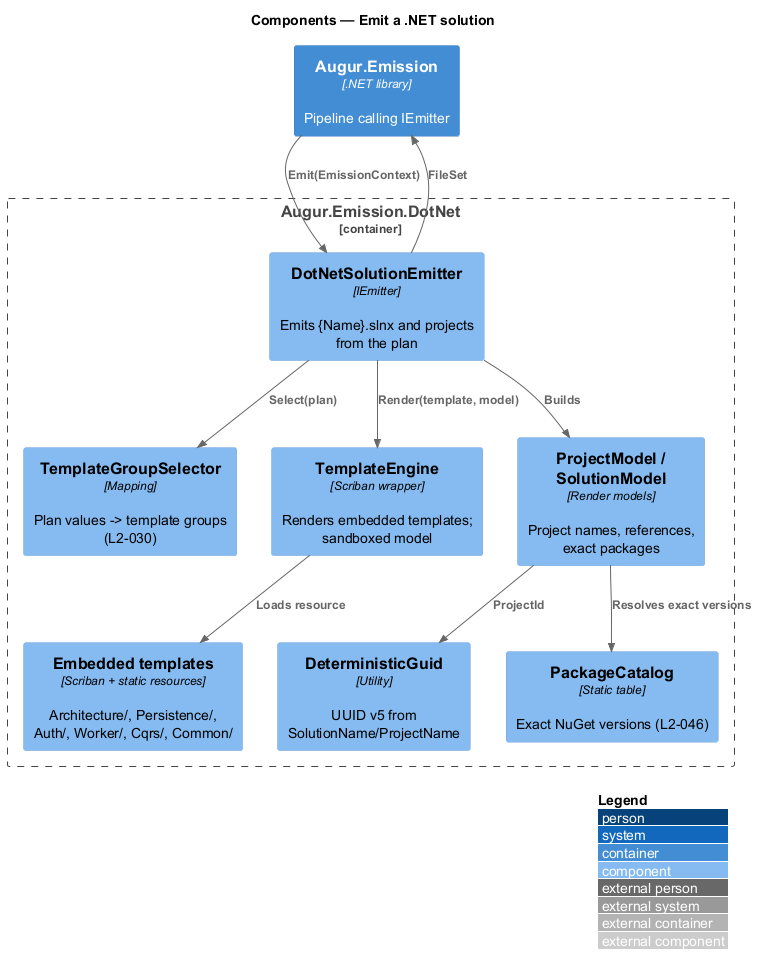
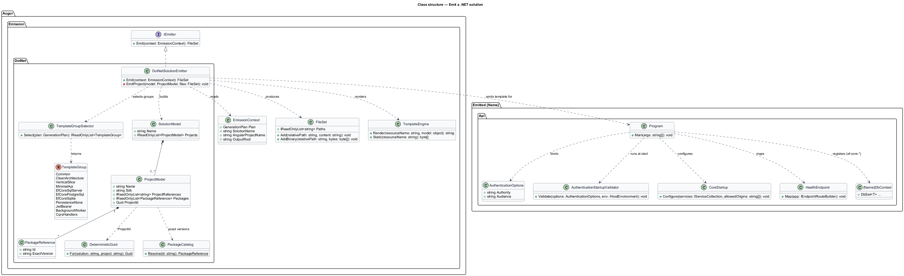
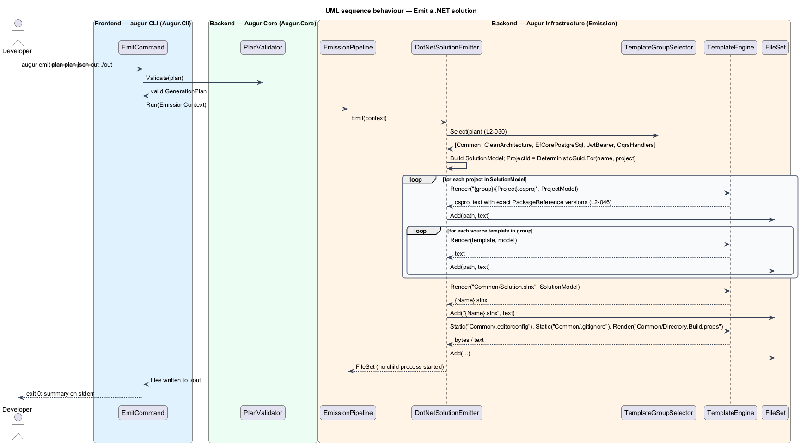
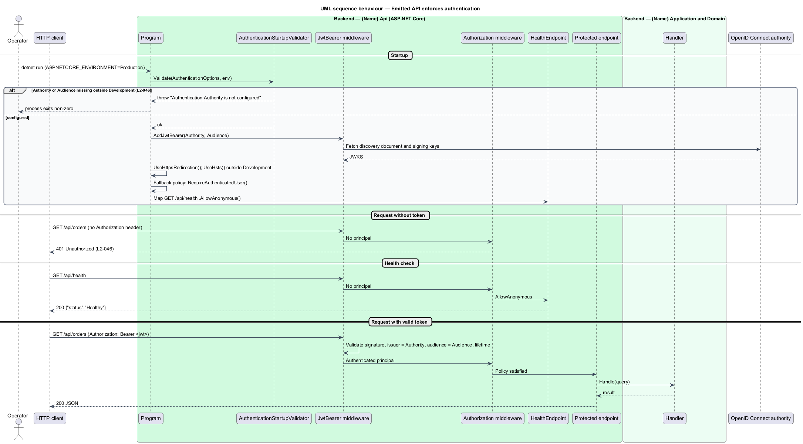

# Emit a .NET solution

## Overview

Augur turns a validated *generation plan* — typed record of every resolved decision for one run — into source code without any model involvement. When the plan's `target` is `dotnet` or `fullstack`, the .NET emitter produces a complete .NET 10 solution: the solution file, one project per architectural role the plan calls for, a test project, and the repository hygiene files a new codebase needs. This feature covers that emitter and the solution it produces.

The emitter is a *template-driven emitter* — component that renders text files from templates embedded in its own assembly, selected by plan values. It never starts `dotnet`, never reads the network, and never consults the model; the plan and the solution name are its only inputs (ADR backend/0002). Each decision value selects a *template group* — named set of templates and static files that together realize one decision value. `architecture=clean-architecture` selects the four-project layout; `persistence=ef-core-postgresql` adds a `DbContext`, the PostgreSQL provider package, and a connection-string entry; `authentication=true` adds JWT bearer validation and a default authorization policy.

The emitted solution is production-shaped from the first build. Nullable reference types and warnings-as-errors are on for every project, every package reference is pinned to an exact version, and the API refuses to start in a non-development environment when security configuration is missing. Every valid combination of `dotnet` decision values builds with zero warnings and passes its tests before an Augur release ships (L2-031).

## Description

The emitter lives in `Augur.Emission.DotNet` and builds on the shared emission pipeline in `Augur.Emission` (see [../emit-output/README.md](../emit-output/README.md)). Names below are introduced by this design; emitted type names are shown with `{Name}` standing for the plan's `solutionName`.

### Emitter components

- **`IEmitter`** — interface in `Augur.Emission`: `Emit(EmissionContext context): FileSet`. The .NET, Angular, and fullstack emitters implement it.
- **`EmissionContext`** — immutable input: `Plan` (`GenerationPlan`), `SolutionName`, `AngularProjectName`, and `OutputRoot`. Nothing else reaches a template.
- **`FileSet`** — ordered map from relative path to normalized bytes (UTF-8 without BOM, LF line endings). The pipeline stages and moves it atomically.
- **`TemplateEngine`** — Scriban wrapper. `Render(resourceName, model)` loads an embedded template, renders it with a sandboxed model limited to `Plan`, `SolutionName`, and `AngularProjectName`, and returns text. Static resources are copied byte-for-byte.
- **`DotNetSolutionEmitter`** — `IEmitter` for the `dotnet` and `fullstack` targets. It selects template groups from plan values, renders each project, and composes the solution file.
- **`TemplateGroupSelector`** — maps plan values to template groups: `Architecture/CleanArchitecture`, `Architecture/VerticalSlice`, `Architecture/MinimalApi`, `Persistence/EfCore{Provider}`, `Persistence/None`, `Auth/JwtBearer`, `Worker/BackgroundService`, `Cqrs/Handlers`, and `Common` (always).
- **`ProjectModel`** — rendering model for one `.csproj`: project name, SDK, project references, exact `PackageReference` list, and default namespace.
- **`SolutionModel`** — rendering model for `{Name}.slnx`: the list of `ProjectModel`s and their deterministic identifiers.
- **`DeterministicGuid`** — derives a version-5 UUID from `SolutionName/ProjectName` so solution and project identifiers are byte-identical on every machine.
- **`PackageCatalog`** — static table of the NuGet packages the templates reference, each with an exact version. Versions are `<TO SUPPLY>` at release time and are verified vulnerability-free by `dotnet list package --vulnerable --include-transitive` in the release pipeline.

### Emitted solution

The project set depends on the plan (L2-030):

| Plan value | Emitted |
|------------|---------|
| `architecture=clean-architecture` | `{Name}.Domain`, `{Name}.Application`, `{Name}.Infrastructure`, `{Name}.Api` |
| `architecture=vertical-slice` | `{Name}.Api` with a `Features/` folder per slice |
| `architecture=minimal-api` | `{Name}.Api` with minimal-API endpoints only |
| `persistence=ef-core-sqlserver` / `ef-core-postgresql` / `ef-core-sqlite` | `{Name}DbContext`, the provider package, `ConnectionStrings:Default` in `appsettings.json` |
| `persistence=none` | No EF Core reference anywhere |
| `authentication=true` | JWT bearer authentication; fallback authorization policy requiring an authenticated user |
| `background-processing=true` | `{Name}.Worker` hosting a `BackgroundService` |
| `cqrs=true` | `Commands/` and `Queries/` handler folders in the application layer |
| always | `{Name}.slnx`, `{Name}.Tests`, `Directory.Build.props`, `.editorconfig`, `.gitignore` |

Key emitted types:

- **`Program`** (in `{Name}.Api`) — minimal hosting entry point. It registers services according to the plan, adds HTTPS redirection and HSTS outside `Development`, maps `GET /api/health` as anonymous, and applies `RequireAuthorization()` to every other endpoint group when `authentication=true`.
- **`AuthenticationOptions`** — bound from the `Authentication` configuration section with `Authority` and `Audience`. `AuthenticationStartupValidator` runs at host start and throws when either is empty and the environment is not `Development`, so the process exits non-zero with a message naming the missing setting (L2-046).
- **`CorsStartup`** — reads `Cors:AllowedOrigins`. CORS middleware is registered only when the list is non-empty, and the policy is built with `WithOrigins(...)`; `AllowAnyOrigin` is never emitted.
- **`HealthEndpoint`** — maps `GET /api/health` returning `200 {"status":"Healthy"}` with `AllowAnonymous()`.
- **`{Name}DbContext`** — EF Core context emitted for any `ef-core-*` value, configured with the chosen provider and `ConnectionStrings:Default`.
- **`Worker`** — `BackgroundService` subclass in `{Name}.Worker` with a cancellation-aware `ExecuteAsync` loop.
- **`{Name}.Tests`** — xUnit acceptance tests using `WebApplicationFactory<Program>`; they assert `GET /api/health` returns 200 and, when `authentication=true`, that an unauthenticated request to a protected endpoint returns 401.

## Requirements

The feature realizes the following level-2 (L2) requirements. Each L2 requirement refines a level-1 (L1) requirement, cited by identifier.

| L2 ID | Refines (L1) | Requirement |
|-------|--------------|-------------|
| `L2-030` | `L1-009` | When the plan's `target` is `fullstack` or `dotnet`, `augur emit` shall produce a .NET 10 solution file `{Name}.slnx` at the root of the output directory, with projects that depend on the plan: |
| `L2-031` | `L1-009` | Emitted code shall build with zero errors and zero warnings, and its tests shall pass. For .NET output this means `dotnet build` and `dotnet test`; for Angular output it means `npm ci`, `ng build` (production configuration), and `ng test` (single headless run). This shall hold for every valid combination of decision values for the `dotnet` and `angular` targets, and for a pairwise-covering set of `fullstack` plans in which every pair of values from two different decisions appears in at least one plan. |
| `L2-046` | `L1-012` | Emitted .NET solutions shall contain no secrets, shall pin every NuGet package to an exact version, and shall have no known vulnerable packages at release time. With `authentication=true`, the API shall validate JWT bearer tokens against an OpenID Connect authority and audience read from configuration (`Authentication:Authority`, `Authentication:Audience`), shall refuse to start outside the `Development` environment when either is missing, and every endpoint shall require an authenticated user unless explicitly marked anonymous (`GET /api/health` is anonymous). Emitted APIs shall enforce HTTPS redirection and HSTS outside `Development`, shall not enable CORS unless allowed origins are listed in configuration, and shall never allow any origin by wildcard. |

The project table that follows the `L2-030` paragraph in the specification is reproduced in the Description above.

## Diagrams

### System context

The developer runs `augur emit`; Augur writes the solution to the output directory. The emitted API, once running, validates tokens against an external OpenID Connect authority.

### Containers

Inside Augur, `Augur.Emission.DotNet` renders templates into a `FileSet` that the shared pipeline writes. The emitted solution is shown as a second system boundary with its projects as containers.

### Components

`DotNetSolutionEmitter` asks `TemplateGroupSelector` which groups apply, renders each through `TemplateEngine`, derives identifiers with `DeterministicGuid`, and assembles the `FileSet`.

### Class structure

The left half shows the emitter classes; the right half shows the key types the templates emit into `{Name}.Api`.

### Behaviour — emit the solution

The emitter selects template groups from the plan, renders every project, and returns one `FileSet` to the pipeline (`L2-030`). No external process runs.

### Behaviour — emitted API enforces authentication

In the emitted API, startup validation refuses to run without an authority outside `Development`; at run time an unauthenticated request to a protected endpoint returns 401 while `GET /api/health` stays open (`L2-046`).

