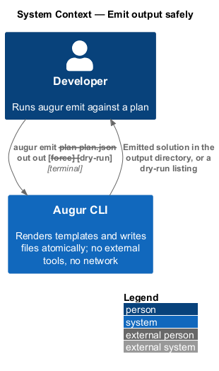
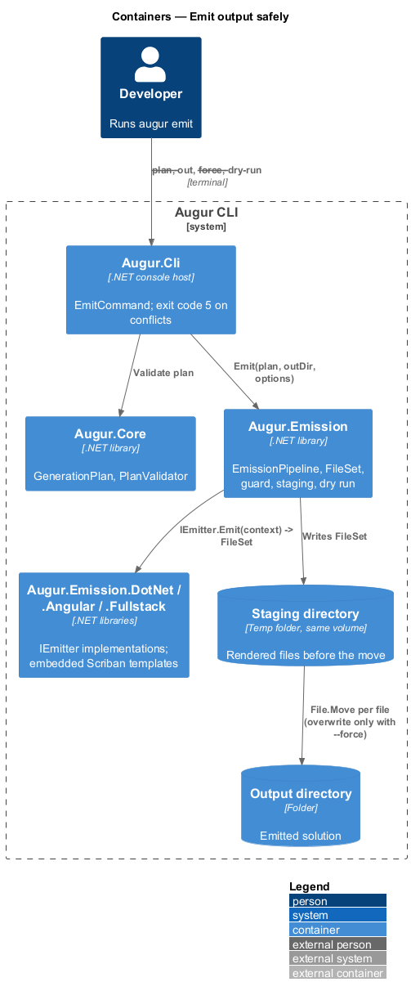
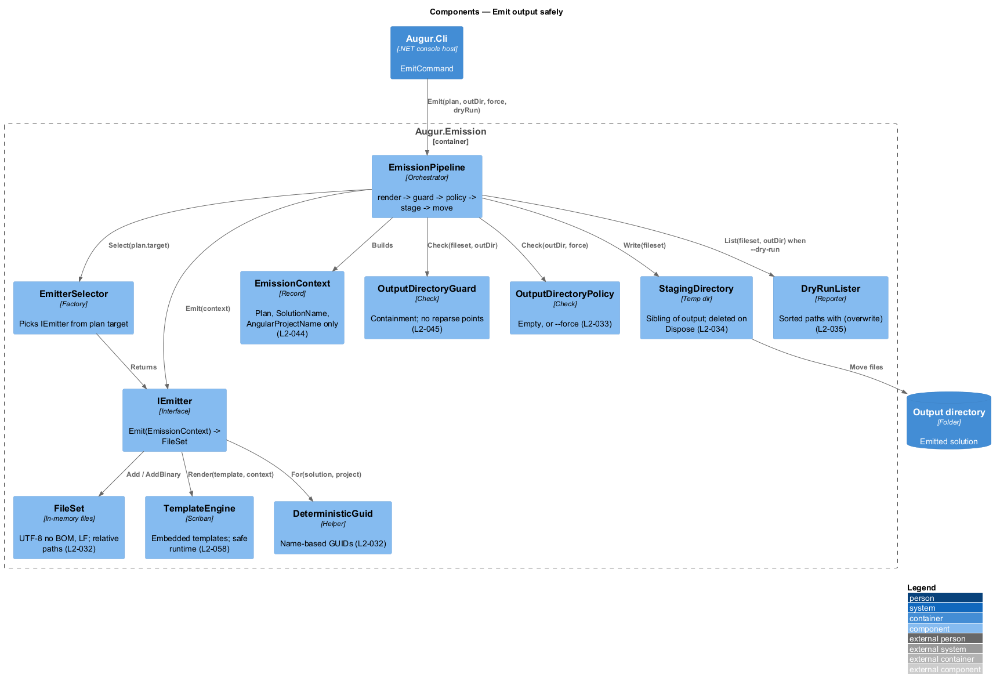
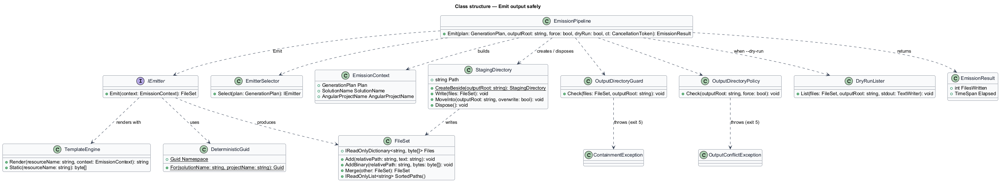
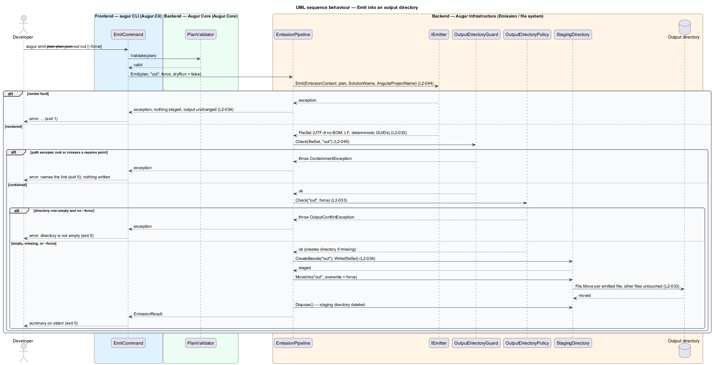
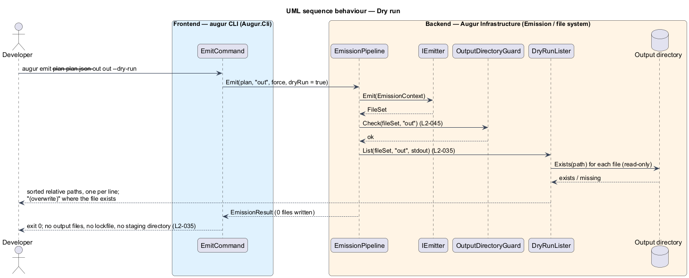

# Emit output safely

## Overview

Emission is the half of Augur that writes files. It takes a validated generation plan and produces a .NET solution, an Angular workspace, or both. The individual emitters (see [emit-dotnet-solution](../emit-dotnet-solution/README.md) and [emit-angular-workspace](../emit-angular-workspace/README.md)) decide *what* files to produce; this feature covers the pipeline every emitter runs through, which decides *how* those files reach the disk.

Four properties hold for every emission. It is *deterministic* — same plan and same Augur version produce byte-identical files, with no timestamps, random values, or machine paths, and with any required GUIDs derived from the solution and project names. It is *atomic* — all files are rendered and checked before any of them touches the output directory, so a failure leaves the directory as it was. It is *contained* — every written path resolves inside the output directory and never passes through a symbolic link or junction. And it is *self-sufficient* — no child process is started and no network request is made; every byte comes from templates and static resources bundled with Augur (ADR backend/0002).

Two options shape a run. `--force` allows emission into a non-empty directory, overwriting only the files Augur emits and leaving everything else alone; without it a non-empty directory ends the run with exit code 5. `--dry-run` lists the relative path of every file that would be written, sorted, marking existing files with `(overwrite)`, and writes nothing at all, lockfile included.

A fifth property guards against the model: emitted content and paths derive only from validated plan values, each a member of a closed set, and from the validated solution name. No specification text and no free text from the Decisions API ever reaches a template.

## Description

The pipeline lives in `Augur.Emission`; the commands live in `Augur.Cli`. Names are introduced by this design.

- **`IEmitter`** — interface with `Emit(EmissionContext) -> FileSet`. One implementation per target (`DotNetSolutionEmitter`, `AngularWorkspaceEmitter`, `FullstackEmitter`); `EmitterSelector` picks one from the plan's `target` value.
- **`EmissionContext`** — the only input an emitter sees: the validated `GenerationPlan`, the `SolutionName`, and the derived `AngularProjectName`. It carries no specification text, no raw answers, and no environment data, which is how L2-044 is enforced by construction.
- **`FileSet`** — in-memory map from relative path to content. `Add(path, text)` normalizes text to UTF-8 without BOM and LF line endings; `AddBinary(path, bytes)` stores static resources byte-for-byte. `Merge(other)` combines two sets and throws on a path collision, which is how `FullstackEmitter` composes the .NET and Angular outputs. Paths are relative, use `/`, and are rejected if they contain `..` or are rooted.
- **`TemplateEngine`** — Scriban renderer over embedded resources. `Render(templateName, context)` renders a Scriban template; `Static(resourceName)` returns an embedded resource byte-for-byte for files such as `package-lock.json`. The template context exposes exactly `Plan`, `SolutionName`, and `AngularProjectName`; templates run with Scriban's safe runtime (no file, environment, or clock access), so output cannot vary by machine or time (L2-032).
- **`DeterministicGuid`** — derives RFC 4122 version 5 (name-based, SHA-1) GUIDs from a fixed Augur namespace GUID plus the solution and project names, for `.slnx` and project files that need them.
- **`OutputDirectoryGuard`** — resolves the output root to a full path and checks every `FileSet` path: the resolved target starts with the root, and no existing directory component on the way is a reparse point (symbolic link or junction). A violation throws `ContainmentException`, mapped to exit code 5 (L2-045).
- **`OutputDirectoryPolicy`** — decides whether emission may proceed: a missing directory is created; an empty directory proceeds; a non-empty directory proceeds only with `--force`, otherwise throws `OutputConflictException` (exit code 5) (L2-033).
- **`StagingDirectory`** — temporary directory created as a sibling of the output directory (same volume) with a random suffix. `Dispose` deletes it unconditionally, so it is removed on success, failure, and cancellation.
- **`EmissionPipeline`** — orchestrator: select emitter; render to a `FileSet`; run `OutputDirectoryGuard`; apply `OutputDirectoryPolicy`; write the `FileSet` into a `StagingDirectory`; move each file into place (`File.Move(overwrite: true)` only under `--force`). Any exception before the move phase leaves the output directory untouched (L2-034). The pipeline uses no `Process` API and holds no `HttpClient` (L2-058).
- **`DryRunLister`** — alternate terminal step. Given the `FileSet` and output root it prints each relative path, sorted ordinally, one per line on stdout, appending ` (overwrite)` for paths that already exist. It performs the containment check so a dry run reports the same failures a real run would, and it returns before `OutputDirectoryPolicy`, staging, or any write (L2-035).
- **`EmitCommand`** — handler for `augur emit --plan <path> --out <dir> [--force] [--dry-run]`; validates the plan (see [validate-plan](../../plan/validate-plan/README.md)) and runs the pipeline.

## Requirements

The feature realizes the following level-2 (L2) requirements. Each L2 requirement refines a level-1 (L1) requirement, cited by identifier.

| L2 ID | Refines (L1) | Requirement |
|-------|--------------|-------------|
| `L2-032` | `L1-009` | Emitting the same plan with the same Augur version shall produce byte-identical files. Emitted files shall be UTF-8 without BOM with LF line endings, and shall contain no timestamps, random values, or machine-specific paths. Any GUIDs required by project or solution files shall be derived deterministically from the solution name and project name. |
| `L2-033` | `L1-009` | `--out <dir>` shall be required for `emit` and `generate`. If the directory exists and is not empty, Augur shall stop with exit code 5 unless `--force` is given. With `--force`, Augur shall overwrite only the files it emits and leave every other file untouched. |
| `L2-034` | `L1-009` | Augur shall render all files into a temporary staging directory and move them into the output directory only after rendering succeeds. If rendering fails, the output directory shall be left unchanged and the staging directory deleted. |
| `L2-035` | `L1-009` | `--dry-run` on `emit` and `generate` shall list the relative path of every file that would be written, sorted, one per line on stdout, marking files that already exist with `(overwrite)`, and shall write nothing (no output files and no lockfile). |
| `L2-044` | `L1-012` | Emitted file contents and paths shall be determined only by the validated plan values (each a member of a closed set) and the validated solution name. No text returned by the Decisions API, other than a validated answer identifier, and no text from the specification shall be written into any emitted file or path. |
| `L2-045` | `L1-012` | Every path Augur writes during emission shall resolve to a location inside the output directory. Augur shall not write through a symbolic link or junction inside the output directory. |
| `L2-058` | `L1-012` | `augur emit` and the emission step of `augur generate` shall not start any external process (including `dotnet`, `npm`, `npx`, `node`, or `ng`) and shall make no network requests. All emitted content, including `package-lock.json`, shall come from templates bundled with Augur. Augur itself shall not require Node.js. |

## Diagrams

### System context

Emission has no external system: the developer, Augur, and the output directory are the whole picture. The container view below carries the detail; this context view is kept for completeness.

### Containers

The CLI host runs the pipeline in `Augur.Emission`, which reads templates from the emitter assemblies and writes through a staging directory into the output directory.

### Components

`EmissionPipeline` renders through an `IEmitter` into a `FileSet`, checks it with `OutputDirectoryGuard`, applies `OutputDirectoryPolicy`, stages in `StagingDirectory`, and moves; `DryRunLister` replaces everything after the guard.

### Class structure

`EmissionPipeline` depends on the guard, policy, staging, and lister; emitters produce a `FileSet` from an `EmissionContext` using `TemplateEngine` and `DeterministicGuid`.

### Behaviour — emit into an output directory

The `alt` blocks cover a non-empty directory without `--force` (`L2-033`), a containment violation (`L2-045`), a render fault with rollback (`L2-034`), and the successful stage-and-move path.

### Behaviour — dry run

The same render and containment check run, then `DryRunLister` prints the sorted paths and the run ends with nothing written (`L2-035`).

