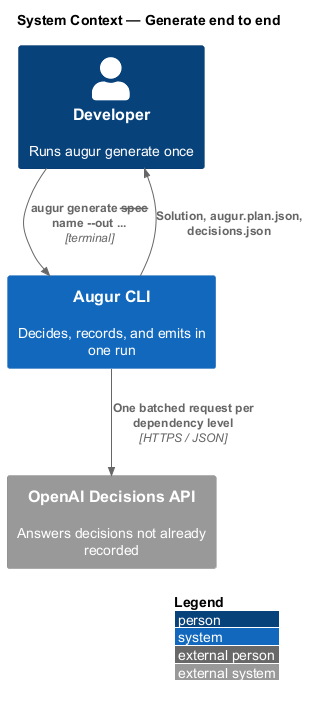
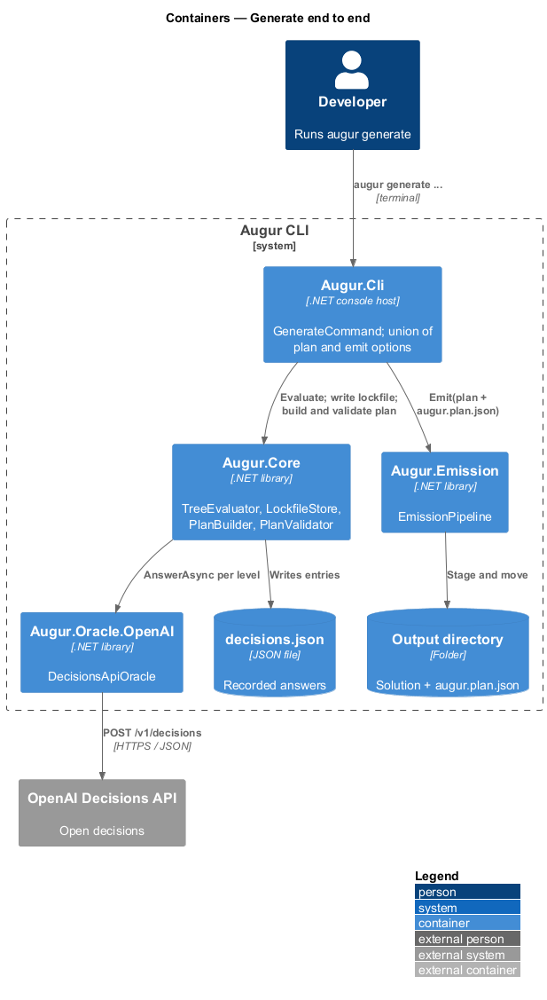
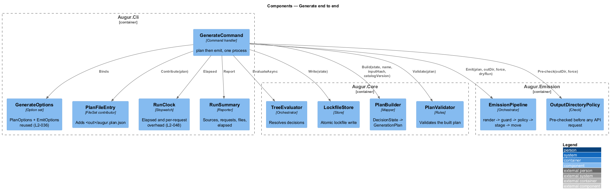
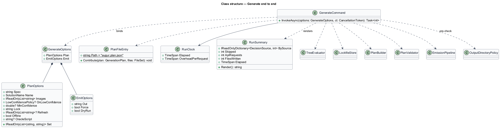
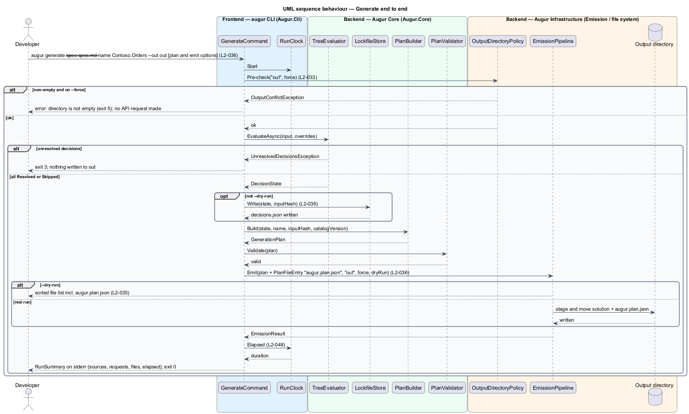

# Generate end to end

## Overview

`augur plan` decides; `augur emit` writes. Most developers want both in one step, so `augur generate` runs the two in sequence: it resolves every decision for a specification, records the decisions in the lockfile, writes the plan into the output directory, and emits the solution there. The result is defined to equal running `plan` and then `emit` with the same inputs, so there is one code path for deciding and one for emitting, and `generate` only orders them.

The command accepts the union of the `plan` and `emit` options: `--spec`, `--name`, `--image`, `--set`, `--on-low-confidence`, `--min-confidence`, `--lock`, `--refresh`, `--offline`, `--oracle-script`, `--out`, `--force`, and `--dry-run`. The *plan file* — canonical JSON copy of the generation plan — is written to `<out>/augur.plan.json`, so the emitted solution carries a record of the decisions that produced it. If any decision cannot be resolved, the run exits with code 3 and writes nothing to the output directory.

The command also carries the run-time budget. Augur is a tool a developer runs interactively, so the requirements set limits on the *reference machine* — 4 CPU cores, 16 GB RAM, SSD storage, .NET 10 runtime installed, as defined in the conventions of `docs/specs/L2.md`: a fully replayed `generate` finishes in at most 3 seconds, an `emit` in at most 2 seconds, peak working set stays at or under 256 MB with maximum-size inputs, and Augur's own overhead per API request stays at or under 100 ms.

## Description

The command lives in `Augur.Cli`; it composes components designed elsewhere. Names are introduced by this design.

- **`GenerateCommand`** — handler for `augur generate`. It runs, in order: option validation; `OutputDirectoryPolicy` pre-check (so a non-empty directory without `--force` fails before any API request is made); specification intake; `TreeEvaluator` (see [evaluate-decision-tree](../../decisions/evaluate-decision-tree/README.md)); `LockfileStore.Write`; `PlanBuilder` and `PlanValidator`; `EmissionPipeline.Emit` with the plan file added to the `FileSet`. Under `--dry-run` it skips the lockfile write and lets the pipeline list files.
- **`GenerateOptions`** — System.CommandLine option set formed from `PlanOptions` and `EmitOptions`, both reused as-is, so no option is declared twice and the two commands cannot drift (L2-036).
- **`PlanFileEntry`** — adds `augur.plan.json` to the emitter's `FileSet` with the canonical plan serialization. Because it goes through the same `FileSet`, it is listed by `--dry-run`, checked by `OutputDirectoryGuard`, and staged and moved with the rest.
- **`RunClock`** — `Stopwatch` wrapper started at process entry. It supplies the elapsed time in the run summary (`ConsoleReporter`) and the per-request overhead figure at `--verbosity diagnostic`.
- **`RunSummary`** — the final stderr line: decisions by source, skipped count, API request count from `RequestCounter`, files written, elapsed time.
- **Performance design** — the budgets in L2-048 are met by construction rather than by tuning: the replayed path makes no network calls and reads one JSON file; templates are parsed once per process and cached; `FileSet` holds content as `byte[]` written with buffered streams; images are read as streams and base64-encoded directly into the request body without an intermediate string, so four 10 MiB images cost about 55 MB of transient memory; the CLI publishes with ReadyToRun to cut startup time. Measured figures on the reference machine are `<TO SUPPLY>` once an implementation exists; the acceptance tests for L2-048 record them.

## Requirements

The feature realizes the following level-2 (L2) requirements. Each L2 requirement refines a level-1 (L1) requirement, cited by identifier.

| L2 ID | Refines (L1) | Requirement |
|-------|--------------|-------------|
| `L2-036` | `L1-009` | `augur generate` shall accept the union of the `plan` and `emit` options, write the lockfile, write the plan to `<out>/augur.plan.json`, and emit the solution into `<out>`. Its result shall equal running `plan` then `emit` with the same inputs. |
| `L2-048` | `L1-013` | On the reference machine, Augur shall meet these limits: `augur generate` fully replayed from the lockfile (no API calls), any valid plan — <= 3 seconds wall clock; `augur emit` for any valid plan — <= 2 seconds wall clock; peak working set for any command with maximum-size inputs (256 KiB spec, four 10 MiB images) — <= 256 MB; Augur's own overhead per API request (time outside the HTTP call) — <= 100 ms. |

## Diagrams

### System context

The developer runs one command; Augur consults the Decisions API for open decisions and produces the solution, lockfile, and plan file.

### Containers

`GenerateCommand` drives the core (decide, lock, plan) and then the emission library, in that order.

### Components

The command composes `TreeEvaluator`, `LockfileStore`, `PlanBuilder`, `PlanValidator`, and `EmissionPipeline`, adding `PlanFileEntry` to the file set.

### Class structure

`GenerateCommand` depends on the reused option sets and on the components of the two halves; `RunClock` and `RunSummary` report timing.

### Behaviour — generate

The `alt` block shows the unresolved-decision exit (code 3, nothing written) and the successful path through lockfile, plan file, and emission (`L2-036`); the summary reports elapsed time against the budget (`L2-048`).

