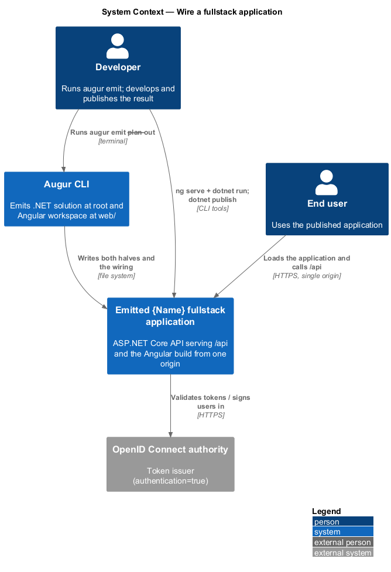
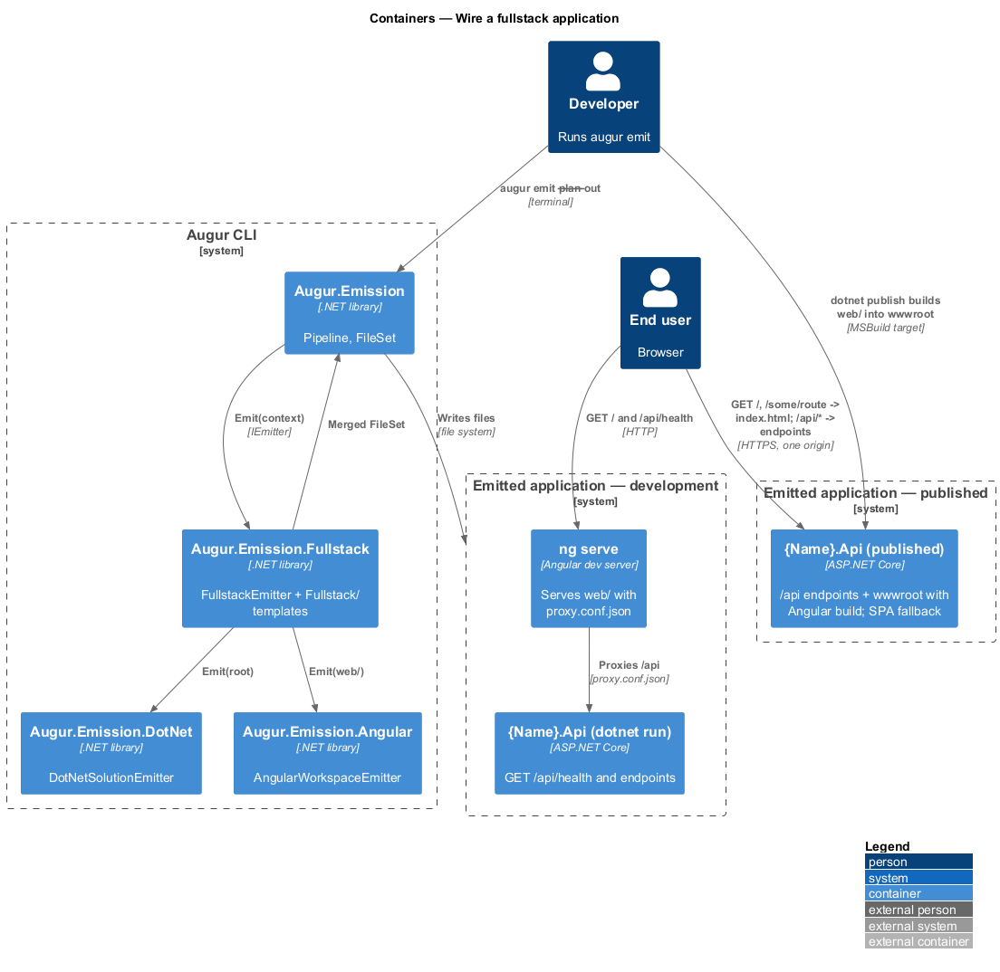
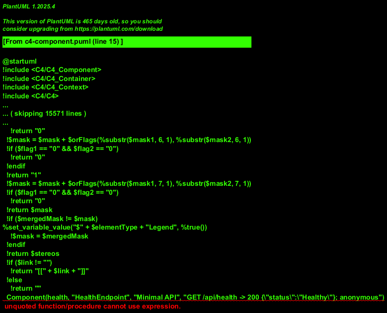
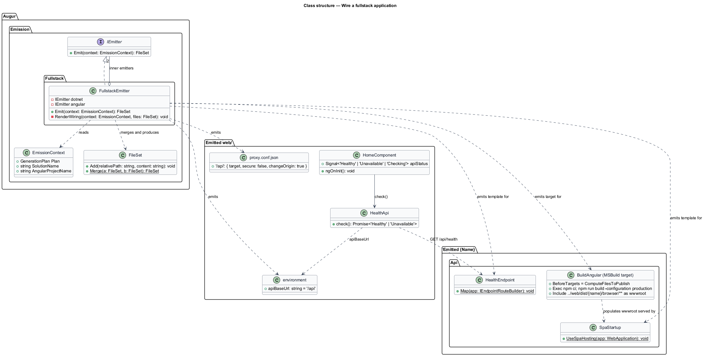
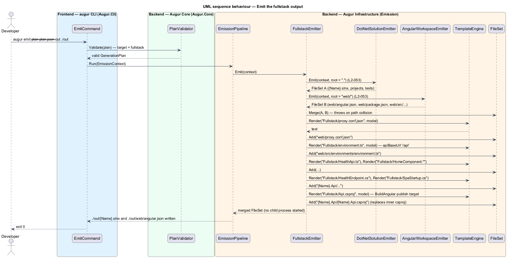
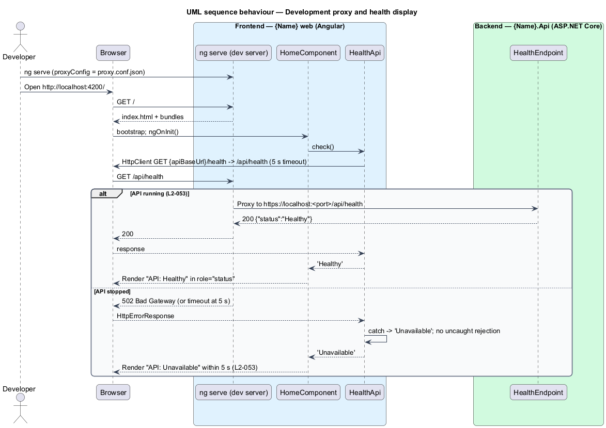
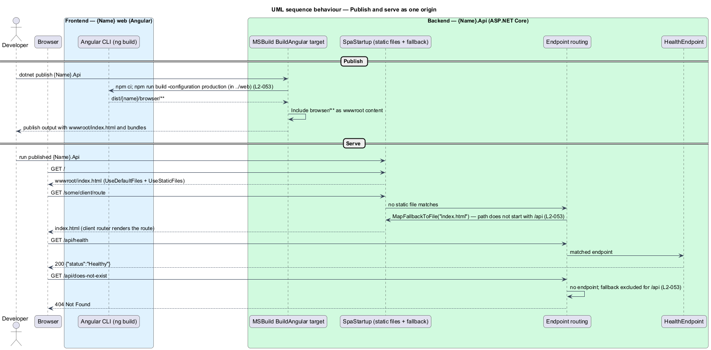

# Wire a fullstack application

## Overview

When the generation plan's `target` is `fullstack`, Augur emits both a .NET solution and an Angular workspace into one output directory and connects them so they work together from the first run. This feature covers that wiring: the emitted API exposes a health endpoint, the Angular development server proxies API calls to it, the Angular home page reports whether the API is reachable, and publishing the API bundles the Angular build into the API's static files so the whole application deploys as one unit on one origin.

A *fullstack application* — single deployable in which an ASP.NET Core API serves both its `/api` endpoints and the compiled Angular application from the same host — needs no cross-origin configuration. During development the two run as separate processes: the API on its development URL and the Angular CLI's development server on its own port. A *development proxy* — Angular CLI setting that forwards requests matching a path prefix to another server — makes `/api` calls from the browser reach the API as if they shared an origin, so the Angular code uses the same relative `apiBaseUrl` in development and production.

The emitted layout places the .NET solution at the output root and the Angular workspace at `web/`. The `{Name}.Api` project owns the publish step: `dotnet publish` runs the Angular production build and copies its output into `wwwroot`, and the API falls back to `index.html` for any non-`/api` path so client-side routes resolve after a hard refresh. Unknown `/api` paths return 404, never the SPA page.

## Description

The feature is realized by `FullstackEmitter` in `Augur.Emission.Fullstack`, which composes `DotNetSolutionEmitter` (see [../emit-dotnet-solution/README.md](../emit-dotnet-solution/README.md)) and `AngularWorkspaceEmitter` (see [../emit-angular-workspace/README.md](../emit-angular-workspace/README.md)) and adds the wiring templates. Names below are introduced by this design.

### Emitter components

- **`FullstackEmitter`** — `IEmitter` for the `fullstack` target. It calls the .NET emitter with the output root, the Angular emitter with `WorkspaceRoot = web/`, merges both `FileSet`s, and renders the `Fullstack/` template group on top. A path emitted by both inner emitters is a design error; `FileSet.Merge` throws on collision.
- **`Fullstack/` template group** — `proxy.conf.json`, the `serve` configuration patch for `angular.json`, `environment.ts` with `apiBaseUrl: '/api'`, `HealthApi`, the health section of `HomeComponent`, `HealthEndpoint`, `SpaStartup`, and the `{Name}.Api.csproj` publish targets.
- **`EmissionContext.AngularProjectName`** — shared with both inner emitters so the `web/` project name and the API's static-file configuration agree.

### Emitted wiring

- **`HealthEndpoint`** (in `{Name}.Api`) — maps `GET /api/health` with `AllowAnonymous()` and returns `200` with body `{"status":"Healthy"}`.
- **`SpaStartup`** (in `{Name}.Api`) — registers `UseDefaultFiles()` and `UseStaticFiles()` over `wwwroot`, then `MapFallbackToFile("index.html")` filtered to paths that do not start with `/api`. Unknown `/api` paths fall through to the router's default 404.
- **`{Name}.Api.csproj` publish targets** — a `BuildAngular` target that runs before `ComputeFilesToPublish`, executes `npm ci` and `npm run build -- --configuration production` in `../web/`, and includes `../web/dist/{name}/browser/**` as `wwwroot` content. The target runs only during `dotnet publish`, never during `dotnet build` or `dotnet test`, and never during Augur's own emission.
- **`proxy.conf.json`** (in `web/`) — forwards `/api` to the API's development URL (`https://localhost:<port>`, port `<TO SUPPLY>` from the emitted `launchSettings.json`) with `secure: false` for the development certificate and `changeOrigin: true`.
- **`angular.json` `serve` configuration** — references `proxy.conf.json` through `proxyConfig`.
- **`environment.ts`** — exports `apiBaseUrl: '/api'`; the same relative value works behind the proxy and when served from `wwwroot`.
- **`HealthApi`** (Angular service) — `GET {apiBaseUrl}/health` through `HttpClient`, with a 5-second timeout; returns `'Healthy'` on `200` with `status: "Healthy"`, otherwise `'Unavailable'`. Errors are caught and never escape as uncaught promise rejections.
- **`HomeComponent`** — calls `HealthApi` on init and renders `API: Healthy` or `API: Unavailable` in a `role="status"` region.
- **CORS** — no CORS middleware is registered for the fullstack target; the API and the application share one origin in production (L2-046).

## Requirements

The feature realizes the following level-2 (L2) requirements. Each L2 requirement refines a level-1 (L1) requirement, cited by identifier.

| L2 ID | Refines (L1) | Requirement |
|-------|--------------|-------------|
| `L2-053` | `L1-009` | When the plan's `target` is `fullstack`, the .NET solution shall be emitted at the root of the output directory and the Angular workspace at `<out>/web/`, wired together as follows: |

The wiring list that follows the `L2-053` paragraph in the specification is reproduced in the Description above.

## Diagrams

### System context

The developer runs `augur emit`; the end user reaches the emitted application through one origin that serves both the Angular files and the `/api` endpoints.

### Containers

Inside Augur, `FullstackEmitter` composes the two inner emitters. The emitted application is shown in both its development shape (two processes joined by the proxy) and its published shape (one process).

### Components

`FullstackEmitter` merges the inner `FileSet`s and renders the `Fullstack/` group; in the emitted API, `HealthEndpoint` and `SpaStartup` carry the runtime wiring.

### Class structure

`FullstackEmitter` holds the two inner emitters; the emitted side pairs `HealthApi` and `HomeComponent` in Angular with `HealthEndpoint` and `SpaStartup` in the API.

### Behaviour — emit the fullstack output

The .NET solution is emitted at the root, the Angular workspace at `web/`, and the wiring templates on top; the merged `FileSet` goes to the pipeline (`L2-053`).

### Behaviour — development proxy and health display

With `ng serve` and the API both running, the home page's health call travels through the development proxy and the page shows `API: Healthy`; when the API is down the page shows `API: Unavailable` within 5 seconds and no error escapes (`L2-053`).

### Behaviour — publish and serve as one origin

`dotnet publish` builds the Angular application into `wwwroot`; at run time the API serves `index.html` for client routes and 404 for unknown `/api` paths (`L2-053`).

