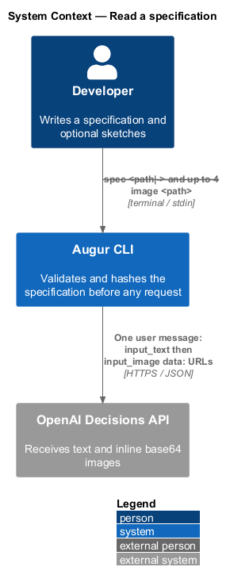
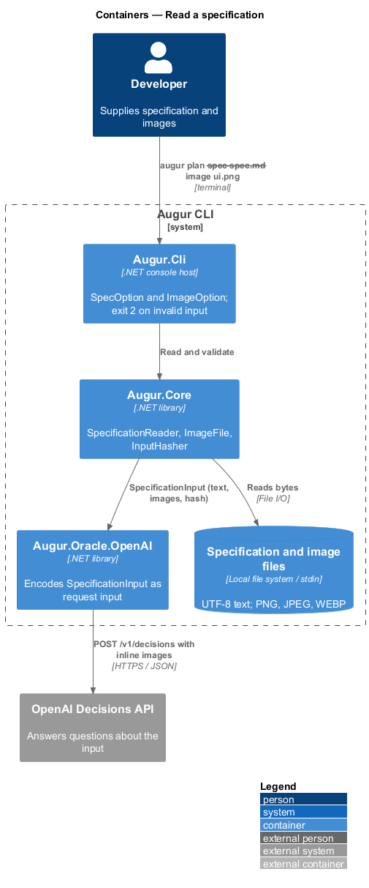
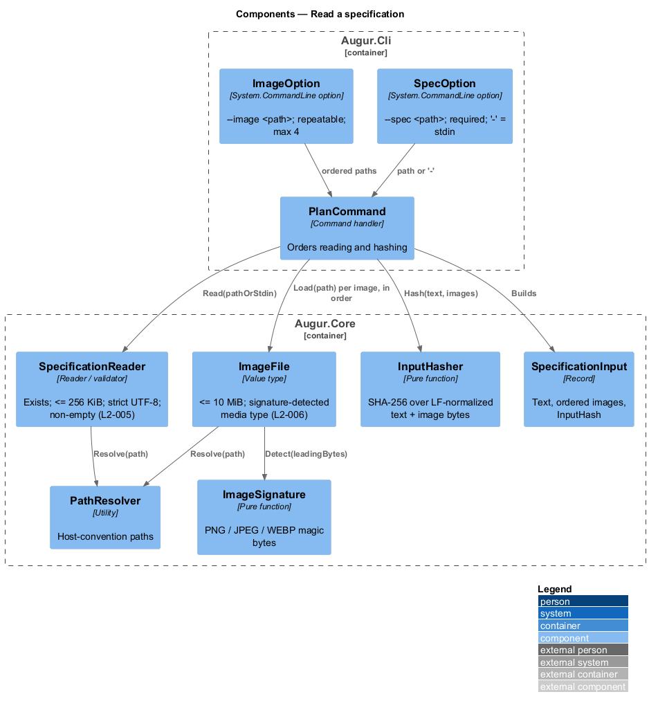
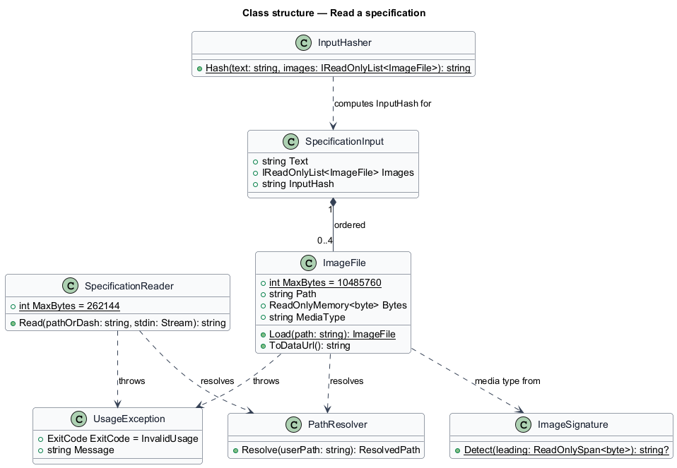
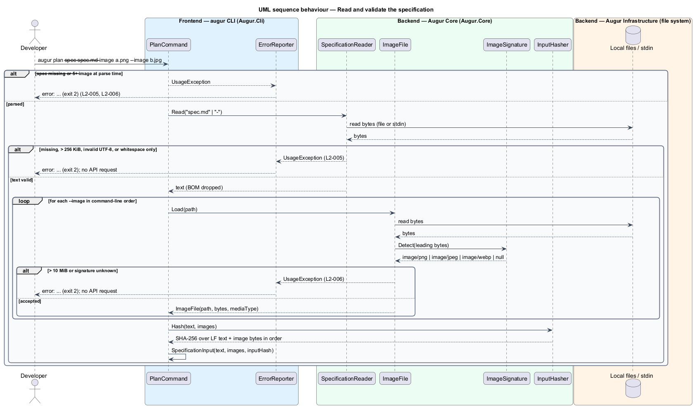

# Read a specification

## Overview

Augur decides what to generate by asking the OpenAI Decisions API questions about a *specification* — natural-language description of the software a developer wants, written as text and optionally illustrated with images such as a whiteboard sketch or a wireframe. This feature covers how that specification enters Augur: the options that supply it, the checks that reject bad input before any request is made, and the single value — the *specification input* — that every later stage reads.

The text comes from `--spec <path>`, or from stdin when the path is `-`. It is UTF-8 (a byte-order mark is accepted and dropped), holds at least one non-whitespace character, and is at most 256 KiB. Images come from up to four `--image <path>` options. Each is PNG, JPEG, or WEBP — recognized by its *file signature* — the fixed leading bytes that identify a file format regardless of its extension — and is at most 10 MiB. Images are never fetched from URLs; the Decisions API accepts only inline base64 `data:` URLs, so Augur reads the bytes and encodes them itself.

Validation happens entirely before the behaviour tree starts. A missing file, empty text, an oversize file, invalid UTF-8, a file that is not an image, or a fifth image each end the run with exit code 2 and a one-line error, and no API request is made. Once accepted, the specification is hashed: the *input hash* is SHA-256 over the text normalized to LF line endings followed by the bytes of each image in command-line order. The lockfile uses this hash to decide whether earlier answers still apply (see `../../lockfile/replay-decisions/README.md`), so two runs with the same images in a different order hash differently and are treated as different inputs.

## Description

Option declaration lives in `Augur.Cli`; reading, validation, and hashing live in `Augur.Core`. Names are introduced by this design.

- **`SpecOption`** — `System.CommandLine` option `--spec <path>`, required on `plan` and `generate`. A missing option is a parser error that `ErrorReporter` reports as `--spec is required` with exit code 2 (L2-005).
- **`ImageOption`** — option `--image <path>`, repeatable, `ArityMax = 4`. A fifth occurrence is rejected at parse time with the message `at most 4 images are allowed` (L2-006).
- **`SpecificationReader`** — reads the text. For `-` it reads stdin to end; otherwise it resolves the path through `PathResolver` and reads the file. It enforces, in order: file exists; byte length <= 262,144; bytes decode as strict UTF-8 (`UTF8Encoding(throwOnInvalidBytes: true)`), dropping a leading BOM; at least one non-whitespace character. Each failure throws `UsageException` with the message the acceptance criteria name (L2-005).
- **`ImageFile`** — value type holding `Path`, `Bytes`, and `MediaType`. `ImageFile.Load(path)` reads the file, checks byte length <= 10,485,760, and calls `ImageSignature.Detect`. A file whose signature matches none of the three formats throws `UsageException("<path> is not a supported image")` (L2-006).
- **`ImageSignature`** — pure function from leading bytes to a media type: `89 50 4E 47 0D 0A 1A 0A` → `image/png`; `FF D8 FF` → `image/jpeg`; `52 49 46 46 ?? ?? ?? ?? 57 45 42 50` → `image/webp`. The extension is ignored.
- **`SpecificationInput`** — immutable record of `Text` (BOM stripped, original line endings kept for display), `Images` (ordered `ImageFile` list), and `InputHash`. It is the one value handed to `TreeEvaluator`, every `IDecisionOracle`, and `LockfileStore`.
- **`InputHasher`** — computes the input hash: SHA-256 over the UTF-8 bytes of `Text` with `\r\n` and `\r` normalized to `\n`, then the raw bytes of each image in order. The result is lower-case hex.
- **`DecisionsApiOracle`** (in `Augur.Oracle.OpenAI`, see `../../oracle/query-decisions-api/README.md`) — consumes `SpecificationInput` to build the request `input`: one user message with an `input_text` part holding `Text` followed by one `input_image` part per image whose URL is `data:<MediaType>;base64,<bytes>` (L2-006).

## Requirements

The feature realizes the following level-2 (L2) requirements. Each L2 requirement refines a level-1 (L1) requirement, cited by identifier.

| L2 ID | Refines (L1) | Requirement |
|-------|--------------|-------------|
| `L2-005` | `L1-002` | `augur plan` and `augur generate` shall require `--spec <path>`. The value `-` reads the specification from stdin. The specification shall be UTF-8 text (BOM permitted) of at least 1 non-whitespace character and at most 256 KiB. |
| `L2-006` | `L1-002` | `augur plan` and `augur generate` shall accept `--image <path>` up to 4 times. Each image shall be PNG, JPEG, or WEBP, identified by its file signature (not its extension), and at most 10 MiB. Images shall be sent to the Decisions API as base64 `data:` URLs inside the same user message as the specification text. |

## Diagrams

### System context

The developer supplies text and images from the local file system or stdin; validated content later travels to the Decisions API inline.

### Containers

Options are declared in `Augur.Cli`; reading, validation, and hashing happen in `Augur.Core`; the oracle library encodes the result into a request.

### Components

`SpecificationReader` and `ImageFile` validate their inputs independently, and `InputHasher` seals the result into a `SpecificationInput`.

### Class structure

`SpecificationInput` owns an ordered list of `ImageFile`; `ImageFile` depends on `ImageSignature` for its media type; `InputHasher` reads both.

### Behaviour — read and validate the specification

Text checks run first, then each image in order, then the hash; any failure exits with code 2 before a request is made (`L2-005`, `L2-006`).

