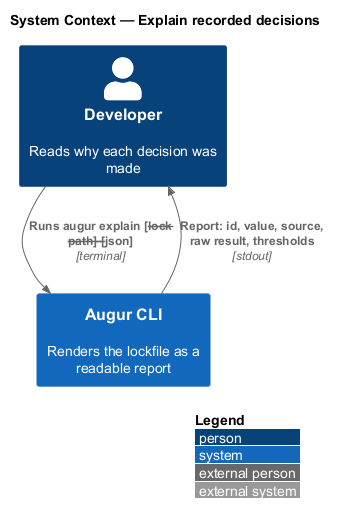
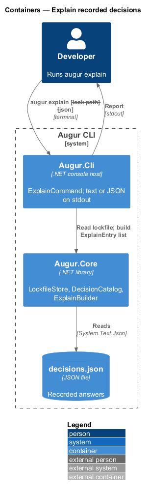
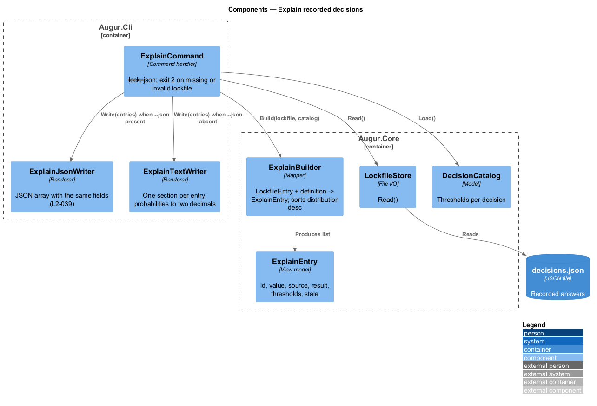
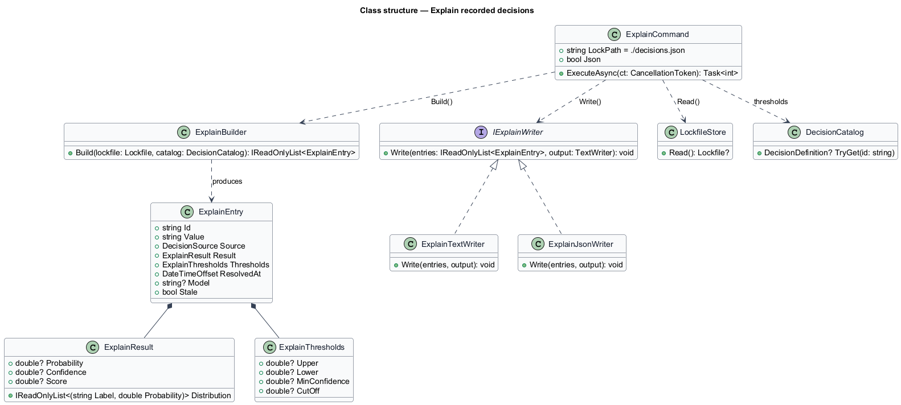
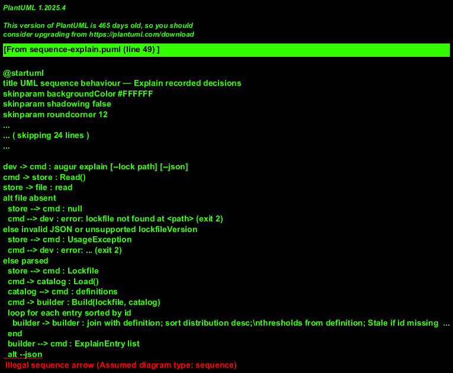

# Explain recorded decisions

## Overview

A generation plan tells the developer *what* Augur decided; it does not say *why*. The lockfile holds the evidence — every raw answer the OpenAI Decisions API, a script, a fallback, or the developer supplied — but as JSON it is slow to read. This feature covers `augur explain`, the command that renders that evidence as a readable report.

For each entry in the lockfile the report shows the decision id, the resolved value, the *source* — where the answer came from: `api`, `fallback`, `user`, or `script` — the raw result, and the *thresholds* — the catalog bounds the resolver compared the answer against. For a predicate the raw result is a probability and the thresholds are the upper and lower bounds. For a choice or score it is the confidence and the full probability distribution over options or levels, sorted from most to least likely, with the minimum confidence and, for a score, the cut-off.

The command reads only the lockfile and the catalog; it does not need the specification, an API key, or a network connection. `--lock <path>` selects a lockfile other than `./decisions.json`; `--json` emits the same information as a JSON array for tooling. A missing lockfile is a usage error with exit code 2.

## Description

The command lives in `Augur.Cli`; the view model is built in `Augur.Core`. Names are introduced by this design.

- **`ExplainCommand`** — System.CommandLine handler for `augur explain [--lock <path>] [--json]`. It calls `LockfileStore.Read()`, loads the `DecisionCatalog`, builds one `ExplainEntry` per lockfile entry through `ExplainBuilder`, and writes the result through `ExplainTextWriter` or `ExplainJsonWriter`. Output goes to stdout only; a missing file, a parse error, or an unsupported `lockfileVersion` is reported on stderr with exit code 2 (see [record decisions](../record-decisions/README.md)).
- **`ExplainBuilder`** — joins each `LockfileEntry` with its `DecisionDefinition` by id and produces an `ExplainEntry`. Entries are ordered by id to match the lockfile. An entry whose id is no longer in the catalog, or whose `questionHash` no longer matches, is still shown, with `Thresholds` marked stale so a hand-inspected report is never misleading.
- **`ExplainEntry`** — view model: `Id`, `Value`, `Source`, `Result` (`ExplainResult`), `Thresholds` (`ExplainThresholds`), `ResolvedAt`, `Model` (API only), and `Stale` (bool).
- **`ExplainResult`** — either `Probability` (predicate) or `Confidence` plus `Distribution` (`IReadOnlyList<(string Label, double Probability)>` sorted by probability descending) for choice and score results; a score result also carries `Score`.
- **`ExplainThresholds`** — `Upper` and `Lower` for a predicate; `MinConfidence` for a choice; `MinConfidence` and `CutOff` for a score. Values are the thresholds recorded in the lockfile entry, so a `--min-confidence` override used at plan time is shown as it applied; entries written without recorded thresholds fall back to the catalog values (L2-039, ADR integration/0002).
- **`ExplainTextWriter`** — renders one section per entry on stdout: a header line `id = value (source)`, the result line(s) with probabilities to two decimals, the distribution as an indented list, and the thresholds line.
- **`ExplainJsonWriter`** — serializes the `ExplainEntry` list as a JSON array with properties `id`, `value`, `source`, `result`, `thresholds`, `resolvedAt`, `model`, and `stale`, using the same canonical `System.Text.Json` options as the lockfile (sorted keys, two-space indent, LF, trailing newline).

The command never writes the lockfile and never contacts an oracle.

## Requirements

The feature realizes the following level-2 (L2) requirements. Each L2 requirement refines a level-1 (L1) requirement, cited by identifier.

| L2 ID | Refines (L1) | Requirement |
|-------|--------------|-------------|
| `L2-039` | `L1-011` | `augur explain [--lock <path>]` shall print, for each lockfile entry, the decision id, resolved value, source, the raw result (probability, or confidence and the full probability distribution sorted descending), and the thresholds that applied. `--json` shall output the same information as JSON. |

## Diagrams

### System context

The developer reads a local report; no external system takes part.

### Containers

The CLI host reads the lockfile through `Augur.Core` and writes the report to stdout.

### Components

`ExplainCommand` composes `LockfileStore`, `DecisionCatalog`, `ExplainBuilder`, and one of two writers.

### Class structure

`ExplainBuilder` joins lockfile entries with catalog definitions into `ExplainEntry` view models; the two writers consume the same list.

### Behaviour — render the report

The command reads the lockfile (exit 2 on absence or parse error), builds one entry per record, and renders text or JSON (`L2-039`).

