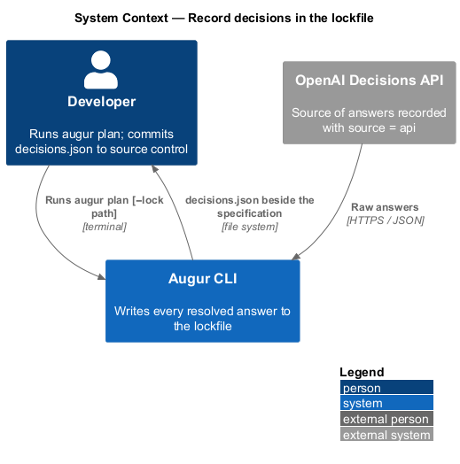
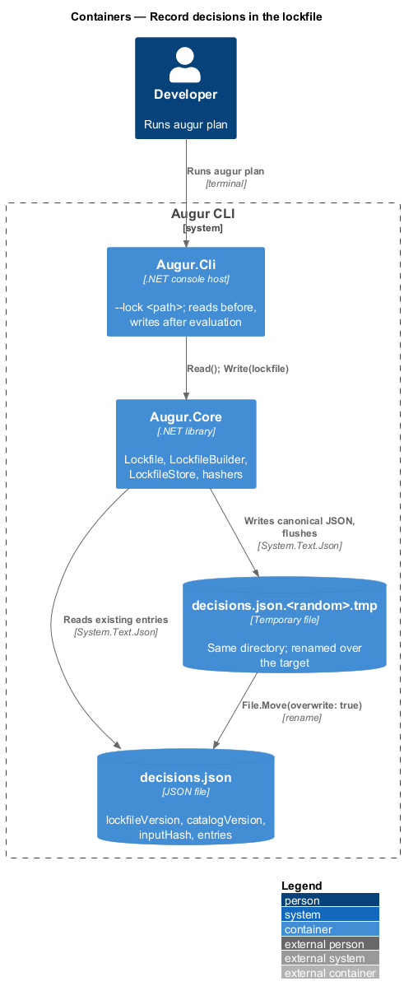
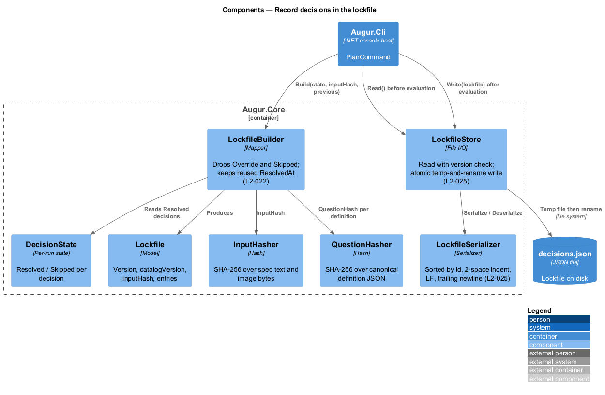
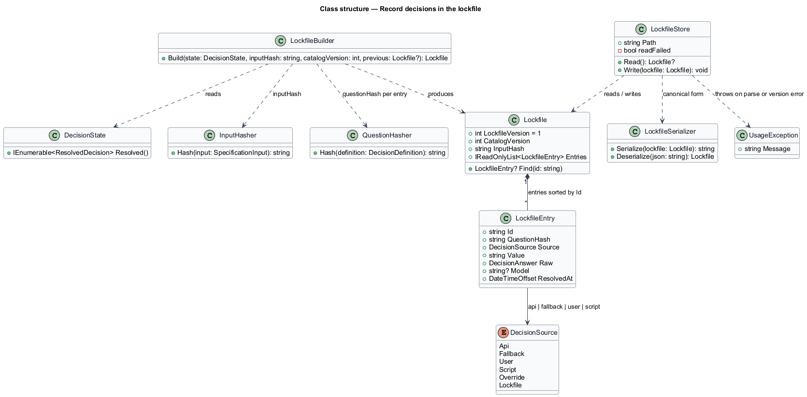
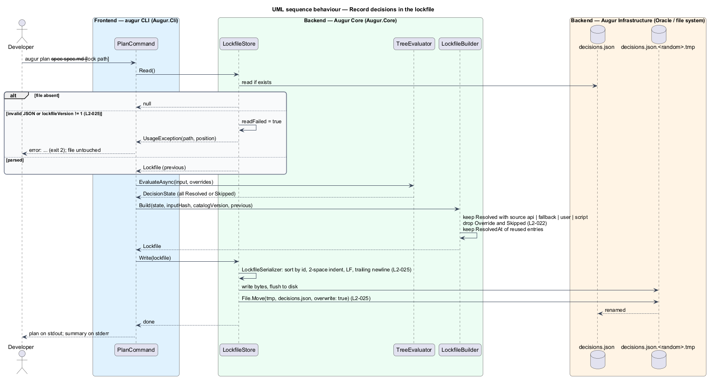

# Record decisions in the lockfile

## Overview

A code generator is expected to produce the same output from the same input every time. The OpenAI Decisions API makes no such promise: the same question may receive a slightly different probability tomorrow. Augur closes that gap with a *lockfile* — JSON file, `decisions.json` by default, that records every answer a run resolved so that later runs can reuse it instead of asking again. This feature covers what the lockfile contains and how it is written safely.

After `augur plan` or `augur generate` has resolved its decisions, Augur writes the lockfile with four top-level fields: `lockfileVersion`, `catalogVersion`, `inputHash`, and `entries`. The *input hash* — SHA-256 over the normalized specification text followed by each image's bytes in command-line order — identifies what the answers were about. Each entry records one resolved decision: its id, the *question hash* — SHA-256 over the canonical JSON of the decision's catalog definition — that identifies what was asked, the source of the answer (`api`, `fallback`, `user`, or `script`), the resolved value, the raw result the resolver saw, the model name for API answers, and the UTC time of resolution.

Two kinds of decision are deliberately absent. An *overridden* decision came from `--set` and is reproduced by the command line, not the lockfile. A *skipped* decision was never asked. The lockfile also never holds the specification text, image data, or credentials; it is safe to commit to source control.

The file is written atomically — to a temporary file in the same directory, then renamed over the target — and in a canonical form: entries sorted by id, two-space indentation, LF line endings, and a trailing newline. A lockfile that cannot be parsed, or whose `lockfileVersion` is unsupported, stops the run and is left untouched so that no hand-edited or corrupted file is silently replaced.

## Description

All components live in `Augur.Core`. Names are introduced by this design.

- **`Lockfile`** — immutable model of the file: `LockfileVersion` (currently 1), `CatalogVersion`, `InputHash`, and `Entries` (`IReadOnlyList<LockfileEntry>`). It exposes `Find(id)` for replay.
- **`LockfileEntry`** — one recorded decision: `Id`, `QuestionHash`, `Source` (`DecisionSource` restricted to `Api`, `Fallback`, `User`, `Script`), `Value`, `Raw` (`DecisionAnswer` result shape: `probability`, or `choice`/`probabilities`/`confidence`, or `score`/`probabilities`/`confidence`), `Model` (present only when `Source = Api`), and `ResolvedAt` (`DateTimeOffset`, serialized as UTC ISO-8601).
- **`LockfileBuilder`** — builds a `Lockfile` from a `DecisionState`. It takes every `Resolved` decision whose source is not `Override`, drops `Skipped` decisions, and preserves the `ResolvedAt` of entries that `ReplayingOracle` reused so a replayed run does not rewrite timestamps (L2-022; see [replay decisions](../replay-decisions/README.md)).
- **`InputHasher`** — computes the input hash: specification text normalized to LF line endings and encoded as UTF-8, followed by each image's bytes in command-line order, through SHA-256, rendered as lowercase hexadecimal.
- **`QuestionHasher`** — computes a decision's question hash from the canonical JSON of its definition (type, instructions, options or levels with descriptions, thresholds); defined with the catalog (see `catalog/define-catalog`).
- **`LockfileSerializer`** — `System.Text.Json` options fixed for determinism: entries sorted by `Id` ordinal, property order fixed by the model, two-space indentation, LF line endings, no BOM, trailing newline. The same options drive both reading and writing.
- **`LockfileStore`** — reads and writes the file at `--lock <path>` (default `./decisions.json`). `Read()` returns `null` when the file does not exist; a `JsonException` is rethrown as `UsageException` with the path, line, and byte position (exit code 2); a `lockfileVersion` other than 1 is a `UsageException` (exit code 2). `Write(Lockfile)` serializes to `<path>.<random>.tmp` in the same directory, flushes to disk, and renames over the target with `File.Move(overwrite: true)` so a reader sees either the old or the new file (L2-025). A read failure sets a flag that makes `Write` refuse to run, so a corrupt file is never overwritten.
- **`PlanCommand`** (`Augur.Cli`) — calls `LockfileStore.Read()` before evaluation and `LockfileStore.Write(LockfileBuilder.Build(state))` after every decision is `Resolved` or `Skipped`. A run that ends with exit code 3 (unresolved decisions) writes nothing.

## Requirements

The feature realizes the following level-2 (L2) requirements. Each L2 requirement refines a level-1 (L1) requirement, cited by identifier.

| L2 ID | Refines (L1) | Requirement |
|-------|--------------|-------------|
| `L2-022` | `L1-007` | After `augur plan` or `augur generate` resolves its decisions, it shall write a lockfile (default `./decisions.json`, configurable with `--lock <path>`) containing: `lockfileVersion`, `catalogVersion`, `inputHash`, and an `entries` array. Each entry holds `id`, `questionHash`, `source` (`api`, `fallback`, `user`, or `script`), `value`, the raw result (`probability`, or `choice`/`probabilities`/`confidence`, or `score`/`probabilities`/`confidence`), `model` (for source `api`), and `resolvedAt` (UTC ISO-8601). Overridden and skipped decisions shall not be written. The lockfile shall never contain the specification text, image data, or credentials. |
| `L2-025` | `L1-007` | The lockfile shall be written atomically (write to a temporary file in the same directory, then rename), with entries sorted by `id`, two-space indentation, LF line endings, and a trailing newline. A lockfile that cannot be parsed or has an unsupported `lockfileVersion` shall stop the run and shall not be overwritten. |

## Diagrams

### System context

The lockfile stays on the developer's machine, beside the specification; nothing in it goes back to the Decisions API.

### Containers

`Augur.Core` owns the lockfile model and store; the CLI host decides when to read and when to write.

### Components

`LockfileBuilder` filters the `DecisionState`; `LockfileStore` serializes through `LockfileSerializer` and performs the temp-and-rename write.

### Class structure

`Lockfile` owns its `LockfileEntry` list; `LockfileStore` depends on the serializer and surfaces parse failures as `UsageException`.

### Behaviour — read at start, write at end

The store reads the existing file before evaluation, refusing to continue on a parse or version error (`L2-025`). After evaluation the builder drops overridden and skipped decisions (`L2-022`) and the store writes atomically in canonical form.

