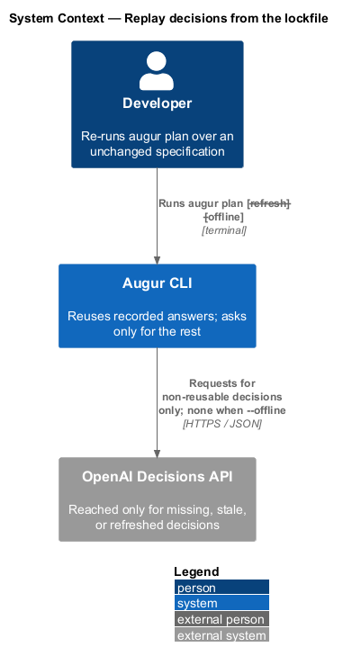
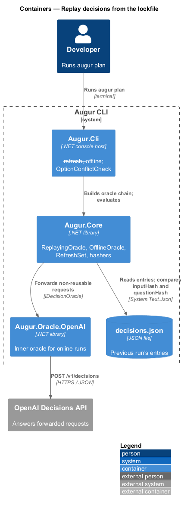
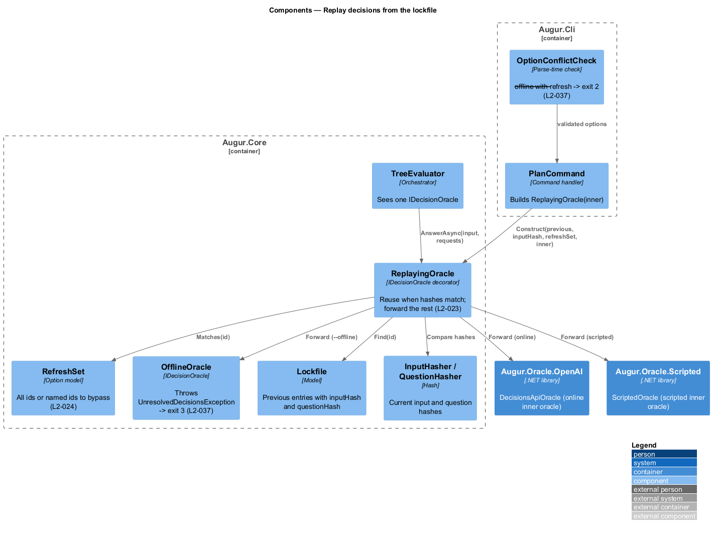
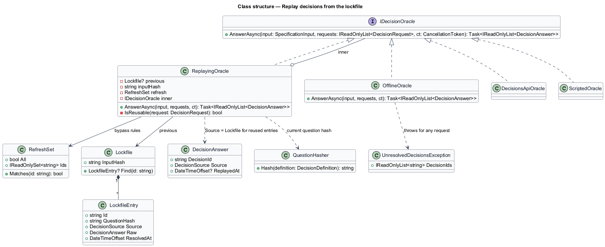
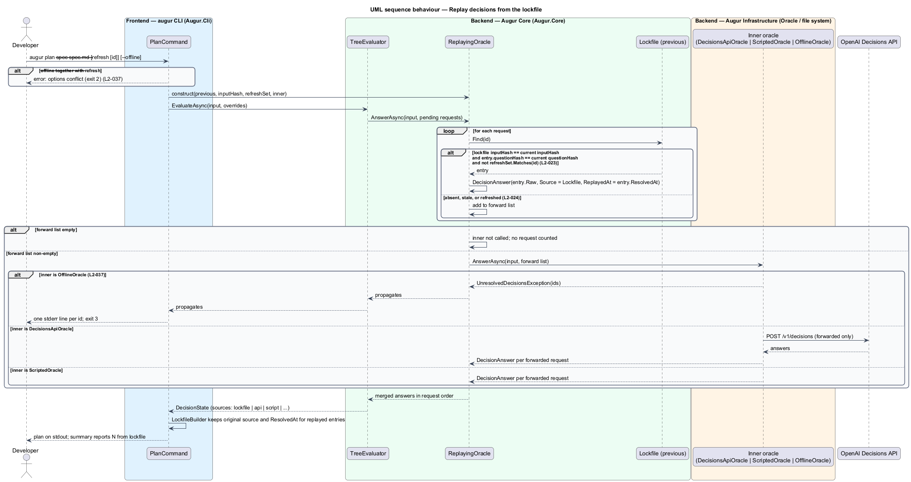

# Replay decisions from the lockfile

## Overview

Once a run has recorded its answers in the lockfile (see [record decisions](../record-decisions/README.md)), every later run over the same specification can reuse them. This feature covers that reuse: when a recorded answer is trusted, when it is discarded, and how a run can be forced to re-ask or forbidden from asking at all.

An entry is *reusable* — eligible to stand in for a fresh oracle answer — when two hashes match. The lockfile's `inputHash` equals the current *input hash* — SHA-256 over the normalized specification text and image bytes — which proves the answers were about this specification. The entry's `questionHash` equals the current *question hash* — SHA-256 over the decision's catalog definition — which proves the question has not changed since. A changed specification invalidates every entry; a catalog change invalidates only the decisions it touched. Only decisions without a reusable entry are sent to an oracle, so an unchanged specification costs no API request at all.

Two options adjust this. `--refresh` discards every entry and re-asks everything; `--refresh <id>` discards only the named entries. `--offline` forbids all network access: decisions resolve only from `--set` overrides and the lockfile, and any decision left over is reported and the run ends with exit code 3. The two options conflict, since a refresh needs an oracle to ask, and combining them is a usage error.

Reused entries keep their original `resolvedAt`, so a replayed run rewrites the lockfile without changing it in any meaningful way.

## Description

Replay is a decorator around any inner `IDecisionOracle`, following ADR integration/0001. Components live in `Augur.Core` unless stated otherwise; names are introduced by this design.

- **`ReplayingOracle`** — `IDecisionOracle` decorator. On construction it receives the previous `Lockfile` (or `null`), the current input hash, the `RefreshSet`, and the inner oracle. `AnswerAsync` splits the batch: for each `DecisionRequest`, when the lockfile's `InputHash` equals the current input hash, the entry's `QuestionHash` equals the definition's question hash, and the id is not in the refresh set, it returns the entry's raw result as a `DecisionAnswer` with `Source = Lockfile` and carries the entry's `ResolvedAt`; otherwise it forwards the request to the inner oracle (L2-023). Forwarded and replayed answers are merged back into request order. When no request is forwarded the inner oracle is not called, so no request counter increments.
- **`RefreshSet`** — parsed from `--refresh` (all) or repeated `--refresh <id>`. `Matches(id)` returns true for every id under `--refresh` with no value, or for the named ids. An id that is not a catalog decision is a `UsageException` with exit code 2 (L2-024).
- **`OfflineOracle`** — `IDecisionOracle` placed inside `ReplayingOracle` when `--offline` is set. Any request that reaches it is unresolvable; it collects the ids and throws `UnresolvedDecisionsException`, which `PlanCommand` maps to exit code 3 after writing one stderr line per id (L2-037). No `HttpClient` is constructed in offline mode, so no connection can be opened.
- **`OptionConflictCheck`** (`Augur.Cli`) — rejects `--offline` together with `--refresh` (either form) at parse time with exit code 2.
- **`TreeEvaluator`** — unchanged; it sees one `IDecisionOracle` and stores `ResolvedDecision`s whose `Source` is `Lockfile` for replayed answers, which the run summary reports as `lockfile` (see [evaluate the decision tree](../../decisions/evaluate-decision-tree/README.md)).
- **`LockfileBuilder`** — when writing the new lockfile, maps `Source = Lockfile` back to the entry's original source and keeps the original `ResolvedAt`, so a replayed entry is byte-identical to its predecessor.
- **`DecisionResolver`** — replayed answers pass through the same `AnswerValidator` and thresholds as fresh ones; a hand-edited lockfile value outside the answer set is rejected (see [resolve a decision](../../decisions/resolve-decision/README.md)).

The oracle chain for a normal run is `ReplayingOracle(DecisionsApiOracle)`; for a scripted run `ReplayingOracle(ScriptedOracle)`; for an offline run `ReplayingOracle(OfflineOracle)`.

## Requirements

The feature realizes the following level-2 (L2) requirements. Each L2 requirement refines a level-1 (L1) requirement, cited by identifier.

| L2 ID | Refines (L1) | Requirement |
|-------|--------------|-------------|
| `L2-023` | `L1-007` | On each run, an entry shall be reused when the lockfile's `inputHash` equals the current input hash and the entry's `questionHash` equals the current question hash. Only decisions without a reusable entry shall be sent to an oracle. |
| `L2-024` | `L1-007` | `--refresh` shall ignore every lockfile entry. `--refresh <id>` (repeatable) shall ignore only the named entries. |
| `L2-037` | `L1-010` | `--offline` shall forbid all network access. Decisions shall be resolved only from overrides and the lockfile. Any other decision shall be reported and the run shall exit with code 3. `--offline` cannot be combined with `--refresh`. |

## Diagrams

### System context

A replayed run reads the lockfile and reaches the Decisions API only for decisions that are missing, stale, or refreshed; an offline run never reaches it.

### Containers

The replay decorator sits in `Augur.Core` between the evaluator and whichever oracle implementation the run selected.

### Components

`ReplayingOracle` consults the previous `Lockfile`, the hashers, and the `RefreshSet`, and forwards the remainder to the inner oracle — `DecisionsApiOracle`, `ScriptedOracle`, or `OfflineOracle`.

### Class structure

`ReplayingOracle` and `OfflineOracle` both implement `IDecisionOracle`; the decorator holds a reference to its inner oracle.

### Behaviour — split a batch between lockfile and oracle

For each request the decorator decides between reuse (`L2-023`) and forwarding, with `--refresh` forcing forwarding (`L2-024`). In offline mode a forwarded request ends the run with exit code 3 (`L2-037`).

