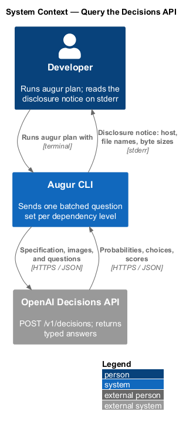
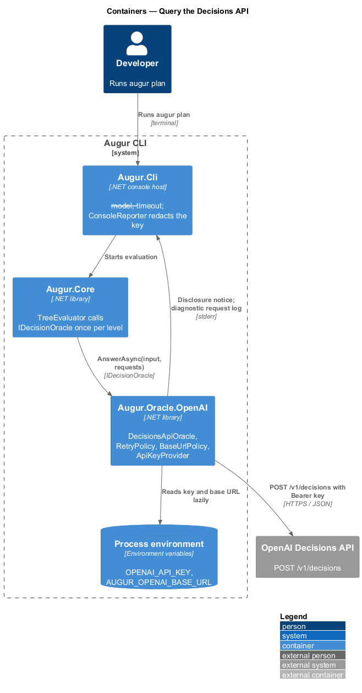
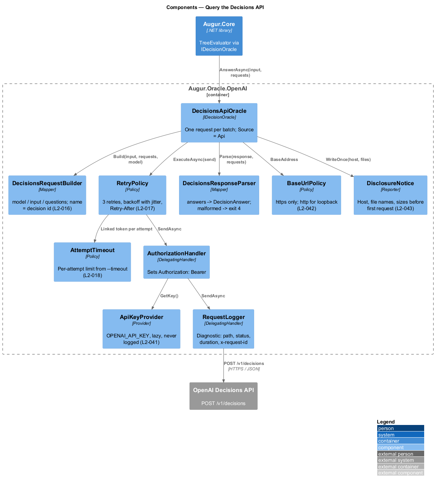
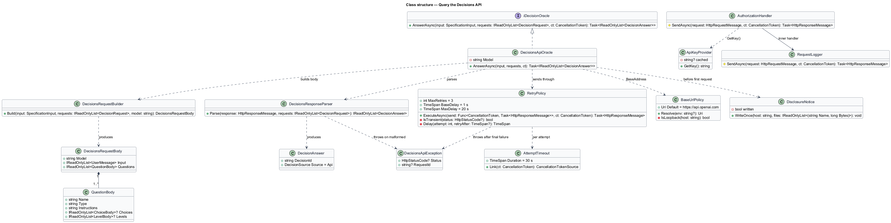
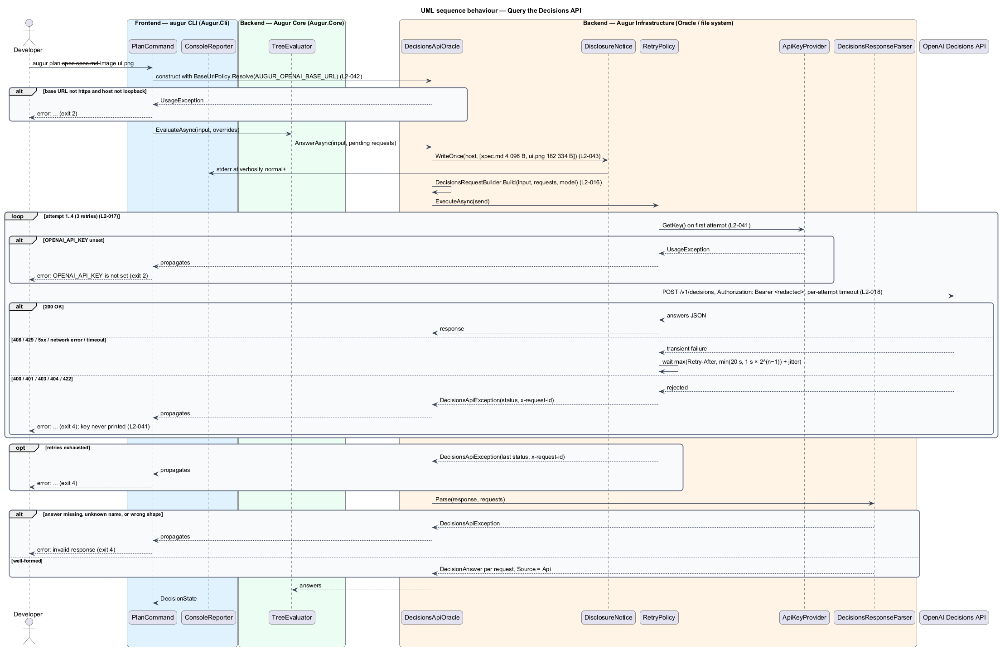

# Query the Decisions API

## Overview

Augur decides what to generate by asking the OpenAI Decisions API typed questions about a specification. This feature covers the one component that talks to that API: how a batch of catalog questions becomes an HTTP request, how the response becomes raw answers, and how the exchange is kept reliable and safe.

The *Decisions API* — OpenAI endpoint `POST /v1/decisions` that returns probabilities, choices, and scores rather than generated text — accepts one request carrying shared evidence (the specification text and any images) and a list of questions. Augur sends every pending decision of one dependency level in a single request (see [evaluate the decision tree](../../decisions/evaluate-decision-tree/README.md)) and names each question after its catalog decision id so answers can be matched back without ambiguity.

The exchange is governed by three safeguards. A *retry policy* — rule set that decides whether a failed attempt is repeated and after what delay — retries transient failures up to three times with exponential backoff and never retries a rejected request. A *per-attempt timeout* — upper bound on how long one HTTP attempt may run — defaults to 30 seconds and counts as a transient failure when exceeded. A *transport policy* — rule set on where traffic may go — requires HTTPS with standard certificate validation, allowing plain HTTP only for loopback test servers.

Two further rules protect the developer. The API key is read only from the `OPENAI_API_KEY` environment variable, only when a request is about to be sent, and is never written anywhere. Before the first request in a run, Augur writes a *disclosure notice* — stderr line naming the endpoint host and the files whose contents are about to leave the machine — so the developer knows what is being sent without the specification text itself ever being logged.

## Description

All components live in `Augur.Oracle.OpenAI` unless stated otherwise. Names are introduced by this design and follow ADR integration/0001.

- **`DecisionsApiOracle`** — implementation of `IDecisionOracle` (`Augur.Core`). `AnswerAsync(SpecificationInput, IReadOnlyList<DecisionRequest>, CancellationToken)` builds one request for the whole batch, sends it through `RetryPolicy`, parses the response, and returns one `DecisionAnswer` per request with `Source = Api`.
- **`DecisionsRequestBuilder`** — maps a `SpecificationInput` and a batch of `DecisionRequest`s to the JSON body. `model` comes from `--model` (default `gpt-6-luna`). `input` is one user message holding an `input_text` part with the specification followed by one `input_image` part per image, each a base64 `data:` URL in command-line order. `questions` holds one entry per request with `name` equal to the decision id, `type` from the definition, `instructions`, and either `choices` (`value`, `description`) or `levels` (`label`, `description`) in catalog order (L2-016).
- **`DecisionsResponseParser`** — deserializes the `answers` array, matches each answer to its request by `name`, and produces `DecisionAnswer` records. A missing answer, an unknown name, or a result shape that does not match the question type throws `DecisionsApiException` with the response's request id; `PlanCommand` maps it to exit code 4. Closed-set and range checks on the values themselves belong to `AnswerValidator` (see [resolve a decision](../../decisions/resolve-decision/README.md)).
- **`RetryPolicy`** — wraps one `SendAsync`. It retries on HTTP 408, 429, 500, 502, 503, 504, on a network error, and on a per-attempt timeout, up to 3 retries. The delay before retry *n* is `min(20 s, 1 s × 2^(n−1))` plus uniform jitter of up to 25 %; when the response carries `Retry-After`, the delay is at least that value. HTTP 400, 401, 403, 404, and 422 are not retried (L2-017). After the final failure it throws `DecisionsApiException` carrying the status code and request id.
- **`AttemptTimeout`** — per-attempt `CancellationTokenSource` linked to the run's token. The duration comes from `--timeout <seconds>` (1 to 300, default 30); a value outside the range is a usage error with exit code 2. A timed-out attempt surfaces to `RetryPolicy` as transient (L2-018).
- **`ApiKeyProvider`** — reads `OPENAI_API_KEY` on first use and caches it for the run. No command-line option exists for the key. When the variable is unset and a request is about to be sent, it throws `UsageException` with exit code 2 before any connection is opened. The provider exposes the key only to `AuthorizationHandler`; `ConsoleReporter` (`Augur.Cli`) redacts the value from every message it writes, at every verbosity (L2-041).
- **`AuthorizationHandler`** — `DelegatingHandler` that sets `Authorization: Bearer <key>` on each outgoing request. It is the only component that holds the key in a header.
- **`BaseUrlPolicy`** — validates the base URL at startup. The default is `https://api.openai.com`; `AUGUR_OPENAI_BASE_URL` replaces it. A URL whose scheme is not `https` is rejected with exit code 2 unless its host is `localhost`, `127.0.0.1`, or `::1`. The `HttpClient` uses the platform default certificate validation, and no option or environment variable can relax it (L2-042).
- **`DisclosureNotice`** — writes, once per run and only before the first request reaches the API, one stderr block at verbosity `normal` or higher: the endpoint host and, for the specification and each image, the file name and byte size. It never writes file contents (L2-043). A run fully served from the lockfile emits no notice.
- **`RequestLogger`** — at verbosity `diagnostic`, logs method, URL path, status code, duration, attempt number, and the response's `x-request-id` through `ConsoleReporter`. Headers and bodies are never logged.

The `HttpClient` is registered as a typed client with `AuthorizationHandler` and `RequestLogger` in its handler chain, `BaseUrlPolicy` supplying `BaseAddress`, and `Timeout` set to `Timeout.InfiniteTimeSpan` so that `AttemptTimeout` alone governs each attempt.

## Requirements

The feature realizes the following level-2 (L2) requirements. Each L2 requirement refines a level-1 (L1) requirement, cited by identifier.

| L2 ID | Refines (L1) | Requirement |
|-------|--------------|-------------|
| `L2-016` | `L1-005` | Augur shall send `POST {baseUrl}/v1/decisions` with a JSON body containing `model`, `input`, and `questions`. Each question's `name` shall equal the catalog decision id. The default base URL is `https://api.openai.com`; it can be changed with the `AUGUR_OPENAI_BASE_URL` environment variable. The default model is `gpt-6-luna`; it can be changed with `--model`. |
| `L2-017` | `L1-005` | Augur shall retry a request that fails with HTTP 408, 429, 500, 502, 503, 504, or a network error, up to 3 retries, using exponential backoff with jitter starting at 1 second and capped at 20 seconds. When a `Retry-After` header is present, Augur shall wait at least that long. HTTP 400, 401, 403, 404, and 422 shall not be retried. |
| `L2-018` | `L1-005` | Each HTTP attempt shall time out after 30 seconds by default, configurable with `--timeout <seconds>` (1 to 300). A timed-out attempt counts as a transient failure under L2-017. |
| `L2-041` | `L1-012` | The API key shall be read only from the `OPENAI_API_KEY` environment variable. No command-line option shall accept a key. The key is required only if at least one decision must be sent to the Decisions API. The key shall never appear in stdout, stderr, logs (at any verbosity), the plan, the lockfile, emitted files, or exception messages. |
| `L2-042` | `L1-012` | All Decisions API traffic shall use HTTPS with standard certificate validation, which cannot be disabled. `AUGUR_OPENAI_BASE_URL` shall be rejected unless it uses `https`, except that `http` is permitted for loopback hosts (`localhost`, `127.0.0.1`, `::1`) to allow local test servers. |
| `L2-043` | `L1-012` | Before the first Decisions API request in a run, at verbosity `normal` or higher, Augur shall write to stderr the endpoint host and the names and byte sizes of the files whose contents will be sent. The specification text and image data shall never be logged. |

## Diagrams

### System context

Augur is the only client of the Decisions API in this picture; the developer sees what leaves the machine through the disclosure notice on stderr.

### Containers

`Augur.Core` calls the oracle through `IDecisionOracle`; `Augur.Oracle.OpenAI` owns the HTTP client and every policy around it. Environment variables supply the key and the base URL.

### Components

`DecisionsApiOracle` composes the request builder, retry policy, attempt timeout, and response parser. The `HttpClient` handler chain carries authorization and diagnostic logging.

### Class structure

`DecisionsApiOracle` implements `IDecisionOracle` and depends on the builder, parser, retry policy, and providers; `RetryPolicy` owns the backoff schedule.

### Behaviour — send one batched request

The oracle validates the base URL and emits the disclosure notice (`L2-043`) before the first attempt, reads the key lazily (`L2-041`), and sends the batch (`L2-016`). The `alt` block covers success, a transient failure that is retried with backoff (`L2-017`), a timeout treated as transient (`L2-018`), and a rejected request that ends the run with exit code 4.

