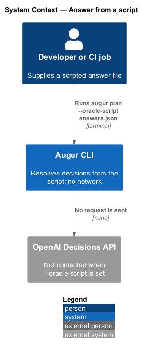
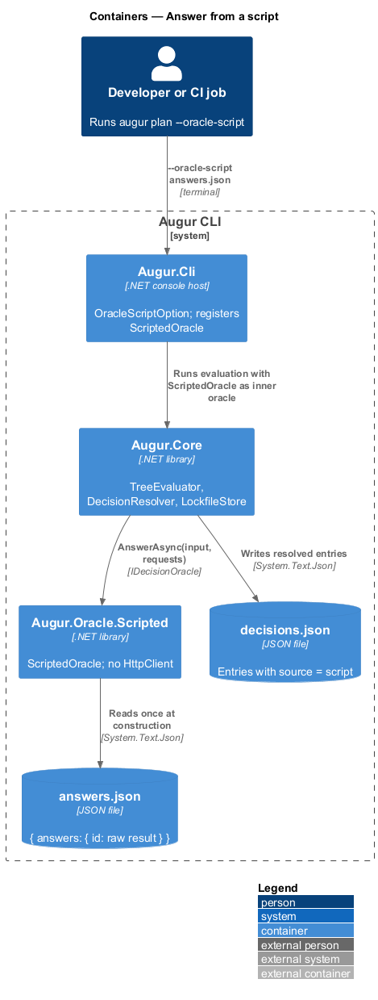
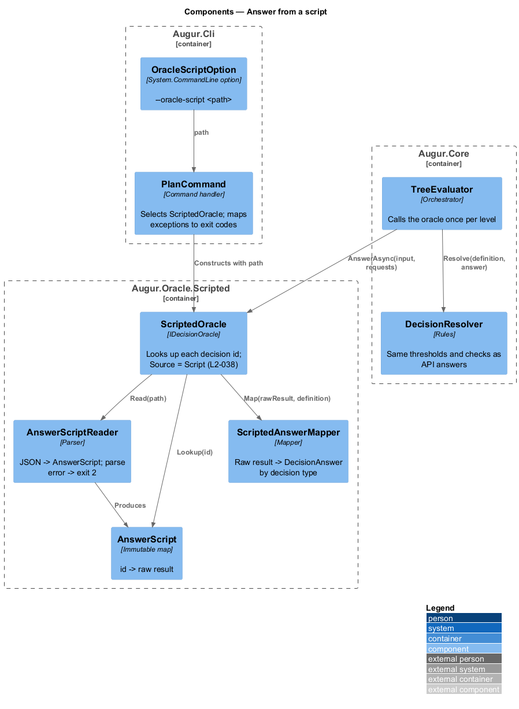
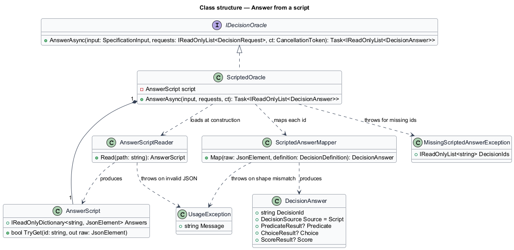
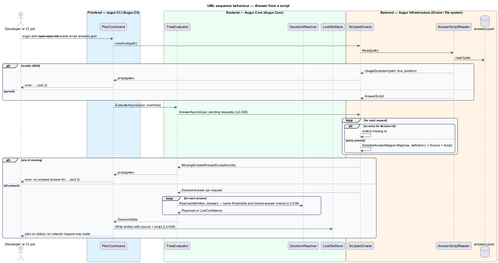

# Answer from a script

## Overview

Augur's acceptance tests and continuous-integration runs cannot depend on the OpenAI Decisions API: the answers would vary, the runs would cost money, and the project's rules forbid tests from calling the live service. This feature replaces the API with a *scripted answer file* — JSON document that supplies, for each decision id, a raw result in the same shape the API would return.

The option `--oracle-script <path>` selects the file. A scripted answer is treated exactly like an API answer from that point on: it passes the closed-answer and range checks, it is measured against the same thresholds, a weak answer falls to the same low-confidence policy, and the resolved decision is written to the lockfile with source `script`. The only difference is provenance. This is what lets one test exercise the complete `plan` → lockfile → `emit` path, including fallbacks, with no network at all.

The file has the form `{ "answers": { "<id>": { ...raw result... } } }`. A predicate entry carries `probability`; a choice entry carries `choice`, `probabilities`, and `confidence`; a score entry carries `score`, `probabilities`, and `confidence`. An entry missing for a decision that is pending ends the run with exit code 3, because the decision cannot be resolved; a file that is not valid JSON ends the run with exit code 2, because the input is malformed.

## Description

The scripted oracle lives in `Augur.Oracle.Scripted`; selection lives in `Augur.Cli`. Names are introduced by this design and follow ADR integration/0001.

- **`OracleScriptOption`** — System.CommandLine option for `--oracle-script <path>`. When present, `PlanCommand` registers `ScriptedOracle` as the inner oracle in place of `DecisionsApiOracle`; `ApiKeyProvider` is never constructed, so `OPENAI_API_KEY` is not read.
- **`ScriptedOracle`** — implementation of `IDecisionOracle` (`Augur.Core`). On construction it loads the file through `AnswerScriptReader`. `AnswerAsync(SpecificationInput, IReadOnlyList<DecisionRequest>, CancellationToken)` ignores the input, looks up each request's decision id, and returns one `DecisionAnswer` per request with `Source = Script`. No `HttpClient` exists in the assembly.
- **`AnswerScriptReader`** — parses the JSON document with `System.Text.Json`. A parse failure throws `UsageException` naming the file path and the line and byte position from `JsonException`; `PlanCommand` maps it to exit code 2. The reader keeps raw results as `JsonElement`s so that shape checking can use the decision's type.
- **`AnswerScript`** — immutable map from decision id to raw result.
- **`ScriptedAnswerMapper`** — converts a raw result to `DecisionAnswer` for the request's `DecisionDefinition` type: `PredicateResult` from `probability`, `ChoiceResult` from `choice`/`probabilities`/`confidence`, `ScoreResult` from `score`/`probabilities`/`confidence`. A result whose fields do not match the decision type throws `UsageException` naming the entry (exit code 2). Value membership and range checks are left to `AnswerValidator` (see [resolve a decision](../../decisions/resolve-decision/README.md)), which reports a scripted violation with exit code 2 rather than 4 because `Source = Script`.
- **`MissingScriptedAnswerException`** — thrown by `ScriptedOracle` when a pending decision has no entry. It lists every missing id in the batch; `PlanCommand` maps it to exit code 3.
- **`LockfileStore`** (`Augur.Core`) — unchanged; it records scripted resolutions with `source: "script"` and no `model` field (see [record decisions](../../lockfile/record-decisions/README.md)).

`ReplayingOracle` wraps `ScriptedOracle` exactly as it wraps `DecisionsApiOracle`, so a scripted run also reuses matching lockfile entries.

## Requirements

The feature realizes the following level-2 (L2) requirements. Each L2 requirement refines a level-1 (L1) requirement, cited by identifier.

| L2 ID | Refines (L1) | Requirement |
|-------|--------------|-------------|
| `L2-038` | `L1-010` | `--oracle-script <path>` shall replace the Decisions API with answers from a JSON file of the form `{ "answers": { "<id>": { ...raw result... } } }`, where each raw result has the same fields as the API result for that decision's type. Scripted answers go through the same threshold, fallback, closed-answer, and lockfile rules as API answers, with source `script`. No network request is made. |

## Diagrams

### System context

With a script in play the Decisions API is absent; the developer or a CI job supplies the answers as a file.

### Containers

`Augur.Oracle.Scripted` takes the place of `Augur.Oracle.OpenAI` behind the same `IDecisionOracle` interface; nothing in `Augur.Core` changes.

### Components

`ScriptedOracle` reads the file once through `AnswerScriptReader` and maps each requested id with `ScriptedAnswerMapper`.

### Class structure

`ScriptedOracle` implements `IDecisionOracle` and owns an `AnswerScript`; the mapper produces the same `DecisionAnswer` type the API oracle produces.

### Behaviour — serve a batch from the script

The `alt` blocks cover an unparseable file (exit 2), a missing entry (exit 3), and a well-formed answer that continues through the normal resolver path (`L2-038`).

