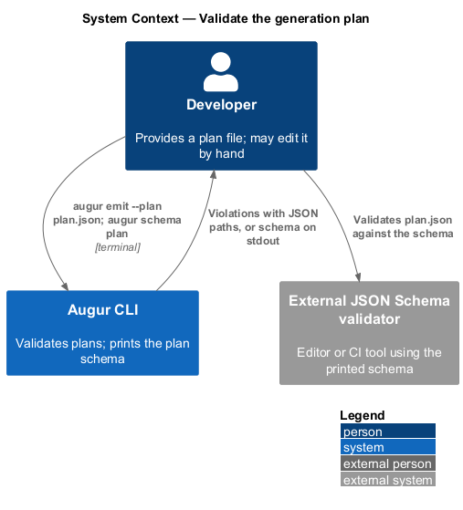
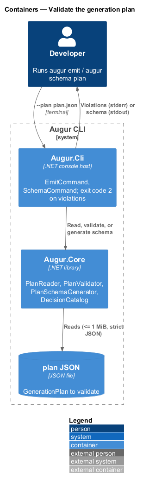
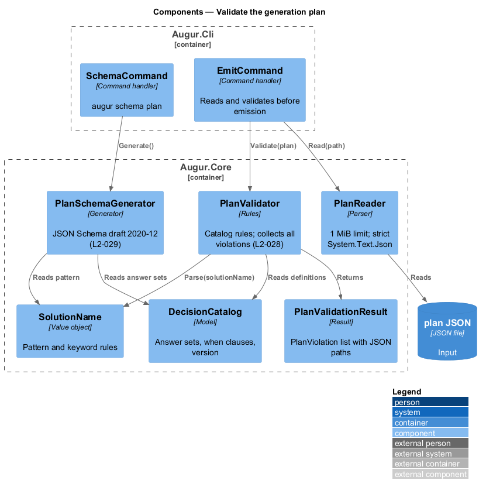
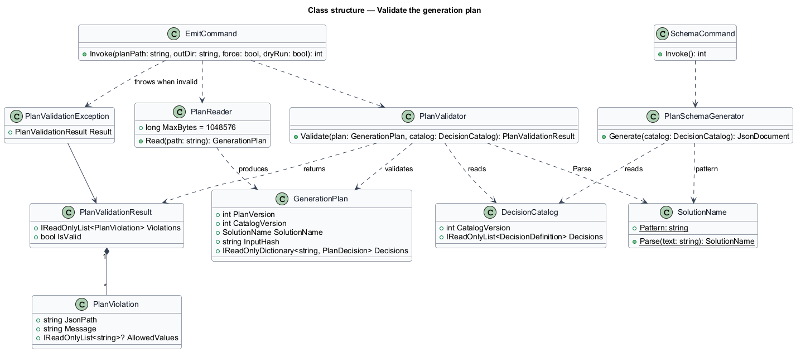
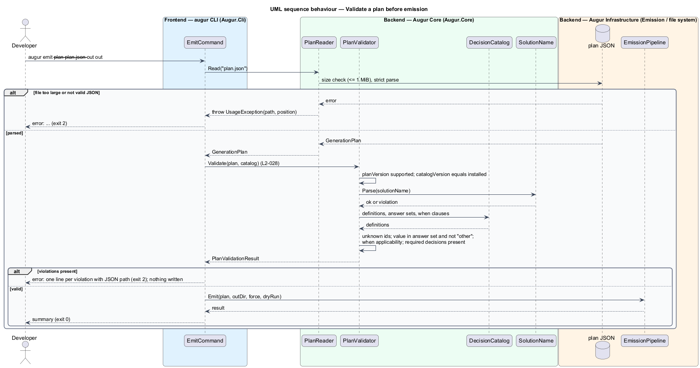
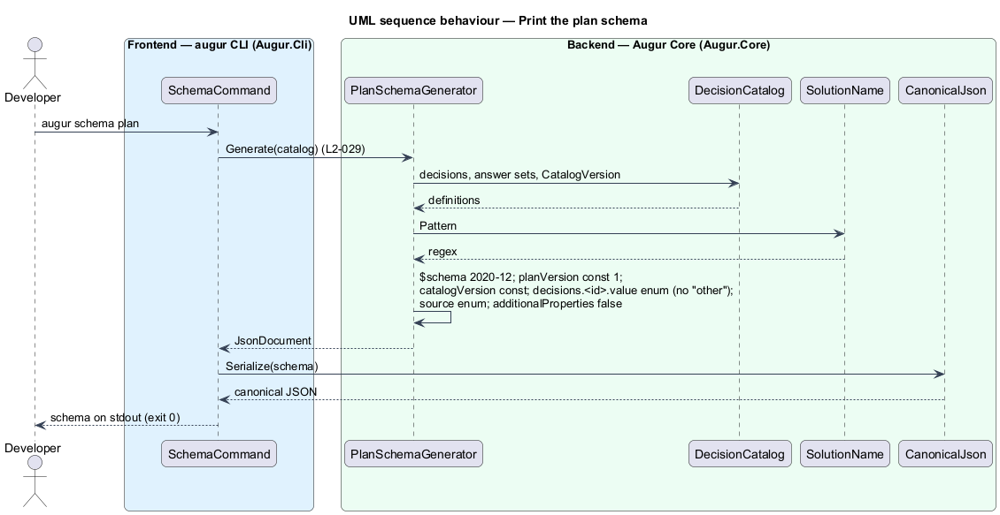

# Validate the generation plan

## Overview

A generation plan can arrive at `augur emit` from three places: fresh from `augur plan`, from a file saved weeks ago, or edited by hand. Emission trusts the plan completely — plan values choose templates and become file names — so the plan is checked against two sources of truth before a single file is rendered. This feature covers that check and the schema that makes it possible outside Augur.

The first source of truth is the *plan schema* — JSON Schema (draft 2020-12) that describes the shape of a `GenerationPlan` for the installed catalog, including the allowed values of each decision. `augur schema plan` prints it so editors and CI pipelines can validate a plan with any standard validator. The second source is the *decision catalog* — versioned list of every decision Augur can make, its closed set of answers, and its `when` clause. Catalog rules such as "this decision applies only when `target` is `dotnet`" cannot be expressed cleanly in a schema, so Augur applies them in code.

Validation rejects: an unsupported `planVersion`; a `catalogVersion` different from the installed catalog; unknown decision ids; values outside a decision's answer set; `other` as a value; missing required decisions; a value for a decision whose `when` clause is false; an invalid `solutionName`; and a plan file larger than 1 MiB. Each rejection names the offending JSON path, such as `$.decisions.architecture.value`, and ends the run with exit code 2 before any output directory is touched.

## Description

All types live in `Augur.Core` except the commands, which live in `Augur.Cli`. Names are introduced by this design.

- **`PlanReader`** — reads a plan file. It rejects files larger than 1 MiB before parsing, parses with `System.Text.Json` in strict mode (no comments, no trailing commas, unknown properties rejected), and returns a `GenerationPlan`. Parse errors carry the file path and the error position.
- **`PlanValidator`** — applies the catalog rules in a fixed order and collects every violation into a `PlanValidationResult` rather than stopping at the first. The order is: `planVersion`; `catalogVersion`; `solutionName` through `SolutionName.Parse`; unknown ids; per-decision value in answer set and not `other`; `when` applicability (a value present for a decision whose `when` evaluates false, or absent for one whose `when` evaluates true); required decisions (every decision with no `when` clause).
- **`PlanValidationResult`** — list of `PlanViolation` entries; `IsValid` is true when the list is empty.
- **`PlanViolation`** — record with `JsonPath` (for example `$.decisions.architecture.value`), `Message`, and, for answer-set violations, `AllowedValues`.
- **`PlanValidationException`** — thrown by `EmitCommand` when the result is invalid; the message lists each violation on its own line. The CLI maps it to exit code 2.
- **`PlanSchemaGenerator`** — builds a JSON Schema document from the installed `DecisionCatalog`: `$schema` set to draft 2020-12; `planVersion` as `const 1`; `catalogVersion` as `const` of the installed version; `solutionName` as a string with the `SolutionName` pattern and `maxLength` 64; `inputHash` as a 64-character hexadecimal string; `decisions` as an object with one property per catalog decision, each an object with `value` as an `enum` of the answer set without `other` and `source` as an `enum` of the six sources; `additionalProperties` false throughout. `when` rules are not encoded; the schema documents that in its `description`.
- **`SchemaCommand`** — handler for `augur schema plan`; writes the schema to stdout with `CanonicalJson` and exits 0.
- **`EmitCommand`** — reads `--plan`, runs `PlanReader` then `PlanValidator`, and only on success proceeds to emission (see [emit-output](../../emission/emit-output/README.md)).

The same `PlanValidator` runs inside `augur generate` on the plan it has just built, so a catalog or builder defect surfaces as a validation error rather than as a broken emitted solution.

## Requirements

The feature realizes the following level-2 (L2) requirements. Each L2 requirement refines a level-1 (L1) requirement, cited by identifier.

| L2 ID | Refines (L1) | Requirement |
|-------|--------------|-------------|
| `L2-028` | `L1-008` | `augur emit --plan <path>` shall validate the plan against the plan schema and the current catalog before emitting anything. Validation shall reject: unsupported `planVersion`; a `catalogVersion` different from the installed catalog; unknown decision ids; values outside a decision's answer set; `other` as a value; missing required decisions; a value present for a decision whose `when` clause is false; and an invalid `solutionName`. |
| `L2-029` | `L1-008` | `augur schema plan` shall print a JSON Schema (draft 2020-12) describing `GenerationPlan` for the installed catalog, including the allowed values of each decision. |

## Diagrams

### System context

Validation is local. The developer provides a plan file and, optionally, uses the printed schema with an external validator.

### Containers

The CLI host reads `--plan`; the core reads, validates, and generates the schema from the catalog.

### Components

`EmitCommand` chains `PlanReader` and `PlanValidator`; `SchemaCommand` calls `PlanSchemaGenerator`. Both validators read the installed `DecisionCatalog`.

### Class structure

`PlanValidator` produces a `PlanValidationResult` of `PlanViolation`s; `PlanSchemaGenerator` depends on the catalog and `SolutionName` for its pattern.

### Behaviour — validate a plan before emission

The reader enforces the size limit and strict parsing; the validator collects every violation and the command exits 2 with the JSON paths, or continues to emission (`L2-028`).

### Behaviour — print the plan schema

`augur schema plan` derives the schema from the installed catalog and writes it to stdout (`L2-029`).

