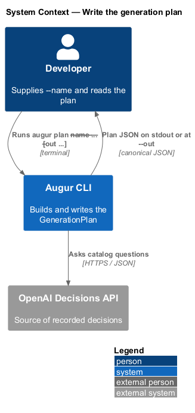
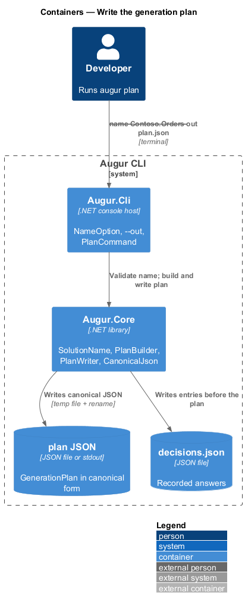
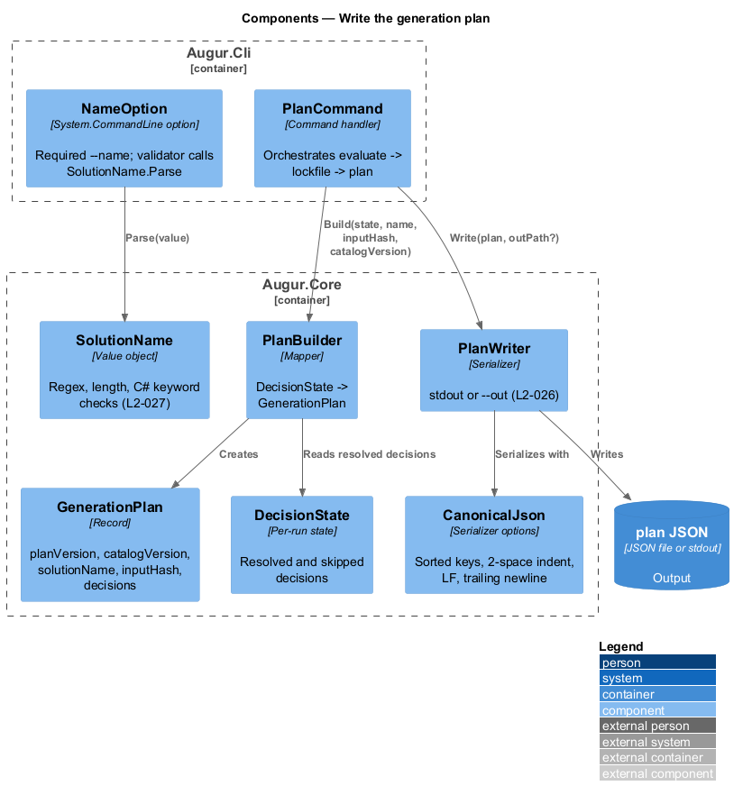
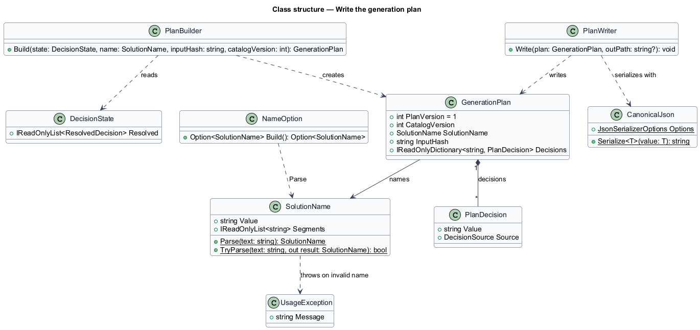
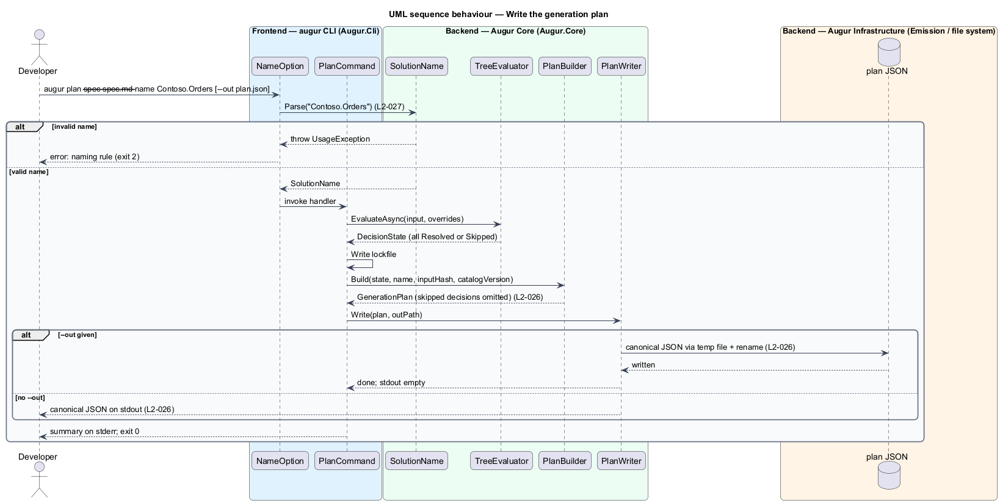

# Write the generation plan

## Overview

Augur separates deciding from emitting. The decision half runs a behaviour tree over the catalog and ends with a set of resolved decisions; the emitting half turns those decisions into files. The artefact that joins the two halves is the *generation plan* — JSON document holding every resolved decision, the solution name, and the identity of the input and catalog that produced it. This feature covers how `augur plan` produces that document.

The plan is the contract between the two halves. It is small, readable, and stable: a developer can save it, diff it between runs, edit a value by hand, and feed it to `augur emit` later. For that to work the plan is written in a *canonical form* — serialization with sorted keys, two-space indentation, LF line endings, and a trailing newline — so the same decisions always produce the same bytes and a diff shows only real changes.

Every plan carries a *solution name* — dot-separated PascalCase identifier such as `Contoso.Orders` that names the emitted .NET solution and derives the Angular project name. The name is supplied with `--name`, is required for `plan` and `generate`, and is validated before any decision is made so that no path or namespace in emitted code can ever be malformed.

## Description

Plan types live in `Augur.Core`; the command and option definitions live in `Augur.Cli`. Names are introduced by this design.

- **`GenerationPlan`** — immutable record with `PlanVersion` (1), `CatalogVersion`, `SolutionName`, `InputHash`, and `Decisions`, an ordered map from decision id to `PlanDecision`. Skipped decisions are absent; overridden decisions are present with source `override`.
- **`PlanDecision`** — record with `Value` and `Source` (`api`, `lockfile`, `override`, `fallback`, `user`, or `script`), the serialized form of a `ResolvedDecision` from the decision subsystem (see [evaluate-decision-tree](../../decisions/evaluate-decision-tree/README.md)).
- **`SolutionName`** — value object. `Parse(string)` accepts a name that matches `^[A-Z][A-Za-z0-9]*(\.[A-Z][A-Za-z0-9]*)*$`, is at most 64 characters, and has no dot-separated segment equal to a C# keyword when compared case-insensitively; otherwise it throws `UsageException`, which the CLI maps to exit code 2. The keyword list is the C# reserved keyword set from the language specification.
- **`PlanBuilder`** — maps a completed `DecisionState` and the run's `SolutionName`, `InputHash`, and catalog version to a `GenerationPlan`. It drops skipped decisions and reads `Value` and `Source` from each `ResolvedDecision`.
- **`CanonicalJson`** — serializer options shared by the plan writer, the lockfile store, and the catalog listing: properties sorted ordinally, two-space indentation, LF line endings, UTF-8 without BOM, one trailing newline.
- **`PlanWriter`** — serializes a `GenerationPlan` with `CanonicalJson` to stdout, or to the file named by `--out <path>`. With `--out`, stdout stays empty. The file write goes through a temporary file and rename so a failed write never leaves a truncated plan.
- **`NameOption`** — System.CommandLine option for `--name <SolutionName>`, marked required on `plan` and `generate`; its validator calls `SolutionName.Parse` so the error surfaces during argument parsing.
- **`PlanCommand`** — orchestrates the run: parse options, read the specification, evaluate the tree, write the lockfile, build the plan, write the plan.

## Requirements

The feature realizes the following level-2 (L2) requirements. Each L2 requirement refines a level-1 (L1) requirement, cited by identifier.

| L2 ID | Refines (L1) | Requirement |
|-------|--------------|-------------|
| `L2-026` | `L1-008` | `augur plan` shall write the plan to stdout, or to the path given by `--out <path>`. The plan is JSON containing `planVersion`, `catalogVersion`, `solutionName`, an `inputHash`, and a `decisions` object mapping every non-skipped decision id to `{ "value": ..., "source": ... }`. Serialization shall use sorted keys, two-space indentation, LF line endings, and a trailing newline. |
| `L2-027` | `L1-008` | `--name <SolutionName>` shall be required for `plan` and `generate`. It shall match `^[A-Z][A-Za-z0-9]*(\.[A-Z][A-Za-z0-9]*)*$`, be at most 64 characters, and no dot-separated segment shall be a C# keyword (compared case-insensitively). |

## Diagrams

### System context

The developer supplies the solution name and receives the plan; the Decisions API is involved only through the decisions the plan records.

### Containers

The CLI host parses `--name` and `--out`; the core builds and serializes the plan; the plan file is the output.

### Components

`PlanCommand` validates the name through `SolutionName`, builds the plan from `DecisionState` through `PlanBuilder`, and hands it to `PlanWriter`, which uses `CanonicalJson`.

### Class structure

`GenerationPlan` owns its `PlanDecision` entries and a `SolutionName`; `PlanWriter` depends on `CanonicalJson`.

### Behaviour — write a plan

Name validation runs at argument parsing (`L2-027`) before any work; the plan is built from the completed state and written canonically to stdout or `--out` (`L2-026`).

